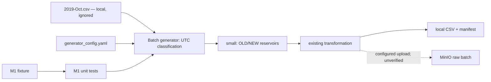

# Current implementation map

## Purpose and confidence

Bản đồ source sau final cleanup trên `rebuild-clean` (2026-10-05). Chỉ mô tả file đang tồn tại; source inspection và unit test không chứng minh pipeline runtime. Thiết kế ở [TARGET_ARCHITECTURE.md](TARGET_ARCHITECTURE.md); schema/ý nghĩa dữ liệu ở [DATA_CONTRACT.md](DATA_CONTRACT.md); tiến độ ở [IMPLEMENTATION_ROADMAP.md](IMPLEMENTATION_ROADMAP.md).

## Source còn lại

| File | Vai trò | Giới hạn kiểm chứng |
| --- | --- | --- |
| `src/generator/batch_generator.py` | M1: parse UTC, classify OLD/NEW, sample rồi gọi transformation/writer hiện có | Fixture/unit; medium/full và MinIO chưa kiểm chứng lại |
| `src/generator/__init__.py` | Package generator; import tới late-event buffer cũ đã được gỡ | Không còn stream generator |
| `config/generator_config.yaml` | Config generator; vẫn có khai báo cho các phần chưa rebuild | Config không chứng minh implementation/service tồn tại |
| `tests/test_batch_selection_m1.py` | Chín test M1 | Không chứng minh pipeline/scale |
| `tests/conftest.py` | Đường dẫn import và fixture môi trường cho test | Mock Airflow/governance cũ đã được gỡ |
| `tests/fixtures/m1_october_boundaries.csv.fixture` | Fixture boundary nhỏ, cố ý không sắp xếp | Giữ trong Git; không phải output sinh ra |

## Source-declared flow

Các cạnh là khai báo source; MinIO không được chạy/readback trong final cleanup. `--local-output-dir` dành cho small mode, ghi CSV/manifest vào đích cục bộ và tắt MinIO. Medium/full vẫn có byte target và replica transformations; chưa chạy benchmark.

## Component đã gỡ khỏi baseline

Source/config/DAG của stream generator, late-event buffer, Spark, Flink, Feast, governance, DWH/setup scripts, Airflow, Docker/Compose và API placeholder đã được gỡ. Makefile, notebook và test cũ ngoài M1 cũng đã được gỡ. Không có downstream consumer implementation trong baseline hiện tại.

Bản đồ pipeline và các phát hiện cũ thuộc snapshot `old-vibe-backup` tại `2cf00cf`, không phải source đang tồn tại. Các phần CURRENT của data contract và trạng thái code trong rubric được giữ nguyên theo yêu cầu; khi đọc phải đối chiếu bản đồ này, không dùng chúng để kết luận component cũ còn trong baseline. Thiết kế/contract/rubric requirements không thay đổi.

## M1 và evidence

Shared `_classify_chunk` dùng UTC start/evolution/end từ config. Small mode sample riêng từng population bằng seeded random-priority reservoirs; shortage không backfill. October là batch target, November là stream target chưa có implementation trong baseline.

Giữ [ghi chú M1](docs/m1_batch_selection.md) và fixture/tests. JSON/manifest/log evidence runtime cũ và script independent readback đã được dọn. Số liệu small runtime trong ghi chú là lịch sử; không xác nhận runtime hiện tại. Final cleanup chỉ chạy unit M1, không chạy generator trên toàn bộ CSV, MinIO hay downstream.

Ghi chú component mới và evidence mới được index tại [docs/INDEX.md](docs/INDEX.md). Không bắt đầu M2 trong cleanup này.
