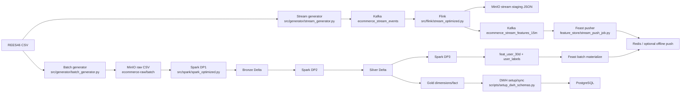

# Current implementation map

## Purpose and confidence

This file maps connections declared in current source, configuration and DAGs. It answers how the repository is presently wired. It does not describe the desired design (see [TARGET_ARCHITECTURE.md](TARGET_ARCHITECTURE.md)) or define dataset semantics (see [DATA_CONTRACT.md](DATA_CONTRACT.md)). A static source connection is not proof of successful runtime delivery. The original map was a static audit. [M1](docs/m1_batch_selection.md) subsequently verified only batch selection/sampling and isolated small local CSV readback; no downstream pipeline was run.

## Source-declared flow

| Source-declared producer | Output | Source-declared next consumer | Qualification |
| --- | --- | --- | --- |
| Batch generator | MinIO `ecommerce-raw/batch/raw_events_old.csv` and `raw_events_new.csv` (large mode can part files) | Spark DP1 | Config/source path; not read back. |
| Stream generator | Kafka `ecommerce_stream_events`, key `user_id` | Flink optimized job | Generator config is October data; code has October hard-coded boundary. |
| Flink event branch | MinIO `ecommerce-raw/staging/stream_events/` JSON | Spark DP1 staging ingest | Job declares a filesystem sink. |
| Flink feature branch | Kafka `ecommerce_stream_features_15m` and print output | Feast stream pusher | Flink declares HOP output; topic delivery not verified. |
| Spark DP1 | Delta `bronze/raw_events` | Spark DP2 | Delta source path/config. |
| Spark DP2 | Delta `silver/stg_events`, `gold/dim_product`, `gold/dim_user`, `gold/fact_user_events` | Spark DP3 and DWH sync | Static calls/paths; schemas/readbacks unverified. |
| Spark DP3 | Delta `gold/feat_user_30d`, `gold/user_labels`; Parquet Feast export | Feast materialization and historical retrieval | Current implementation uses 30d features and candidate-minute labels. |
| Feast batch materialize | Configured Redis online store | Future online retrieval | Feast config/job exists; no inference service identified. |
| Feast stream pusher | Redis by default; optional offline/both | Feast online/historical retrieval | `target` defaults online; offsets/write completeness unverified. |
| DWH setup/sync | PostgreSQL bronze/silver/gold tables | SQL analytics | Script contains destructive `DROP TABLE ... CASCADE`; do not run casually. |

## Batch M1 update

- Shared `_classify_chunk` parses UTC source timestamps and uses configured start/evolution/end; no row offset or independent benchmark date rules remain.
- `small` scans the source and samples each classified population with seeded random-priority reservoirs; shortages are observable and not backfilled.
- `--local-output-dir` writes isolated local CSV/manifest and disables MinIO. Runtime evidence is limited to 1,000 selected source rows and output readback.
- Medium/full retain byte targets and replica transformations; shared classification is SOURCE-DECLARED there, not benchmark runtime evidence.
- October is the batch target, November the stream target. Current stream implementation still uses October and was not changed in M1.

## Material current-versus-target differences

- Current Spark DP3 aggregates 30-day batch features. The target model contract is four 15-minute behavior features.
- Current Flink computes four 15-minute fields with a one-minute sliding HOP window, but the result uses `event_timestamp=HOP_END`; this does not by itself establish the same decision-time semantics as target training.
- Current `ecom_propensity_v1` includes both 30-day and 15-minute views; target baseline is 15-minute only.
- Current labels are generated from Silver view/cart-active user/minutes, not joined to persisted inference records. No prediction service/log was identified in the audited paths.
- Current stream generator config says Oct 26–31, while code uses an October input/offset and stops when event time is no longer October. The November replay target is not implemented by this path.
- Stream events and computed features are separate Flink outputs. Feature aggregates are lossy; event staging preserves rows for history/replay.
- PostgreSQL DDL uses different column names/types/nullability from Delta in places; the DWH copy is a separate schema and needs reconciliation.

## Inspection findings for later milestones

| Finding | Location / trigger | Invariant at risk | Verification needed |
| --- | --- | --- | --- |
| Batch classification/sampling verified locally in M1 | `src/generator/batch_generator.py`, generator config | UTC October membership, disjoint schema groups; sample only after classification | [Fixture + small readback](docs/m1_batch_selection.md); MinIO and benchmark/replica output remain unverified. |
| Stream source range differs from config description | `src/generator/stream_generator.py`, `config/generator_config.yaml` | Replay covers the intended interval once, with offsets/checkpoints consistent | Bounded fixture and Kafka readback in isolated topic. |
| Composite dedup can collapse distinct same-time actions | Spark Silver and Flink dedup key omits session/event id | One legitimate event maps to one retained event | Construct collision fixture; decide stable identity policy. |
| Gold event hash omits event type | `src/spark/spark_optimized.py` | Event identity does not collide across different actions | Unit fixture/readback; compare same user/time/product different type. |
| Product version ties use an underspecified ordering | Spark DP2 window ordering | Temporal join chooses exactly one deterministic version | Tied-attribute fixture and orphan/multiplicity checks. |
| HOP event-time readiness versus immediate prediction is unsettled | `src/flink/stream_optimized.py` | Train and serving use same as-of data availability | Flink 1.17 event-time fixture for on-time/late events. |
| Stream pusher uses Kafka auto-commit and buffers before `store.push` | `feature_store/stream_push_job.py` | No acknowledged Kafka row is lost, duplicated, or skipped across failure | Isolated broker/store; crash/restart offsets and offline/online readback. |
| DWH loader reads Parquet paths, while inputs include Delta tables | `scripts/setup_dwh_schemas.py` | Postgres matches active Delta snapshot and maintains relational keys | Compare Delta snapshot API/schema to DWH count/hash; inspect current Delta-aware read path. |

For exact schema, grain and timestamp meaning, use [DATA_CONTRACT.md](DATA_CONTRACT.md). For implementation order and current learning status, use [IMPLEMENTATION_ROADMAP.md](IMPLEMENTATION_ROADMAP.md). Component-specific explanations and new runtime evidence belong in [`docs/`](docs/INDEX.md).
