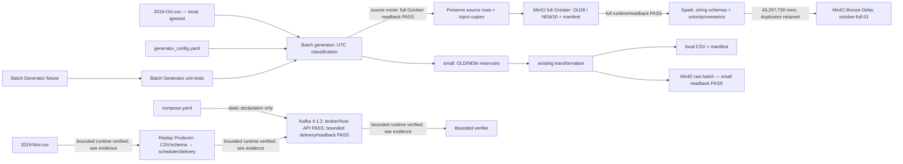

# Current implementation map

## Purpose and confidence

Bản đồ source/config cập nhật 2026-10-08 sau bounded Replay Producer runtime/readback và recovery verification; broker/API checks trước đó là learner terminal outputs; Batch Generator full October readback đã PASS ngày 2026-10-08 ([evidence](docs/evidence/batch_generator_october.json)). Full October Spark Raw → Bronze cũng đã có [runtime evidence](docs/evidence/spark_raw_to_bronze_full.json). Chỉ mô tả file đang tồn tại; source inspection và unit test không chứng minh pipeline runtime. Thiết kế ở [TARGET_ARCHITECTURE.md](TARGET_ARCHITECTURE.md); schema/ý nghĩa dữ liệu ở [DATA_CONTRACT.md](DATA_CONTRACT.md); tiến độ ở [IMPLEMENTATION_ROADMAP.md](IMPLEMENTATION_ROADMAP.md).

## Source còn lại

| File | Vai trò | Giới hạn kiểm chứng |
| --- | --- | --- |
| `src/generator/batch_generator.py` | Batch Generator: benchmark sampling/replicas; source mode đọc toàn bộ October, phân OLD/NEW và tiêm duplicate | Unit + small và full October source readback PASS; benchmark medium/full ≥100 GB chưa kiểm chứng ([evidence](IMPLEMENTATION_ROADMAP.md#batch-generator--minio-raw-storage--2026-10-06)) |
| `compose.yaml` | MinIO + Kafka 4.1.2 single-node KRaft; riêng named volumes và healthchecks | MinIO: small và full October source readback PASS theo evidence đã liên kết. Kafka: broker health/internal API và host metadata API đã có learner outputs; bounded CLI replay/resume/readback PASS; readback sau broker bật lại theo learner; full scale/recreate unverified |
| `src/spark/raw_to_bronze.py`, `config/spark_config.yaml` | OLD/NEW string schemas → union/provenance → Delta → exact readback; smoke/full CLI | Full 43,297,739 rows READBACK_PASS; no Silver/dedup/Airflow claim |
| `tests/test_raw_to_bronze.py` | Fixture/mock validation, local Delta roundtrip, full/smoke limits | 25 PASS on Python 3.11.17; runtime evidence separate |
| `requirements.txt` | Khai báo python-dotenv 1.2.1 cho CLI | Fixture dotenv pass; upload logic không đổi |
| `src/generator/replay_producer.py` | CLI/config, streaming CSV validation, JSON 10 fields và key user_id | Unit-tested + bounded native ACK/readback PASS ([evidence](docs/kafka_stream_replay.md)) |
| `src/generator/replay_runtime.py` | Event-time-progress late, duplicate, rate, ACK/error, checkpoint/resume at-least-once | Bounded delivery và Ctrl+C/resume/readback PASS; exactly-once unverified |
| `scripts/verify_kafka_replay.py` | Bounded consumer đối chiếu ACK positions, key/value/headers | Native journal readback 2.031/3.041 messages PASS; không phải toàn-topic audit |
| `tests/test_replay_producer.py`, `tests/test_replay_runtime.py` | CSV/scheduler/delivery/recovery/readback correctness trên fixture | Không chứng minh Kafka runtime hoặc scale |
| `src/generator/__init__.py` | Package generator; import tới late-event buffer cũ đã được gỡ | Không còn stream generator |
| `config/generator_config.yaml` | October batch; November streaming `[2019-11-01,2019-12-01)` UTC; broker `localhost:9092`, topic `ecommerce_stream_events` | Replay Producer/readback đã có source và unit tests; bounded November runtime đã verify; full replay chưa verify |
| `tests/test_batch_generator.py` | 18 test Batch Generator | Không chứng minh pipeline/scale |
| `tests/conftest.py` | Đường dẫn import và fixture môi trường cho test | Mock Airflow/governance cũ đã được gỡ |
| `tests/fixtures/batch_generator_october_boundaries.csv.fixture` | Fixture boundary nhỏ, cố ý không sắp xếp | Giữ trong Git; không phải output sinh ra |

## Source-declared flow



Sơ đồ mô tả source; nhánh small local/MinIO đã có [runtime readback](IMPLEMENTATION_ROADMAP.md#batch-generator--minio-raw-storage--2026-10-06) ngày 2026-10-06. CLI nạp root `.env` vào `os.environ`, giữ ưu tiên environment có sẵn; bucket vẫn lấy từ YAML. `--local-output-dir` dành cho small mode, ghi CSV/manifest vào đích cục bộ và tắt MinIO. Medium/full vẫn có byte target và replica transformations; chưa chạy benchmark.

## Lịch sử component đã gỡ khỏi baseline

Source/config/DAG của stream generator, late-event buffer, Spark, Flink, Feast, governance, DWH/setup scripts, Airflow và API placeholder đã được gỡ; Docker/Compose cũ đã gỡ, nay có `compose.yaml` khai báo MinIO và Kafka, broker/API đã PASS theo learner outputs, bounded replay/readback đã verify; recreate/HA chưa verify. Makefile, notebook và test cũ ngoài Batch Generator cũng đã được gỡ. Tại thời điểm cleanup lịch sử chưa có downstream consumer; Spark Raw → Bronze hiện đã verify, Silver và các consumer sau Bronze chưa implement.

Bản đồ pipeline và các phát hiện cũ thuộc snapshot `old-vibe-backup` tại `2cf00cf`, không phải source đang tồn tại. Data contract và target DE đã được đồng bộ theo quyết định learner; rubric không được nâng trạng thái từ static config. Không dùng LEGACY paths để kết luận component cũ còn trong baseline.

## Lịch sử Batch Generator small và cleanup

Shared `_classify_chunk` dùng UTC start/evolution/end từ config. Small mode sample riêng từng population bằng seeded random-priority reservoirs; shortage không backfill. October là batch target, November đã có input/date config và broker Compose declaration; Replay Producer/readback đã verify bounded November; không claim full replay.

Giữ [ghi chú Batch Generator](docs/batch_generator.md) và fixture/tests. JSON/manifest/log evidence runtime cũ và script independent readback đã được dọn. Số liệu small runtime trong ghi chú là lịch sử; không xác nhận runtime hiện tại. Final cleanup chỉ chạy unit Batch Generator, không chạy generator trên toàn bộ CSV, MinIO hay downstream.

Lần chạy lịch sử 2026-10-06: [Batch Generator → MinIO small runtime evidence](IMPLEMENTATION_ROADMAP.md#batch-generator--minio-raw-storage--2026-10-06), 1.020.000 dòng; schema/count/bytes và CSV SHA-256 readback PASS. Không xác nhận ≥100 GB hoặc downstream.

Ghi chú component mới và evidence mới được index tại [docs/INDEX.md](docs/INDEX.md). Không bắt đầu Batch Generator — schema and deterministic fields trong cleanup này.

## Kafka Stream Replay — current verification status

- `compose.yaml`: `apache/kafka:4.1.2`, one KRaft node with broker/controller roles; host `localhost:9092` (published only on 127.0.0.1), internal `kafka:29092`, controller `kafka:29093`; log directory backed by named volume `kafka_data`; healthcheck calls Kafka topic-list API.
- Static checks recorded in [roadmap](IMPLEMENTATION_ROADMAP.md): Compose validation and `git diff --check` PASS. Runtime evidence bên dưới do learner chạy và gửi output trong chat ngày 2026-10-07 (Asia/Ho_Chi_Minh); không có timestamp chính xác cho từng lệnh, không phải agent rerun hoặc benchmark.
- Broker checks: `docker compose up -d --no-deps kafka` → volume/container created/started; `docker compose ps kafka` → healthy; `docker compose logs --tail=80 kafka` → Kafka 4.1.2, INTERNAL/HOST READY, Kafka Server started, không thấy ERROR/WARN trong excerpt. `docker compose exec kafka /opt/kafka/bin/kafka-topics.sh --bootstrap-server kafka:29092 --list` → trống, không báo lỗi. `docker compose exec kafka /opt/kafka/bin/kafka-metadata-quorum.sh --bootstrap-server kafka:29092 describe --status` → cluster `MkU3OEVBNTcwNTJENDM2Qk`, leader/voter 1, controller `kafka:29093`. Single-node không chứng minh HA/replication nhiều node.
- Host environment: Python `/home/nhan/miniconda3/envs/ecom-rebuild/bin/python`, Python 3.11; pip cùng environment. `python -m pip install "confluent-kafka==2.3.0"` → Successfully installed; import readback `ck.__version__` → `2.3.0`, module nằm trong `ecom-rebuild/lib/python3.11/site-packages/confluent_kafka/`. TCP tới localhost:9092 PASS; TCP riêng không chứng minh Kafka protocol.
- **Host Kafka API PASS** — exact learner command (read-only metadata, không tạo topic/gửi message):

  ```bash
  python -c "from confluent_kafka.admin import AdminClient; client = AdminClient({'bootstrap.servers': 'localhost:9092'}); metadata = client.list_topics(timeout=10); print('Cluster ID:', metadata.cluster_id); print('Brokers:', [(b.id, b.host, b.port) for b in metadata.brokers.values()]); print('Topics:', sorted(metadata.topics)); print('PASS: host đọc được Kafka metadata')"
  ```

  Output: `Cluster ID: MkU3OEVBNTcwNTJENDM2Qk`; `Brokers: [(1, 'localhost', 9092)]`; `Topics: []`; `PASS: host đọc được Kafka metadata`. Cluster ID và HOST advertised address khớp Compose; topics trống tại thời điểm kiểm tra. Learner giải thích được Python kết nối Kafka; đã phân biệt TCP reachability với Kafka metadata response.
- **Giới hạn của broker/API checks ở trên:** metadata không chứng minh delivery guarantees hoặc compatibility toàn bộ API. Topic trống trong output metadata là trạng thái lịch sử tại thời điểm kiểm tra; không phải live inventory. Các kiểm chứng CLI bounded sau đó được ghi riêng trong [Kafka evidence](docs/kafka_stream_replay.md).
- Replay Producer và verifier có 46 unit cases; native bounded runs/readback và Ctrl+C/resume đã được learner chạy ([evidence](docs/kafka_stream_replay.md)). Unit tests riêng không chứng minh runtime. No Flink or Kafka → Lakehouse persistence implementation.
- Source semantics: source-order streaming, fail-fast validation, JSON 10 fields/key `str(user_id)` UTF-8; late due theo event-time progress; deterministic duplicate/discount; real-time submission rate. Pending late events được checkpoint, phần end flush không được claim đủ late delay.
- Recovery: checkpoint sau ACK drain, giữ pending queue, bind source path/size/mtime + config và Kafka topic ID/partitions; crash trước checkpoint có thể gửi lại. Resume đọc lại prefix CSV; không claim exactly-once. ACK audit mặc định cap 10.000; lớn hơn cap chỉ `sample_only`.
- Operational entry points: `python -m src.generator.replay_producer --help`; `python -m scripts.verify_kafka_replay --help`. Help là read-only; các native runtime commands/results ở [evidence](docs/kafka_stream_replay.md). Burst bị tắt và không triển khai theo phạm vi đã duyệt.
- Standalone quickstart readback/cleanup was learner-reported in chat and recorded separately in the roadmap; it is not project Stream Replay evidence.

- **Kafka verification handoff lịch sử (2026-10-08):** bounded replay/recovery verification complete: 2.000 source → 2.031 readback và interrupted/resumed 3.000 source → 3.041 readback. Run restart đọc lại PASS sau broker khởi động lại theo learner. Raw artifacts ignored; tracked snapshot ở evidence. Không claim total topic count, full scale, exactly-once, recreate hoặc learning component DONE. Kafka giữ nguyên; handoff hiện tại là đề xuất Spark Raw → Bronze sau full October verification.


## Batch Generator complete-source mode — corrected fault scope

Single Batch Generator CLI ingest/verify: bounded multipart transport → two final CSVs/manifest; source preservation + date schema evolution + configured duplicate injection. Manifest separates source/injected/output counts; verifier parses schema/date/count/copy pairs as well as hashes. 18 simulated-S3 unit cases PASS; learner full October runtime/readback PASS (see evidence). Previous full-source no-injection run had learner native hash readback PASS but missed requested fault scope; exact prefix/local artifacts removed; history retained in [component note](docs/batch_generator.md#superseded-run-without-duplicate-injection). No Kafka changes. [Guide](docs/batch_generator.md).

Source verifier now supports automatic atomic `--evidence-output` export after all checks PASS, including measured injection ratios, timing, versions/code/artifact hashes and limitations. 18 simulated-S3 tests PASS. Actual learner full October verify PASS: 42,448,764 source, 848,975 injected copies, 43,297,739 output; 5,879,140,530 CSV bytes. Source/order business identity and statistical skew not independently reconstructed.

## Historical handoff review — 2026-10-08

Baseline reviewed: `d890e26`. Exact input paths and row-preservation rule are in the [contract](DATA_CONTRACT.md#spark-raw--bronze-handoff--current-input-proposed-consumer). Current read-only MinIO inspection confirms exactly two CSVs plus manifest, CSV sizes/headers and remote manifest SHA-256 matching evidence; this is not a repeated full CSV hash audit. Local manifest/readback and generator code hashes also match the recorded snapshot. No generator bug demonstrated; source/config unchanged.

Current checks: default Python 3.13.12: 64 unit tests PASS (18 Batch Generator + 46 Replay); Ruff and Compose static validation PASS. Learner `ecom-rebuild` Python 3.11.17 has no pytest/ruff/PySpark/Delta installed; these results are not a test run in that environment and do not establish Spark readiness. No Kafka runtime was rerun. See exact commands in the [roadmap](IMPLEMENTATION_ROADMAP.md#batch-generator--spark-raw--bronze-handoff-review--2026-10-08).

## Historical Spark initial implementation — 2026-10-08

`src/spark/raw_to_bronze.py` and `config/spark_config.yaml` now implement the bounded proposal: verified-source preflight, separate string schemas, empty-field preservation, union/provenance, fresh Delta destination and multiplicity-aware readback. No full-run option, dedup or casting. Destination bucket is now created only after a confirmed missing-bucket 404; source buckets are never provisioned by Spark. This supersedes earlier statements of no Spark source; it does **not** establish Spark runtime readiness. `tests/test_raw_to_bronze.py`: 10 pure/mock checks PASS; 2 native Spark/Delta fixture tests SKIPPED because the default environment lacks pinned Delta. Combined suite: 74 PASS / 2 SKIP on Python 3.13.12. Native MinIO/Delta verification still pending. No Spark evidence report has been created.

Destination-bucket change: 20 pure/mock tests PASS in learner Python 3.11.17; 2 native tests deselected for this scoped change. Learner previously ran the original 12-case module with Delta JARs: 12 PASS in 39.92s. MinIO smoke run 01 failed at preflight (destination HeadBucket 404); no Spark/Delta write occurred. Native MinIO success remains pending.

## Historical Spark pre-full-run status — 2026-10-08

Learner smoke 02 report: 1,000 OLD + 1,000 NEW, READBACK_PASS, Delta version 0, 52.8874 seconds; evidence at [Spark smoke](docs/evidence/spark_raw_to_bronze.json). This supersedes earlier native-MinIO-pending statements for the bounded scope only. Full October is not yet run. `--mode full` now reads without limit, checks per-schema manifest output counts before writing and in readback, uses disk-only cache and 64 shuffle partitions. Default `--mode smoke` remains bounded. Config provisions Delta/Hadoop AWS packages through SparkSession; manual PYSPARK_SUBMIT_ARGS is no longer required. Full output is `s3a://ecommerce-lakehouse/bronze/raw_events/<run-id>`; smoke stays isolated under verification. JSON checks now report schema, counts, multiplicities, OLD discount and source binding. Old evidence is unchanged and describes the earlier code hash.

## Spark Raw → Bronze — current full runtime result

Learner run `october-full-01`, 2026-10-08 12:26:11–12:43:51 UTC: **READBACK_PASS**, OLD 20,851,661 / NEW 22,446,078 (43,297,739 total), Delta version 0; 1060.1005s including exact readback, not an optimization benchmark. [Full evidence](docs/evidence/spark_raw_to_bronze_full.json) matches local report and current code hash. Runtime versions: Spark 3.5.0, Delta 3.0.0, boto3 1.34.0; local[2], driver 2g, 64 shuffle partitions. Output `s3a://ecommerce-lakehouse/bronze/raw_events/october-full-01`. Schema/counts/multiplicities/OLD discount/source metadata checks PASS. Raw text representation rules remain as in contract; duplicates retained. Silver, Airflow, feature/label runtime and ≥100 GB remain outside verified scope. Smoke evidence unchanged.
