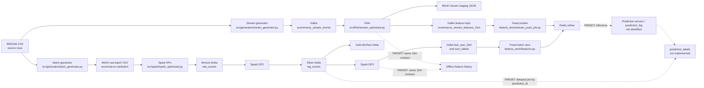

# Canonical Data Contract

## Purpose and status

This file is the source of truth for dataset meaning, grain, keys, timestamps, and intended ownership. It separates **CURRENT** (what the repository source/config declares) from **TARGET** (the agreed 15-minute purchase-propensity design). A source declaration proves only that code/config exists. Runtime schemas, row counts, delivery guarantees, and rubric completion remain **unverified** until a named run reads data back and records evidence.

Related documents: [TARGET_ARCHITECTURE.md](TARGET_ARCHITECTURE.md) describes the intended system; [CURRENT_IMPLEMENTATION.md](CURRENT_IMPLEMENTATION.md) maps source connections; [IMPLEMENTATION_ROADMAP.md](IMPLEMENTATION_ROADMAP.md) tracks work; [RUBRIC.md](RUBRIC.md) tracks workbook criteria.

## Problem and canonical target

For each eligible user and prediction minute `t`, estimate whether the user will make at least one `purchase` event in `[t, t + 1 hour)`. The model's canonical input is four behavioral features over event-time interval `[t - 15 minutes, t)`:

| Canonical feature | Type | Meaning |
| --- | --- | --- |
| `f_views_15m` | int64 | Count of `view` events for the user in the half-open 15-minute window |
| `f_carts_15m` | int64 | Count of `cart` events in that window |
| `f_purchases_15m` | int64 | Count of `purchase` events in that window |
| `total_spend_15m` | float64 | Sum of `price` for `purchase` events in that window |

The feature row grain is `(user_id, feature_timestamp)`. The prediction grain is one actual prediction `(prediction_id)`; the label grain is also `(prediction_id)`. A prediction uses the feature snapshot actually available to serving at its decision time. Late events arriving after the decision do not rewrite the historical prediction. A label stays pending until the complete one-hour outcome horizon and the chosen late-arrival/completeness policy have elapsed; only then may it become 0 or 1.

The canonical six business columns for an offline/online feature record are `user_id`, the four features above, and `feature_timestamp`. `feature_created_timestamp` is operational availability metadata, not a model feature. Feast's current `created` field can map to it after validating timestamp behavior. Do not confuse event time, window end, processing/creation time, and prediction time.

## Data principles

1. `event_time` is when an action happened; it does not say when the system received it. Record ingestion/availability separately when needed.
2. All canonical times are UTC. Current SQL/Parquet fields are often timestamp-without-time-zone and depend on code conventions; a readback must verify serialization and timezone handling.
3. All windows use `[start, end)` to avoid counting a boundary event twice.
4. Event facts are lossless relative to the accepted source event fields; feature aggregates are intentionally lossy and cannot replace event history.
5. Every deduplication key is a business rule, not a universal event identity. Current source has no stable source `event_id`.
6. Batch historical feature generation and Flink online feature generation must implement the same four-feature definitions and timestamp boundary semantics.
7. Offline history retains time-indexed feature rows; online serving exposes the latest valid feature row per entity. Feast defines retrieval/materialization and online access; it does not compute the canonical features.
8. A stored prediction must retain its actual feature snapshot (or an immutable reference to it) so labels and training rows cannot silently join to newer values.

## Timestamp dictionary

| Canonical concept | Meaning | Current source mapping / status |
| --- | --- | --- |
| `event_timestamp` | Event occurrence time in normalized UTC form | Silver `event_timestamp`, derived from raw `event_time`; Gold fact also carries it. In the Flink feature topic the same name currently means window end. Context is required. |
| `ingestion_timestamp` | Time accepted by the first durable system | Spark Bronze `ingestion_time`; DWH Bronze defaults `ingestion_time`. Kafka event payload does not carry a distinct arrival time. |
| `processed_timestamp` | Time a processing stage handled a record | No canonical persisted field found. Add only if a component needs it and its clock/meaning is defined. |
| `feature_timestamp` | As-of time / exclusive end of the feature window and point-in-time lookup key | Target canonical field. Current Spark 30d view uses `event_timestamp` at target-date midnight; Flink sets `event_timestamp` to HOP window end. |
| `feature_created_timestamp` | Time feature materialization/write made the row available | Target name. Current Spark/Feast uses `created`; Flink sink declares `created` from processing-time `CURRENT_TIMESTAMP`. Runtime meaning/UTC handling unverified. |
| `prediction_timestamp` | Decision time of a real model inference | Current label job creates minute timestamps from Silver activity; there is no identified prediction service/log, so this is not evidence an inference happened. |
| `label_window_start` | Inclusive beginning of the one-hour outcome interval | Target: equal to `prediction_timestamp`. Not stored as a separate current label column. |
| `label_window_end` | Exclusive end of the outcome interval | Target: `prediction_timestamp + 1 hour`. Not stored as a separate current label column. |
| `label_matured_timestamp` | Time the horizon/completeness rule permits final label assignment | Target only; not implemented. |
| `valid_from_timestamp` | Inclusive start of a dimension version | Current `dim_product.valid_from_ts`; target terminology mapping. |
| `valid_to_timestamp` | Exclusive end of a dimension version; null denotes open/current | Current `dim_product.valid_to_ts`; temporal join uses `< valid_to_ts` or null. |

## Dataset contracts

Types below describe source declarations and transformations, not a runtime readback. `nullable` is marked where the code/schema establishes it; otherwise it is not constrained by current producer code. Physical Delta paths refer to `src/spark/common.py` constants. PostgreSQL is a separate physical representation, not assumed byte-for-byte/schema identical to Delta.

### Source CSV event — CURRENT

- **Purpose / grain:** one REES46 CSV source row per event as provided by the file.
- **Producer:** external dataset; read by `src/generator/batch_generator.py` and `src/generator/stream_generator.py`.
- **Consumers:** batch generator → MinIO raw CSV; stream generator → Kafka event topic.
- **Physical location:** configured input path `2019-Oct.csv`; config also contains date ranges. Stream code has a hard-coded October byte offset and stops outside October. November replay is not currently wired in this config/code path.
- **Schema:** source header columns are split as CSV text. The generator parses selected values below. The source files were not rewritten/read through a data audit in this documentation task.

| Column | Logical type | Null/current behavior |
| --- | --- | --- |
| `event_time` | UTC timestamp text | Source string; parser preserves text. |
| `event_type` | string | Source value. |
| `product_id` | int64 | Stream parser: null if empty; invalid integer row skipped. |
| `category_id` | int64 | Stream parser: null if empty; invalid integer row skipped. |
| `category_code` | string | Stream parser: null if empty. |
| `brand` | string | Stream parser: null if empty. |
| `price` | float64 | Stream parser: 0.0 if empty; invalid number row skipped. |
| `user_id` | int64 | Stream parser: null if empty; invalid integer row skipped. |
| `user_session` | string | Stream parser: null if empty. |
| `discount_percent` | int32 | Added by generator for post-evolution data; random configured value, not present in original source schema. |

### Raw batch CSV objects — CURRENT

- **Purpose / grain:** generated copy of source events, split by configured schema-evolution date; offline ingestion input.
- **Producer:** batch generator (`src/generator/batch_generator.py`), config `config/generator_config.yaml`.
- **Consumers:** Spark DP1 in `src/spark/spark_optimized.py`; the Airflow DP1 DAG invokes that stage.
- **Physical location:** `s3://ecommerce-raw/batch/raw_events_old.csv` and `s3://ecommerce-raw/batch/raw_events_new.csv`; large mode may emit part files. Small mode also writes local output as defined by the generator.
- **Schema:** old part contains the nine source columns through `user_session`; new part adds `discount_percent`. CSV columns are textual on disk; Spark casts IDs to BIGINT and price to DOUBLE. Config says Oct 1–15 old and Oct 16–25 new. Sampling/date correctness and output contents have not been read back in this task.
- **Key/timestamps:** no enforced key; no separate ingestion timestamp in CSV. Event timestamp is source `event_time`.

### Stream event record and Kafka topic — CURRENT

- **Purpose / grain:** one produced event message (plus deliberately injected retry duplicates); Kafka transports events to Flink.
- **Producer:** `src/generator/stream_generator.py`, configured by `config/generator_config.yaml`.
- **Consumers:** Flink `src/flink/stream_optimized.py`; a parallel Flink sink persists event rows to raw staging.
- **Physical location:** Kafka topic `ecommerce_stream_events`, key `user_id`; staging JSON `s3://ecommerce-raw/staging/stream_events/`; archive prefix is declared in Spark config/source for post-ingest staging files.
- **Schema:** JSON has ten fields: the nine source fields plus generated `discount_percent` (BIGINT IDs, DOUBLE price, INT discount at Flink table declaration). No stable `event_id` or explicit arrival timestamp.
- **Key/timestamp:** Kafka key preserves per-user partition affinity, not event uniqueness. `event_time` is event time; broker timestamp is not mapped into the payload contract. Generator counters count attempted produce calls and callback errors are logged; do not interpret those counters as confirmed acknowledgements without readback.
- **Current mismatch:** config says the stream date range is Oct 26–31, while code uses October offset/prefix and stops after October. Configured burst multiplier is 30; module documentation says x10. Actual behavior needs a bounded fixture.

### Bronze Lakehouse `raw_events` — CURRENT

- **Purpose / grain:** ingested source event with arrival/ingestion metadata, before Silver cleanup.
- **Producer:** Spark DP1 batch and staged-stream ingestion.
- **Consumers:** Spark DP2 Silver transform; DWH sync script can copy Bronze to PostgreSQL.
- **Physical location:** Delta at `s3a://ecommerce-lakehouse/bronze/raw_events`; input roots are `s3a://ecommerce-raw/batch` and `s3a://ecommerce-raw/staging/stream_events`.
- **Schema:** `event_time STRING`, `event_type STRING`, `product_id BIGINT`, `category_id BIGINT`, `category_code STRING`, `brand STRING`, `price DOUBLE`, `user_id BIGINT`, `user_session STRING`, `discount_percent INT`, `ingestion_time TIMESTAMP`. The old CSV part is adapted with null discount. Spark adds `ingestion_time=current_timestamp()`.
- **Key/timestamps:** no business primary key; `ingestion_time` is processing/ingestion time, not event time. Runtime Delta snapshot/schema unverified.

### Silver Lakehouse `stg_events` — CURRENT

- **Purpose / grain:** one retained event after current deduplication and basic normalization.
- **Producer:** Spark DP2 (`process_silver_layer`).
- **Consumers:** Gold facts/dimensions, DP3 feature/label jobs, optional DWH sync.
- **Physical location:** Delta `s3a://ecommerce-lakehouse/silver/stg_events`, partitioned by `date`.
- **Schema:** Bronze columns retained, plus `event_timestamp TIMESTAMP`, `date DATE`, `category_level1 STRING`; raw `event_time` remains. `ingestion_time` is retained by the current withColumn chain. IDs are BIGINT; price DOUBLE; discount INT from Bronze.
- **Transform/key:** `dropDuplicates(user_id,event_time,product_id,event_type)`; this omits `user_session` and cannot distinguish identical-looking legitimate actions without source event id. `event_timestamp` parses the UTC suffix, `date` derives from it; null brand/category are filled with placeholders and category level is split from category code. No explicit quarantine table is written.
- **DWH variant:** PostgreSQL `silver.stg_events` has a surrogate `id`, omits `ingestion_time`, uses `discount_percent NUMERIC(5,2)` and declares several columns NOT NULL. It is a different physical schema.

### Gold dimensions and event fact — CURRENT

**`dim_product`**
- **Grain/key:** one observed product-attribute version; `product_sk` is MD5 of product id and `valid_from_ts`.
- **Producer/consumer:** Spark DP2; temporal join into `fact_user_events`, DWH sync/analytics.
- **Physical location:** Delta `s3a://ecommerce-lakehouse/gold/dim_product`; PostgreSQL `gold.dim_product` copy.
- **Columns:** `product_sk STRING`, `product_id BIGINT`, `category_id BIGINT`, `category_level1 STRING`, `brand STRING`, `price DOUBLE`, `discount_percent INT`, `valid_from_ts TIMESTAMP`, `valid_to_ts TIMESTAMP nullable`, `is_current BOOLEAN`.
- **Temporal rule:** join uses `[valid_from_ts, valid_to_ts)` and null end for current. Attributes are grouped to find earliest occurrence; ties in source ordering need deterministic-rule review.

**`dim_user`**
- **Grain/key:** one row per `user_id`; current code is a current aggregate, not historical user SCD2.
- **Producer/consumer:** Spark DP2; fact/analytics and DWH copy.
- **Physical location:** Delta `s3a://ecommerce-lakehouse/gold/dim_user`; PostgreSQL `gold.dim_user`.
- **Columns:** `user_id BIGINT`, `first_seen TIMESTAMP`, `last_seen TIMESTAMP`, `total_lifetime_events BIGINT`, `is_active BOOLEAN`, `valid_from_ts TIMESTAMP`, `valid_to_ts TIMESTAMP nullable`, `is_current BOOLEAN`.

**`fact_user_events`**
- **Grain:** one Silver event after left temporal product join; intended to reference one product version.
- **Producer/consumer:** Spark DP2; DWH/analytics. Gold fact is not the direct Flink feature consumer.
- **Physical location:** Delta `s3a://ecommerce-lakehouse/gold/fact_user_events`, partitioned by date; PostgreSQL `gold.fact_user_events`.
- **Columns:** `event_id STRING`, `event_timestamp TIMESTAMP`, raw `event_time STRING`, `date DATE`, `user_id BIGINT`, `product_sk STRING nullable in the Spark join result`, `category_level1 STRING`, `brand STRING`, `price DOUBLE`, `discount_percent INT`, `event_type STRING`, `user_session STRING`.
- **Key risk:** current event hash uses `(user_id,event_time,product_id)` and omits `event_type`; it is not enforced unique. PostgreSQL renames `event_timestamp` to `event_time`, makes `product_sk NOT NULL`, and adds surrogate `id`; load compatibility needs readback.

### Current batch feature table `feat_user_30d` — CURRENT, not canonical target

- **Purpose / grain:** one row per user for target-date midnight, aggregating a preceding date range.
- **Producer:** Spark DP3 `compute_feat_user_30d`.
- **Consumers:** Feast `user_batch_features_30d`, batch materialization, historical retrieval/training path.
- **Physical location:** Delta `s3a://ecommerce-lakehouse/gold/feat_user_30d`; clean Parquet export `s3a://ecommerce-lakehouse/feast/user_batch_features_30d/`; PostgreSQL `gold.feat_user_30d`.
- **Columns:** `user_id BIGINT`, `f_views_30d BIGINT`, `f_carts_30d BIGINT`, `f_purchases_30d BIGINT`, `f_spend_30d DOUBLE`, `f_distinct_categories_30d BIGINT`, `event_timestamp TIMESTAMP`, `created TIMESTAMP`, and Delta `date DATE` partition column (Parquet export drops `date`).
- **Timestamp/key:** Spark sets `event_timestamp` to target date at midnight; `created=current_timestamp()`. Not a 15-minute feature row and not aligned to prediction-minute grain. It remains in CURRENT code and is excluded from the canonical target model input.

### Current Flink 15-minute feature row — CURRENT, partial path

- **Purpose / grain:** per-user hopping-window aggregate, 15-minute size, one-minute slide.
- **Producer:** Flink optimized job from Kafka `ecommerce_stream_events`.
- **Consumers:** console print sink and Kafka feature topic `ecommerce_stream_features_15m`; Feast stream pusher consumes the topic.
- **Physical location:** Kafka topic plus a print sink. The raw event sink goes separately to MinIO staging. There is no direct Flink write to Redis.
- **Feature columns:** `user_id BIGINT`, `f_views_15m BIGINT`, `f_carts_15m BIGINT`, `f_purchases_15m BIGINT`, `total_spend_15m DOUBLE`, `event_timestamp TIMESTAMP(3)` (HOP_END), `created TIMESTAMP(3)` (processing time expression).
- **Key/time:** window row grain `(user_id, window_end)`; Kafka feature sink declares no key. Watermark is event time minus 15 minutes. Source dedup key is `(user_id,event_time,product_id,event_type)`. Window output and late correction behavior have not been run/read back. Current stream feature is not wired to a prediction service in inspected code.

### Target canonical offline/online feature history — TARGET, not implemented end-to-end

- **Purpose / grain:** one complete feature snapshot per user and feature timestamp, shared semantically between Spark history and Flink stream computation.
- **Producers:** Spark historical computation from canonical event history; Flink feature computation from accepted stream events. Both must share definitions, UTC handling, `[t-15m,t)` boundaries, dedup policy, and late-data availability semantics.
- **Consumers:** Feast offline retrieval/training joins; Feast online retrieval for inference; Airflow incremental materialization moves eligible offline history to online. Stream feature pusher separately writes each accepted realtime row to offline and online as required by rubric.
- **Physical location:** offline history in Delta/Parquet on MinIO; online latest state via Feast-managed Redis. Exact online key encoding belongs to Feast and is not a project contract.
- **Canonical schema/grain:** `user_id INT64 NOT NULL`, `f_views_15m INT64 NOT NULL`, `f_carts_15m INT64 NOT NULL`, `f_purchases_15m INT64 NOT NULL`, `total_spend_15m FLOAT64 NOT NULL`, `feature_timestamp TIMESTAMP_UTC NOT NULL`; logical key `(user_id, feature_timestamp)`; `feature_created_timestamp TIMESTAMP_UTC` is recommended availability metadata.
- **Status:** target contract only. Current Feast stream view uses 15m names but maps timestamps as `event_timestamp`/`created`; batch view remains 30d. FeatureService currently includes both views. No online/offline readback confirms parity or freshness.

### Current Feast configuration and online values — CURRENT

- **Purpose:** define entity, feature views, historical source and online store; retrieve/materialize/push values, not derive feature aggregates.
- **Producer:** `feature_store/features.py`, `feature_store/feature_store.yaml`; batch producer is Spark export, stream producer is Flink Kafka sink plus `feature_store/stream_push_job.py`.
- **Consumers:** materialization job/DAG and historical retrieval; Redis online store is intended for model-serving consumers, but no implemented prediction service was found in the inspected source.
- **Physical location:** Feast registry `feature_store/data/registry.db`; local provider; file offline store; Redis online store per config. Stream batch source points at `s3://ecommerce-lakehouse/gold/feat_user_stream/stream_features.parquet`, while pusher also manages that path. Exact source compatibility and write behavior require runtime verification.
- **Current views:** `user_batch_features_30d` has five 30d fields, 30-day TTL; `user_stream_features_15m` has four 15m fields, 2-hour TTL. `ecom_propensity_v1` combines both views (nine features), conflicting with the agreed 15m-only baseline.
- **Timestamp mapping:** both sources use `event_timestamp` and `created`, with Feast 0.38.0 declared in requirements/config. TTL is a configured online freshness horizon; it is not the 15m event window or a proof of offline retention.

### Current labels and target prediction/label records

**Current `user_labels`**
- **Grain:** `(user_id,prediction_timestamp)` generated from each minute with view/cart activity in Silver; this is a candidate minute, not a logged inference.
- **Producer:** Spark DP3 `compute_ground_truth_labels`.
- **Consumers:** PostgreSQL `gold.user_labels` sync and historical retrieval/training code.
- **Physical location:** Delta `s3a://ecommerce-lakehouse/gold/user_labels/date=...`; PostgreSQL `gold.user_labels`.
- **Columns:** `user_id BIGINT`, `prediction_timestamp TIMESTAMP`, `target_purchase_1h INT`, `date DATE`.
- **Current logic:** right-censors candidate times later than max event time minus one hour; label is 1 if a purchase exists in `[prediction_timestamp,prediction_timestamp+1h)`, otherwise 0. It does not persist prediction id, exact feature snapshot, explicit window boundaries, pending state, or maturation time. Completeness under late arrivals is not proven.

**Target `prediction_log` and `prediction_labels` — TARGET, no serving implementation identified**

| Dataset | Grain and columns | Producer | Consumer / storage |
| --- | --- | --- | --- |
| `prediction_log` | one row per `prediction_id`; `prediction_id STRING`, `user_id INT64`, `prediction_timestamp TIMESTAMP_UTC`, four canonical feature values, `feature_timestamp TIMESTAMP_UTC`, `score FLOAT64`, `model_version STRING` | Future prediction service reading Feast online values | Audit/debug and label join; durable Gold table/object storage. |
| `prediction_labels` | one row per `prediction_id`; `prediction_id STRING`, `label_window_start TIMESTAMP_UTC`, `label_window_end TIMESTAMP_UTC`, `target_purchase_1h INT8 nullable while pending`, `label_status STRING`, `label_matured_timestamp TIMESTAMP_UTC nullable` | Future delayed-label job joining actual persisted predictions to canonical purchase events | Training dataset builder; durable Gold table/object storage. |

Training rows must join by `prediction_id`, include the exact features used, and exclude pending labels. A date-only event dataset cannot prove what an actual serving system knew at prediction time.

## Current versus target matrix

| Concern | CURRENT source declaration | TARGET contract | Status |
| --- | --- | --- | --- |
| Batch source | October CSV, configured split/sample; generator behavior needs fixture/readback | October bootstrap with explicit, verified partition boundaries; November stream replay kept disjoint | MISMATCH / runtime unverified |
| Event identity/dedup | Composite field subset, no stable event id | Explicit source/event identity or documented conservative dedup rule | PARTIAL |
| Durable event history | Raw CSV, Bronze Delta, Silver Delta; Flink writes stream staging separately | Preserve accepted source events independently of lossy features | IMPLEMENTED IN SOURCE / runtime unverified |
| 15m feature semantics | Flink hopping window; Spark path currently computes 30d | Four identical per-user windows with same event-time, boundary and late availability semantics | PARTIAL |
| Feature keys/timestamps | Names overloaded as `event_timestamp`; Flink has HOP_END and `created` | `(user_id,feature_timestamp)` plus separate creation/availability time | MISMATCH |
| Offline and online stream writes | Kafka pusher supports online/offline/both; default is online | Demonstrate offline and online paths with readback | CODE EXISTS / not verified |
| Incremental materialize | Feast materializer and Airflow DAG exist for current batch view | Incremental offline-to-online for canonical feature view and stale-write policy | CODE EXISTS / target mismatch |
| Prediction log | No inference service or exact feature snapshot identified | Persist every prediction and exact inputs | NOT IMPLEMENTED / needs repo-wide final inventory |
| Labels | Silver-derived user/minute candidates, not prediction-linked | Delayed outcomes linked to persisted prediction id | MISMATCH |
| PostgreSQL mirror | DDL and copy code exist; schemas differ from Delta | Explicit documented mapping and reconciled readback | PARTIAL / runtime unverified |
| Rubric result | Code and workbook mappings exist | Evidence-backed criterion status | NOT VERIFIED |

## Lineage overview

Solid links below mean the producer/consumer connection is declared in inspected source/config. They do not assert successful runtime delivery. Dashed links are target-only or lack an identified implementation.

The stream's raw-event staging branch preserves event details for later history/reprocessing. The feature branch is a lossy aggregate for serving. Feast does not replace raw/clean event persistence, and raw event persistence does not replace time-indexed feature history. Spark and Flink must agree on feature meaning before their outputs can safely train/serve the same model.

## Known contract gaps to resolve in implementation milestones

1. Validate generator boundaries, CSV parsing, schema split, sampling, and stream source/date mismatch on a tiny fixture before any large run.
2. Choose a stable event identity/dedup policy; current composite dedup can merge distinct events and fact hash omits event type.
3. Align Spark historical and Flink realtime 15m feature definitions, timestamp field, watermark/late-data availability policy, and output keys.
4. Decide whether prediction is minute-scheduled, event-triggered with minute bucketing, or another policy; keep training availability semantics identical to inference.
5. Replace candidate-event labels with delayed labels attached only to persisted predictions; define maturation/completeness and pending handling.
6. Verify Feast 0.38 offline/online push, incremental materialization, TTL/freshness, and stale-write behavior using an isolated fixture and readback.
7. Define a mapping and reconciliation between Delta and PostgreSQL representations; never infer success from DDL or a DAG trigger.
