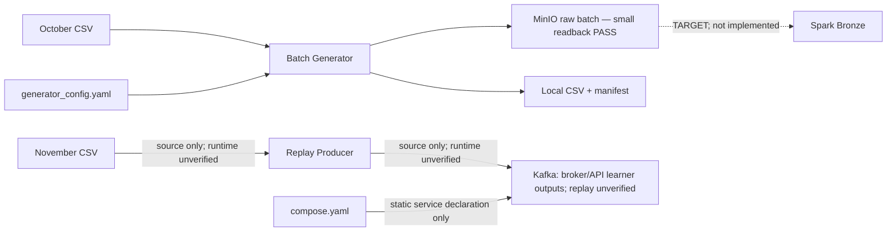
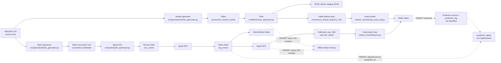

# Canonical Data Contract

## Purpose and status

This file is the source of truth for dataset meaning, grain, keys, timestamps, and intended ownership. It separates **CURRENT rebuild-clean** (source/config present on this branch), **LEGACY old-vibe-backup** (historical source declarations, not current implementation), and **TARGET** (the agreed 15-minute purchase-propensity design). A source declaration proves only that code/config exists. Runtime claims require named readback evidence. Batch Generator now has [small MinIO readback evidence](docs/batch_generator_minio.md) for 1,020,000 output rows; delivery guarantees, downstream pipelines and full-scale output remain **unverified**.

Related documents: [TARGET_ARCHITECTURE.md](TARGET_ARCHITECTURE.md) describes the intended system; [CURRENT_IMPLEMENTATION.md](CURRENT_IMPLEMENTATION.md) maps source connections; [IMPLEMENTATION_ROADMAP.md](IMPLEMENTATION_ROADMAP.md) tracks work; [RUBRIC.md](RUBRIC.md) tracks workbook criteria.

## Branch scope

- **CURRENT rebuild-clean:** Batch Generator, its YAML/config/tests and Compose declarations for MinIO plus Kafka. Small Batch Generator → MinIO runtime readback PASS; Replay Producer/readback source và unit tests đã có; November replay/restart/persistence runtime NOT VERIFIED; no downstream implementation. Broker/API learner outputs được phân loại riêng trong CURRENT_IMPLEMENTATION.md. Retained dependency/config declarations do not prove a service or consumer exists.
- **LEGACY old-vibe-backup:** historical Spark/Flink/Feast/Airflow/DWH/governance/stream source, recorded at snapshot `2cf00cf`. Paths, schemas and mismatches marked LEGACY below are reference only; reuse requires validation against TARGET.
- **TARGET:** learner-approved DE flow ends at a Feature–Label Dataset; implementation gaps remain. See [target flow and OPEN decisions](TARGET_ARCHITECTURE.md).

## Problem and canonical target

For each selected `(user_id,t)` sample, create four features over `[t-15m,t)` and a label indicating purchase in `[t,t+1h)`. Here `t=feature_timestamp`; cadence/eligibility remains OPEN, not necessarily every minute. The DE output is a Feature–Label Dataset, not a trained model.

| Canonical feature | Type | Meaning |
| --- | --- | --- |
| `views_15m` | int64 | Count of `view` events for the user in the half-open 15-minute window |
| `carts_15m` | int64 | Count of `cart` events in that window |
| `purchases_15m` | int64 | Count of `purchase` events in that window |
| `total_spend_15m` | float64 | Sum of `price` for `purchase` events in that window |

Feature and historical label grain is `(user_id, feature_timestamp)` in both October and November. Label computation uses sample identity/time and clean purchase events, not the four feature values. A label stays PENDING until the one-hour horizon and coverage/completeness policy permit finalization; then it is 1 if a qualifying purchase exists, otherwise 0.

Feature records contain `user_id`, the four features, `feature_timestamp` and `created_timestamp`. Creation time is operational metadata, not a feature or proof of online availability. Event time, arrival/ingestion time, feature window end, creation time and future prediction time are distinct. Mapping LEGACY `event_timestamp`/`created` (also rubric temporal names) to target fields requires explicit verification.

## Data principles

1. `event_time` is when an action happened; it does not say when the system received it. Record ingestion/availability separately when needed.
2. All canonical times are UTC. LEGACY SQL/Parquet fields are often timestamp-without-time-zone and depend on code conventions; a readback must verify serialization and timezone handling.
3. All windows use `[start, end)` to avoid counting a boundary event twice.
4. Event facts are lossless relative to the accepted source event fields; feature aggregates are intentionally lossy and cannot replace event history.
5. Every deduplication key is a business rule, not a universal event identity. Current source has no stable source `event_id`.
6. Batch historical feature generation and Flink online feature generation must implement the same four-feature definitions and timestamp boundary semantics.
7. Offline history retains time-indexed feature rows; online serving exposes the latest valid feature row per entity. Feast defines retrieval/materialization and online access; it does not compute the canonical features.
8. Dataset rows join finalized labels to the matching `(user_id,feature_timestamp)` snapshot/revision. Future production predictions must preserve exact inputs; that separate production linkage does not define historical label identity.

## Timestamp dictionary

| Canonical concept | Meaning | CURRENT rebuild-clean / LEGACY mapping / TARGET status |
| --- | --- | --- |
| `event_timestamp` | Event occurrence time in normalized UTC form | CURRENT: raw CSV retains `event_time`; normalized field not implemented. LEGACY: Silver `event_timestamp`, derived from raw `event_time`; Gold fact also carries it. In the Flink feature topic the same name in LEGACY means window end. Context is required. |
| `ingestion_timestamp` | Time accepted by the first durable system | CURRENT: no separate CSV ingestion timestamp. LEGACY: Spark Bronze `ingestion_time`; DWH Bronze defaults `ingestion_time`. Kafka event payload does not carry a distinct arrival time. |
| `processed_timestamp` | Time a processing stage handled a record | No canonical persisted field found. Add only if a component needs it and its clock/meaning is defined. |
| `feature_timestamp` | As-of time / exclusive end of the feature window and point-in-time lookup key | CURRENT: no feature implementation. Target canonical field. LEGACY Spark 30d view uses `event_timestamp` at target-date midnight; Flink sets `event_timestamp` to HOP window end. |
| `created_timestamp` | Time the feature record was created; not necessarily its online availability time | CURRENT: no feature implementation. Target name. LEGACY Spark/Feast uses `created`; Flink sink declares `created` from processing-time `CURRENT_TIMESTAMP`. LEGACY runtime meaning/UTC handling unverified. |
| `prediction_timestamp` | Decision time of a real model inference | CURRENT: no label job. LEGACY label job creates minute timestamps from Silver activity; there is no identified prediction service/log, so this is not evidence an inference happened. |
| `label_window_start` | Inclusive beginning of the one-hour outcome interval | Historical target: `feature_timestamp`; future production outcome: `prediction_timestamp`. Not stored as a separate LEGACY label column. |
| `label_window_end` | Exclusive end of the outcome interval | Historical target: `feature_timestamp + 1 hour`; future production outcome: `prediction_timestamp + 1 hour`. Not stored as a separate LEGACY label column. |
| `label_matured_timestamp` | Time the horizon/completeness rule permits final label assignment | Target only; not implemented. |
| `valid_from_timestamp` | Inclusive start of a dimension version | CURRENT: no dimension implementation. LEGACY `dim_product.valid_from_ts`; target terminology mapping. |
| `valid_to_timestamp` | Exclusive end of a dimension version; null denotes open/current | CURRENT: no dimension implementation. LEGACY `dim_product.valid_to_ts`; temporal join uses `< valid_to_ts` or null. |

## Dataset contracts

CURRENT sections describe retained source and link named runtime evidence. LEGACY sections preserve historical declarations; none establish runtime on rebuild-clean. LEGACY Delta paths refer to removed `src/spark/common.py` constants. PostgreSQL and Delta were separate physical representations. Logical types below do not establish enforced CSV types/nullability.

### Source CSV event — CURRENT rebuild-clean

- **Purpose / grain:** one REES46 CSV source row per event as provided by the file.
- **Producer:** external dataset; CURRENT readers are `src/generator/batch_generator.py` and `src/generator/replay_producer.py`. LEGACY reader `src/generator/stream_generator.py` is absent from rebuild-clean.
- **Consumers:** CURRENT Batch Generator → MinIO raw CSV. CURRENT November Replay Producer → Kafka is implemented but runtime unverified; historical stream behavior is LEGACY below.
- **Physical location:** batch input `2019-Oct.csv`; streaming config declares `2019-Nov.csv`, UTC interval `[2019-11-01,2019-12-01)`. Replay Producer và Compose Kafka đã có source; CLI November → Kafka chưa được learner verify runtime.
- **Schema:** source header columns are split as CSV text. Batch Generator uses pandas CSV parsing/type inference and UTC event_time classification; Replay Producer validation/null rules được ghi trong CURRENT stream contract bên dưới; removed parser rules vẫn là LEGACY. The source files were not rewritten/read through a data audit in this documentation task.

| Column | Logical type | CURRENT behavior / LEGACY parser behavior |
| --- | --- | --- |
| `event_time` | UTC timestamp text | Source string; parser preserves text. |
| `event_type` | string | Source value. |
| `product_id` | int64 | CURRENT batch: pandas inference; replay: bắt buộc int64, empty/invalid gây lỗi. LEGACY: null if empty; invalid integer row skipped. |
| `category_id` | int64 | CURRENT batch: pandas inference; replay: bắt buộc int64, empty/invalid gây lỗi. LEGACY: null if empty; invalid integer row skipped. |
| `category_code` | string | CURRENT batch: pandas inference; replay: empty → JSON null. LEGACY: null if empty. |
| `brand` | string | CURRENT batch: pandas inference; replay: empty → JSON null. LEGACY: null if empty. |
| `price` | float64 | CURRENT batch: pandas inference; replay: finite float bắt buộc, empty/NaN/Infinity gây lỗi. LEGACY: 0.0 if empty; invalid number row skipped. |
| `user_id` | int64 | CURRENT batch: pandas inference; replay: bắt buộc int64, empty/invalid gây lỗi. LEGACY: null if empty; invalid integer row skipped. |
| `user_session` | string | CURRENT batch: pandas inference; replay: empty → JSON null. LEGACY: null if empty. |
| `discount_percent` | int32 | Added by generator for post-evolution data; random configured value, not present in original source schema. |

### Raw batch CSV objects — CURRENT rebuild-clean

- **Purpose / grain:** generated copy of source events, split by configured schema-evolution date; offline ingestion input.
- **Producer:** batch generator (`src/generator/batch_generator.py`), config `config/generator_config.yaml`.
- **Consumers:** no downstream consumer implemented on rebuild-clean. TARGET Spark raw → Bronze; LEGACY Spark DP1/Airflow paths are described below.
- **Physical location:** `s3://ecommerce-raw/batch/raw_events_old.csv` and `s3://ecommerce-raw/batch/raw_events_new.csv`; large mode may emit part files. Small mode also writes local output as defined by the generator.
- **Schema:** old part contains the nine source columns through `user_session`; new part adds `discount_percent`. CSV columns are textual on disk; LEGACY Spark casts IDs to BIGINT and price to DOUBLE, but no Spark implementation exists on rebuild-clean. Config defines UTC BATCH `[2019-10-01,2019-11-01)`, OLD `[2019-10-01,2019-10-16)` and NEW `[2019-10-16,2019-11-01)`. The shared classifier parses event_time before sampling; row position never determines schema membership. Small mode uses independently seeded random-priority reservoirs, quotas floor(N/2) OLD and remainder NEW. A short population is returned without duplication or quota transfer. INVALID and EXCLUDED counts are logged and persisted in the small manifest. [Batch Generator evidence](docs/batch_generator.md) verifies fixture boundaries and local 1,000-source-row sample readback (510 output rows per group after existing transformation); [Small MinIO readback](docs/batch_generator_minio.md) verifies 510,000 rows per schema, exact headers/field counts, total bytes and CSV equality to local. Full October output and ≥100 GB remain NOT YET VERIFIED.
- **Key/timestamps:** no enforced key; no separate ingestion timestamp in CSV. Event timestamp is source `event_time`.

### Stream event record and Kafka topic — CURRENT rebuild-clean

- **Status:** implemented + fixture/fake-client unit verification; native November replay, late/duplicate readback, broker persistence and restart/resume are **NOT VERIFIED**. Existing broker/API learner outputs are separate from CLI verification.
- **Producer / consumer:** `src/generator/replay_producer.py` delegates delivery/scheduling to `src/generator/replay_runtime.py`; bounded audit consumer is `scripts/verify_kafka_replay.py`. Flink and durable stream archive remain absent.
- **Input / grain:** source-order November CSV over `[2019-11-01,2019-12-01)` UTC, one message per accepted source event plus injected copies. `max-events` bounds accepted source events, not message count. Strict header/field count, parsed UTC non-decreasing timestamp, int64 IDs and finite price; invalid records fail with record/physical-line location, valid out-of-range records are excluded. `event_type` is nonempty but not enum-validated; finite price is not constrained nonnegative.
- **Payload / key:** UTF-8 JSON preserves nine source fields plus deterministic configured integer `discount_percent`; IDs are JSON integers, price a finite JSON number, optional empty category_code/brand/user_session become null. Key is UTF-8 `str(user_id)`, not event identity. No business `event_id` is invented.
- **Time / injection:** payload `event_time` retains original UTC text. Kafka record timestamp is not set to 2019; producer uses client default send timestamp (broker readback unverified). Late events keep original payload and release when source progress reaches `event_time + delay`; configured 5–10 minutes are event-time displacement, not real waiting. End-of-input releases pending events as `end_flush`, separately from full-delay `due`. Rate is submissions per real second including duplicates; duplicate is one extra same key/value with a distinct copy header. Burst is disabled/outside implemented scope.
- **Provenance / recovery:** headers carry replay_run, source_record, copy, release, delay_seconds and progress. Source record provenance is not a downstream business dedup rule. Checkpoint stores source position and pending late entries only after emitted messages ACK; source path/size/mtime, settings and Kafka cluster/topic ID/partition set must match on resume. At-least-once after process crash, not exactly-once; resume reparses/skips the prefix. Native restart semantics still require runtime verification.
- **Bounded verification:** `acks.jsonl` stores expected key/value/headers and ACK partition/offset up to configured cap; counters continue beyond the cap, readback scope becomes `sample_only`. Verifier compares journal targets and due thresholds, not an independent reconstruction of all source fault choices or Flink watermark behavior. Crash may leave additional uncheckpointed Kafka messages outside the recovered journal; readback does not prove absence of those duplicates.

## LEGACY dataset declarations — old-vibe-backup

Sections explicitly marked LEGACY describe producer/consumer implementation files absent from rebuild-clean; retained config/source CSV references may still exist. Their schemas/rules are historical reference, not current TARGET or runtime evidence. Interleaved TARGET sections below describe the learner-approved contracts separately.

### Stream event record and Kafka topic — LEGACY old-vibe-backup

- **Purpose / grain:** one produced event message (plus deliberately injected retry duplicates); Kafka transports events to Flink.
- **Producer:** `src/generator/stream_generator.py`, configured by `config/generator_config.yaml`.
- **Consumers:** Flink `src/flink/stream_optimized.py`; a parallel Flink sink persists event rows to raw staging.
- **Physical location:** Kafka topic `ecommerce_stream_events`, key `user_id`; staging JSON `s3://ecommerce-raw/staging/stream_events/`; archive prefix is declared in Spark config/source for post-ingest staging files.
- **Schema:** JSON has ten fields: the nine source fields plus generated `discount_percent` (BIGINT IDs, DOUBLE price, INT discount at Flink table declaration). No stable `event_id` or explicit arrival timestamp.
- **Key/timestamp:** Kafka key preserves per-user partition affinity, not event uniqueness. `event_time` is event time; broker timestamp is not mapped into the payload contract. Generator counters count attempted produce calls and callback errors are logged; do not interpret those counters as confirmed acknowledgements without readback.
- **Legacy mismatch:** config says the stream date range is Oct 26–31, while code uses October offset/prefix and stops after October. Configured burst multiplier is 30; module documentation says x10. Actual behavior needs a bounded fixture.

### Bronze Lakehouse `raw_events` — LEGACY old-vibe-backup

- **Purpose / grain:** ingested source event with arrival/ingestion metadata, before Silver cleanup.
- **Producer:** Spark DP1 batch and staged-stream ingestion.
- **Consumers:** Spark DP2 Silver transform; DWH sync script can copy Bronze to PostgreSQL.
- **Physical location:** Delta at `s3a://ecommerce-lakehouse/bronze/raw_events`; input roots are `s3a://ecommerce-raw/batch` and `s3a://ecommerce-raw/staging/stream_events`.
- **Schema:** `event_time STRING`, `event_type STRING`, `product_id BIGINT`, `category_id BIGINT`, `category_code STRING`, `brand STRING`, `price DOUBLE`, `user_id BIGINT`, `user_session STRING`, `discount_percent INT`, `ingestion_time TIMESTAMP`. The old CSV part is adapted with null discount. Spark adds `ingestion_time=current_timestamp()`.
- **Key/timestamps:** no business primary key; `ingestion_time` is processing/ingestion time, not event time. Runtime Delta snapshot/schema unverified.

### Silver Lakehouse `stg_events` — LEGACY old-vibe-backup

- **Purpose / grain:** one retained event after legacy deduplication and basic normalization.
- **Producer:** Spark DP2 (`process_silver_layer`).
- **Consumers:** Gold facts/dimensions, DP3 feature/label jobs, optional DWH sync.
- **Physical location:** Delta `s3a://ecommerce-lakehouse/silver/stg_events`, partitioned by `date`.
- **Schema:** Bronze columns retained, plus `event_timestamp TIMESTAMP`, `date DATE`, `category_level1 STRING`; raw `event_time` remains. `ingestion_time` is retained by the legacy withColumn chain. IDs are BIGINT; price DOUBLE; discount INT from Bronze.
- **Transform/key:** `dropDuplicates(user_id,event_time,product_id,event_type)`; this omits `user_session` and cannot distinguish identical-looking legitimate actions without source event id. `event_timestamp` parses the UTC suffix, `date` derives from it; null brand/category are filled with placeholders and category level is split from category code. No explicit quarantine table is written.
- **DWH variant:** PostgreSQL `silver.stg_events` has a surrogate `id`, omits `ingestion_time`, uses `discount_percent NUMERIC(5,2)` and declares several columns NOT NULL. It is a different physical schema.

### Gold dimensions and event fact — LEGACY old-vibe-backup

**`dim_product`**
- **Grain/key:** one observed product-attribute version; `product_sk` is MD5 of product id and `valid_from_ts`.
- **Producer/consumer:** Spark DP2; temporal join into `fact_user_events`, DWH sync/analytics.
- **Physical location:** Delta `s3a://ecommerce-lakehouse/gold/dim_product`; PostgreSQL `gold.dim_product` copy.
- **Columns:** `product_sk STRING`, `product_id BIGINT`, `category_id BIGINT`, `category_level1 STRING`, `brand STRING`, `price DOUBLE`, `discount_percent INT`, `valid_from_ts TIMESTAMP`, `valid_to_ts TIMESTAMP nullable`, `is_current BOOLEAN`.
- **Temporal rule:** join uses `[valid_from_ts, valid_to_ts)` and null end for current. Attributes are grouped to find earliest occurrence; ties in source ordering need deterministic-rule review.

**`dim_user`**
- **Grain/key:** one row per `user_id`; legacy code is a current aggregate, not historical user SCD2.
- **Producer/consumer:** Spark DP2; fact/analytics and DWH copy.
- **Physical location:** Delta `s3a://ecommerce-lakehouse/gold/dim_user`; PostgreSQL `gold.dim_user`.
- **Columns:** `user_id BIGINT`, `first_seen TIMESTAMP`, `last_seen TIMESTAMP`, `total_lifetime_events BIGINT`, `is_active BOOLEAN`, `valid_from_ts TIMESTAMP`, `valid_to_ts TIMESTAMP nullable`, `is_current BOOLEAN`.

**`fact_user_events`**
- **Grain:** one Silver event after left temporal product join; intended to reference one product version.
- **Producer/consumer:** Spark DP2; DWH/analytics. Gold fact is not the direct Flink feature consumer.
- **Physical location:** Delta `s3a://ecommerce-lakehouse/gold/fact_user_events`, partitioned by date; PostgreSQL `gold.fact_user_events`.
- **Columns:** `event_id STRING`, `event_timestamp TIMESTAMP`, raw `event_time STRING`, `date DATE`, `user_id BIGINT`, `product_sk STRING nullable in the Spark join result`, `category_level1 STRING`, `brand STRING`, `price DOUBLE`, `discount_percent INT`, `event_type STRING`, `user_session STRING`.
- **Key risk:** legacy event hash uses `(user_id,event_time,product_id)` and omits `event_type`; it is not enforced unique. PostgreSQL renames `event_timestamp` to `event_time`, makes `product_sk NOT NULL`, and adds surrogate `id`; load compatibility needs readback.

### Legacy batch feature table `feat_user_30d` — LEGACY old-vibe-backup, not canonical target

- **Purpose / grain:** one row per user for target-date midnight, aggregating a preceding date range.
- **Producer:** Spark DP3 `compute_feat_user_30d`.
- **Consumers:** Feast `user_batch_features_30d`, batch materialization, historical retrieval/training path.
- **Physical location:** Delta `s3a://ecommerce-lakehouse/gold/feat_user_30d`; clean Parquet export `s3a://ecommerce-lakehouse/feast/user_batch_features_30d/`; PostgreSQL `gold.feat_user_30d`.
- **Columns:** `user_id BIGINT`, `f_views_30d BIGINT`, `f_carts_30d BIGINT`, `f_purchases_30d BIGINT`, `f_spend_30d DOUBLE`, `f_distinct_categories_30d BIGINT`, `event_timestamp TIMESTAMP`, `created TIMESTAMP`, and Delta `date DATE` partition column (Parquet export drops `date`).
- **Timestamp/key:** Spark sets `event_timestamp` to target date at midnight; `created=current_timestamp()`. Not a 15-minute feature row and not aligned to prediction-minute grain. It exists only in LEGACY code and is excluded from the canonical target model input.

### Legacy Flink 15-minute feature row — LEGACY old-vibe-backup, partial path

- **Purpose / grain:** per-user hopping-window aggregate, 15-minute size, one-minute slide.
- **Producer:** Flink optimized job from Kafka `ecommerce_stream_events`.
- **Consumers:** console print sink and Kafka feature topic `ecommerce_stream_features_15m`; Feast stream pusher consumes the topic.
- **Physical location:** Kafka topic plus a print sink. The raw event sink goes separately to MinIO staging. There is no direct Flink write to Redis.
- **Feature columns:** `user_id BIGINT`, `f_views_15m BIGINT`, `f_carts_15m BIGINT`, `f_purchases_15m BIGINT`, `total_spend_15m DOUBLE`, `event_timestamp TIMESTAMP(3)` (HOP_END), `created TIMESTAMP(3)` (processing time expression).
- **Key/time:** window row grain `(user_id, window_end)`; Kafka feature sink declares no key. Watermark is event time minus 15 minutes. Source dedup key is `(user_id,event_time,product_id,event_type)`. Window output and late correction behavior have not been run/read back. Legacy stream feature is not wired to a prediction service in inspected code.

### Target canonical offline/online feature history — TARGET, not implemented end-to-end

- **Purpose / grain:** one complete feature snapshot per user and feature timestamp, shared semantically between Spark history and Flink stream computation.
- **Producers:** Spark historical computation from canonical event history; Flink feature computation from accepted stream events. Both must share definitions, UTC handling, `[t-15m,t)` boundaries, dedup policy, and late-data availability semantics.
- **Consumers:** Feast offline retrieval/training joins; Feast online retrieval for inference; Airflow incremental materialization moves eligible offline history to online. Realtime writes must support offline and online stores as required by rubric; exact deployable job mapping is OPEN.
- **Physical location:** offline `feat_user_15m` history on MinIO; Delta/Parquet access mapping and Feast compatibility remain OPEN; online latest state via Feast-managed Redis. Exact online key encoding belongs to Feast and is not a project contract.
- **Canonical schema/grain:** `user_id INT64 NOT NULL`, `views_15m INT64 NOT NULL`, `carts_15m INT64 NOT NULL`, `purchases_15m INT64 NOT NULL`, `total_spend_15m FLOAT64 NOT NULL`, `feature_timestamp TIMESTAMP_UTC NOT NULL`; logical key `(user_id, feature_timestamp)`; `created_timestamp TIMESTAMP_UTC` records creation time, not guaranteed online availability. Revision/correction policy remains OPEN; logical grain does not settle revision storage.
- **Status:** target contract only; no Spark/Flink/Feast implementation on rebuild-clean. LEGACY Feast stream view uses 15m names but maps timestamps as `event_timestamp`/`created`; batch view remains 30d. LEGACY FeatureService includes both views. No online/offline readback confirms parity or freshness.

### Historical label history and Feature–Label Dataset — TARGET, not implemented

- **Label history:** `labels_purchase_1h` on MinIO; grain/key `(user_id,feature_timestamp)`, with `t=feature_timestamp`. Logical fields: `user_id`, `feature_timestamp`, `label` (unresolved while pending, otherwise 0/1), `window_start=t`, `window_end=t+1h`, and maturity/finalized status. Physical status column names/enums, paths, retention/versioning and correction policy remain OPEN.
- **October producer:** Historical Label Job reads selected historical `(user_id,t)` samples plus clean October Silver purchase events.
- **November producer:** Delayed Label Job reads durably stored identities of selected realtime snapshots plus clean persisted November Silver purchase events. It waits for horizon and completeness; Flink need not wait an hour or generate labels. Spark/Python job technology and deployable mapping remain OPEN.
- **Rule:** any qualifying purchase in `[t,t+1h)` gives 1, otherwise 0 only when coverage/completeness permits finalization. Missing coverage is PENDING, not an assumed negative. Jobs may share logic.
- **Dataset Builder:** historical feature retrieval through Feast plus label history; join `(user_id,feature_timestamp)` and select the matching snapshot/revision. Spark/Python choice remains OPEN.
- **Dataset output:** `user_id`, `feature_timestamp`, `views_15m`, `carts_15m`, `purchases_15m`, `total_spend_15m`, `label`, with reproducibility/version/provenance metadata. MinIO storage; physical layout/versioning OPEN. Only finalized labels and adequate coverage are eligible. Training/model/prediction are downstream and outside current DE flow.
- **Coverage warning:** sampled events and timestamp-shifted benchmark replicas are not automatically a complete source for either window; the full feature/label source remains OPEN.

### Legacy Feast configuration and online values — LEGACY old-vibe-backup

- **Purpose:** define entity, feature views, historical source and online store; retrieve/materialize/push values, not derive feature aggregates.
- **Producer:** `feature_store/features.py`, `feature_store/feature_store.yaml`; batch producer is Spark export, stream producer is Flink Kafka sink plus `feature_store/stream_push_job.py`.
- **Consumers:** materialization job/DAG and historical retrieval; Redis online store is intended for model-serving consumers, but no implemented prediction service was found in the inspected source.
- **Physical location:** Feast registry `feature_store/data/registry.db`; local provider; file offline store; Redis online store per config. Stream batch source points at `s3://ecommerce-lakehouse/gold/feat_user_stream/stream_features.parquet`, while pusher also manages that path. Exact source compatibility and write behavior require runtime verification.
- **Legacy views:** `user_batch_features_30d` has five 30d fields, 30-day TTL; `user_stream_features_15m` has four 15m fields, 2-hour TTL. `ecom_propensity_v1` combines both views (nine features), conflicting with the agreed 15m-only baseline.
- **Timestamp mapping:** both sources use `event_timestamp` and `created`, with Feast 0.38.0 declared in requirements/config. TTL is a configured online freshness horizon; it is not the 15m event window or a proof of offline retention.

### Legacy labels and target prediction/label records

**LEGACY old-vibe-backup `user_labels` — absent from rebuild-clean**
- **Grain:** `(user_id,prediction_timestamp)` generated from each minute with view/cart activity in Silver; this is a candidate minute, not a logged inference.
- **Producer:** Spark DP3 `compute_ground_truth_labels`.
- **Consumers:** PostgreSQL `gold.user_labels` sync and historical retrieval/training code.
- **Physical location:** Delta `s3a://ecommerce-lakehouse/gold/user_labels/date=...`; PostgreSQL `gold.user_labels`.
- **Columns:** `user_id BIGINT`, `prediction_timestamp TIMESTAMP`, `target_purchase_1h INT`, `date DATE`.
- **Legacy logic:** right-censors candidate times later than max event time minus one hour; label is 1 if a purchase exists in `[prediction_timestamp,prediction_timestamp+1h)`, otherwise 0. It does not persist prediction id, exact feature snapshot, explicit window boundaries, pending state, or maturation time. Completeness under late arrivals is not proven.

**Future production `prediction_log` and `prediction_labels` — outside current DE scope, not implemented**

| Dataset | Grain and columns | Producer | Consumer / storage |
| --- | --- | --- | --- |
| `prediction_log` | one row per `prediction_id`; `prediction_id STRING`, `user_id INT64`, `prediction_timestamp TIMESTAMP_UTC`, four canonical feature values, `feature_timestamp TIMESTAMP_UTC`, `score FLOAT64`, `model_version STRING` | Future prediction service reading Feast online values | Audit/debug and label join; durable Gold table/object storage. |
| `prediction_labels` | one row per `prediction_id`; `prediction_id STRING`, `label_window_start TIMESTAMP_UTC`, `label_window_end TIMESTAMP_UTC`, `target_purchase_1h INT8 nullable while pending`, `label_status STRING`, `label_matured_timestamp TIMESTAMP_UTC nullable` | Future delayed-label job joining actual persisted predictions to canonical purchase events | Training dataset builder; durable Gold table/object storage. |

Future production examples link by `prediction_id` and retain exact logged features with completed outcomes. Historical DE datasets instead join `(user_id,feature_timestamp)`; these records do not define their label identity. The feature-time versus prediction-time relation remains OPEN. A date-only event dataset cannot prove what an actual serving system knew at prediction time.

## Current versus target matrix

| Concern | CURRENT rebuild-clean | TARGET contract | Status / LEGACY comparison |
| --- | --- | --- | --- |
| Batch source | October CSV; parsed UTC classification then deterministic per-schema sampling; shared classifier in benchmark | Full October batch `[Oct 01,Nov 01)`; V2 begins Oct 16; November is stream source | UNIT-VERIFIED + SMALL-RUNTIME-VERIFIED locally ([Batch Generator](docs/batch_generator.md)); [small MinIO readback PASS](docs/batch_generator_minio.md); full output/≥100 GB/November stream NOT YET VERIFIED |
| Kafka Stream Replay | Kafka 4.1.2 Compose, November Replay Producer and bounded verifier | Bounded replay with actual ack and consumer readback | STATIC/UNIT VERIFIED; native November replay/restart/persistence NOT VERIFIED |
| Event identity/dedup | Raw batch has no stable event_id; no downstream dedup implementation | Explicit source/event identity or documented conservative dedup rule | NOT IMPLEMENTED; LEGACY composite dedup is reference only |
| Durable event history | Raw CSV objects in MinIO; no Bronze/Silver or stream archive implementation | Preserve accepted source events independently of lossy features | SMALL RAW READBACK PASS; downstream NOT IMPLEMENTED |
| 15m feature semantics | No Spark/Flink feature implementation | Four identical per-user windows with same event-time, boundary and late availability semantics | NOT IMPLEMENTED; LEGACY 30d/hopping-window mismatch |
| Feature keys/timestamps | No feature producer; raw event_time retained | `(user_id,feature_timestamp)` plus separate creation/availability time | NOT IMPLEMENTED; LEGACY event_timestamp/created mappings only |
| Offline and online stream writes | No Kafka/Feast stream pusher | Demonstrate offline and online paths with readback | NOT IMPLEMENTED; LEGACY pusher only |
| Incremental materialize | No Feast materializer or Airflow DAG | Incremental offline-to-online for canonical feature view and stale-write policy | NOT IMPLEMENTED; LEGACY materializer only |
| Prediction log | No prediction service/log implementation | Future production only; outside current DE flow | NOT IMPLEMENTED |
| Labels / dataset | No label job/table or Dataset Builder implementation | Both lanes: `(user_id,feature_timestamp)`, `[t,t+1h)`, finalized labels joined to matching feature snapshots | NOT IMPLEMENTED; see TARGET contracts above |
| PostgreSQL mirror | No DDL/copy implementation or PostgreSQL service | Explicit documented mapping and reconciled readback | NOT IMPLEMENTED; LEGACY mappings only |
| Rubric result | Batch Generator/MinIO evidence and workbook mapping; downstream absent | Evidence-backed criterion status | SMALL INTEGRATION PASS; see RUBRIC; ≥100 GB NOT VERIFIED |

## Lineage overview — CURRENT rebuild-clean

Solid links describe retained source connections; CSV → raw/local and MinIO readback are verified for the named small run. Dashed links are TARGET requirements with no implementation on this branch.

### LEGACY old-vibe-backup lineage (reference only)

Solid links in this historical diagram describe LEGACY source declarations, not rebuild-clean implementation or runtime. Dashed links labelled TARGET preserve historical design assumptions, including prediction-linked labels; they are not the current DE target. The historical 30d path is not the agreed feature contract. See TARGET sections above for current decisions.

In LEGACY source, the stream's raw-event staging branch declares preservation of event details for later history/reprocessing. The feature branch is a lossy aggregate for serving. Feast does not replace raw/clean event persistence, and raw event persistence does not replace time-indexed feature history. Spark and Flink must agree on feature meaning before their outputs can safely train/serve the same model.

## Known contract gaps to resolve in implementation milestones

1. Batch Generator small MinIO readback PASS; full-output/≥100 GB remain unverified. November Replay Producer/readback and Kafka Compose are present; CLI November runtime, persistence and restart NOT VERIFIED. See [MinIO evidence](docs/batch_generator_minio.md).
2. Choose a stable event identity/dedup policy; LEGACY composite dedup can merge distinct events and LEGACY fact hash omits event type; no downstream dedup implementation exists on rebuild-clean.
3. Align Spark historical and Flink realtime 15m feature definitions, timestamp field, watermark/late-data availability policy, and output keys.
4. Sample cadence/eligibility and replay clock remain OPEN; event time alone cannot reconstruct historical arrival/availability. Future prediction triggering and feature-time alignment are outside current DE scope and unresolved.
5. Implement October historical and November delayed labels keyed by `(user_id,feature_timestamp)`, using clean purchase events; define completeness/maturity and pending handling without depending on predictions.
6. Implement and verify Feast offline/online push (requirements currently declare 0.38.0), incremental materialization, TTL/freshness, and stale-write behavior using an isolated fixture and readback.
7. Define a mapping and reconciliation between Delta and PostgreSQL representations; never infer success from DDL or a DAG trigger.

Other OPEN decisions (full event source, persistence, revisions, write/job mapping, access formats, retention/versioning and DAG boundaries) remain listed in [TARGET_ARCHITECTURE.md](TARGET_ARCHITECTURE.md); no choices are closed by this documentation sync.
