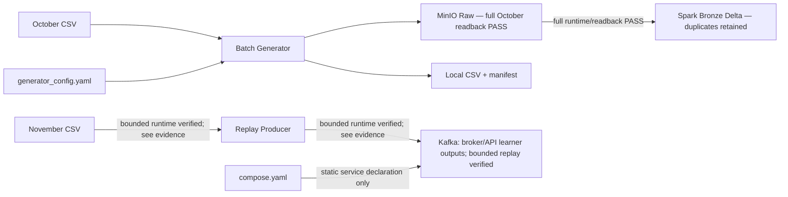
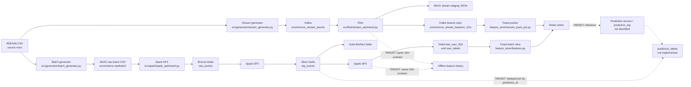

# Canonical Data Contract

## Purpose and status

This file is the source of truth for dataset meaning, grain, keys, timestamps, and intended ownership. It separates **CURRENT rebuild-clean** (source/config present on this branch), **LEGACY old-vibe-backup** (historical source declarations, not current implementation), and **TARGET** (the agreed 15-minute purchase-propensity design). A source declaration proves only that code/config exists. Runtime claims require named readback evidence. Batch Generator now has [small MinIO readback evidence](IMPLEMENTATION_ROADMAP.md#batch-generator--minio-raw-storage--2026-10-06) for 1,020,000 output rows; Full October source readback also PASS ([evidence](docs/evidence/batch_generator_october.json)); delivery guarantees, downstream pipelines and ≥100 GB benchmark remain **unverified**.

Related documents: [TARGET_ARCHITECTURE.md](TARGET_ARCHITECTURE.md) describes the intended system; [CURRENT_IMPLEMENTATION.md](CURRENT_IMPLEMENTATION.md) maps source connections; [IMPLEMENTATION_ROADMAP.md](IMPLEMENTATION_ROADMAP.md) tracks work; [RUBRIC.md](RUBRIC.md) tracks workbook criteria.

## Branch scope

- **CURRENT rebuild-clean:** Batch Generator, its YAML/config/tests and Compose declarations for MinIO plus Kafka. Small and full October source Batch Generator → MinIO declared-checks readback PASS; Replay Producer/readback source và unit tests đã có; bounded November replay/resume/readback verified ([evidence](docs/kafka_stream_replay.md)); full scale/recreate unverified; Spark Raw → Bronze full readback PASS, later downstream not implemented. Broker/API learner outputs được phân loại riêng trong CURRENT_IMPLEMENTATION.md. Retained dependency/config declarations do not prove a service or consumer exists.
- **LEGACY old-vibe-backup:** historical Spark/Flink/Feast/Airflow/DWH/governance/stream source, recorded at snapshot `2cf00cf`. Paths, schemas and mismatches marked LEGACY below are reference only; reuse requires validation against TARGET.
- **TARGET:** October Medallion → training dataset → Kubeflow/MLflow/KServe; November timeline 1× → Flink direct offline/Feast-compatible online writes → on-demand inference. No stream labels or feature topic/consumer in baseline. See [architecture](TARGET_ARCHITECTURE.md).

## Problem and canonical target

Bốn feature tại snapshot UTC mỗi **1 phút**, `t=feature_as_of`: lookback `[t-15m,t)`, purchase label `[t,t+1h)`. Entity `user_id`; feature/October label grain `(user_id,feature_as_of)`. `feature_timestamp` trong target cũ là alias lịch sử, không tạo thêm timestamp độc lập. Physical adapter mapping tới Feast/rubric `event_timestamp` phải được test; lịch sử/evidence không đổi tên.

| Feature | Type | Meaning |
| --- | --- | --- |
| `views_15m` | INT64 | Count view |
| `carts_15m` | INT64 | Count cart |
| `purchases_15m` | INT64 | Count purchase |
| `total_spend_15m` | FLOAT64 | Sum price của purchase |

Counts/spend dùng event hợp lệ sau cleaning. Model baseline không dùng year, absolute timestamp hoặc synthetic discount. Gold event fact là nguồn historical features/labels. Chọn user có event trong lookback, không dùng tương lai để chọn active user. Chỉ tạo batch label khi đủ lookback/horizon; thiếu coverage bị loại khỏi dataset, không mặc định 0. Stream không tạo label.

### Cleaning baseline — target, chưa implement

Normalize UTC event_time; IDs INT64; price finite/nonnegative; event_type thuộc view/cart/purchase; optional empty strings → null, literal `"null"` không tự đổi; discount INT nullable, OLD thiếu giữ null. Invalid rows vào rejected output có reason. Native Spark `dropDuplicates` dùng 10 cột nghiệp vụ chuẩn hóa: `event_time,event_type,product_id,category_id,category_code,brand,price,user_id,user_session,discount_percent`. Exclude operational metadata/source_event_time. Flink dùng cùng equality rule.

Chấp nhận gộp hành vi thật nếu trùng toàn key; khác session/price/discount vẫn giữ. Không thêm source_event_id/copy_index hoặc phục hồi provenance. Counts/spend có thể giảm; gộp purchase giống nhau không đổi existence label, nhưng rejected rows có thể ảnh hưởng completeness. Không claim số duplicate removed chỉ bằng số injection. Bronze/evidence hiện có vẫn giữ mọi multiplicity.

### Time và inference semantics

- `source_event_time`: November source timestamp 2019; `event_time`: timestamp ánh xạ cho demo 1×. `mapped_event_time = demo_start + (source_event_time - source_start)`; giữ anchors qua resume. Không gán now() từng row, không che backlog bằng timestamp mới. Rate chỉ là cap; testing tăng tốc ngoài baseline.
- `ingestion_time`: thời điểm thực sự nhận event tại boundary được ghi rõ; không suy ra từ event_time hoặc ACK. Bronze `_ingested_at` hiện tại là batch processing timestamp, không phải arrival 2019.
- `feature_as_of`: HOP window_end, exclusive end; `created_timestamp`: snapshot creation; actual availability chỉ được xác nhận khi sink write/readback thành công. Creation không chứng minh cả hai store đã commit.
- `prediction_time`: API request/inference time riêng. Horizon trả về `[feature_as_of,feature_as_of+1h)`, không đổi thành request-time horizon.
- Snapshot immutable theo `(user_id,feature_as_of)`: retry cùng key phải cùng values; conflict phải fail/quarantine, không silently revise. Không thay snapshot từng dùng cho prediction khi backfill/late tới.
- API `GET /predict/{user_id}` lấy Feast values và kiểm tra eligibility: READY = demo profile, đủ 15 phút warm-up, complete vector, không future, age ≤90 giây và activity >0; NO_RECENT_ACTIVITY = snapshot hợp lệ/activity=0; FEATURE_NOT_READY = missing/stale/future/warm-up hoặc rubric profile. Unknown user là NOT_READY. Hai trạng thái sau không gọi model. HOP không emit window user rỗng; thiếu row không chứng minh inactivity.
- Response chứa user_id, probability khi READY, feature_as_of, prediction_time, horizon start/end, model_version và freshness/status. Freshness ≠ completeness; October event_time không tái dựng arrival history. Profile/window late policy thuộc [architecture](TARGET_ARCHITECTURE.md#online-on-demand-inference).

### Feast 0.38.0 — source audit và write invariants

**Static source inspection 2026-10-10**, đọc đúng tag `v0.38.0`, không dùng package host 0.66.0 làm bằng chứng cho requirements và không chạy Redis/Flink:

| Source chính thức | Kết quả và giới hạn |
| --- | --- |
| [feature_store.py](https://github.com/feast-dev/feast/blob/v0.38.0/sdk/python/feast/feature_store.py) `push` / `write_to_online_store` | Có SDK write qua registered view/PushSource. `PushMode.BOTH` gọi online rồi offline tuần tự, không atomic |
| [redis.py](https://github.com/feast-dev/feast/blob/v0.38.0/sdk/python/feast/infra/online_stores/redis.py) `online_write_batch` | Đọc stored timestamp rồi HSET, skip older/equal tại precision giây. Không atomic compare-and-set; nhiều writer có race. Cùng entity nhiều lần trong batch đều so với giá trị trước batch |
| [file.py](https://github.com/feast-dev/feast/blob/v0.38.0/sdk/python/feast/infra/offline_stores/file.py) `offline_write_batch` | Có offline write, kiểm schema, đọc Parquet cũ/concat/ghi lại. Không idempotent append hoặc checkpoint commit protocol; không chọn làm stream history sink chỉ vì API tồn tại |

Ưu tiên Flink native history sink vào shared MinIO offline store và SDK-compatible online sink trong cùng job, không feature topic/consumer. API support đã xác nhận bằng source; binding với PyFlink, offline format/Feast retrieval, sink recovery và runtime correctness **OPEN**.

Acceptance invariants của hai sink:

1. Offline retry không nhân snapshot; readback logical key/values/counts sau failure/restart. Native checkpoint commit phải được xác minh cho connector/version/storage chọn.
2. Online mỗi entity một ordered writer, mỗi batch tối đa một snapshot/entity; old/equal retry không overwrite newer. Single writer/failover fencing phải được chứng minh, không chỉ dựa Kafka key hoặc Redis SDK timestamp check.
3. SDK exception/timeout không được swallow. Test timeout sau write, replay trước/sau checkpoint, failure mỗi store riêng. Checkpoint của Flink không tự rollback external SDK side effect; không claim exactly-once dual-write.
4. Partial failure không phải toàn-success: offline success/online fail → history có thể tồn tại nhưng serving pending/stale; online success/offline fail → online có thể thấy row chưa archived. Recovery phải reconcile cùng snapshot, chặn phục vụ snapshot chưa được xác nhận durable theo policy. Cách gate/commit notification còn OPEN; nếu cần protocol phức tạp, báo blocker.
5. Materialization và Flink không cạnh tranh cùng live destination. Baseline dừng/drain writer trước handover; không retimestamp October. Test materialize older after newer bằng controlled sequential run và readback, không giả định atomic stale-write protection.

Alternative nếu gate fail: offline commit trước → existing incremental materialization → online, chỉ sau learner approval; đánh giá latency. Không tự thêm topic/service/custom Redis keys. [Phase 9 tests và acceptance](IMPLEMENTATION_ROADMAP.md#phase-9--flink-features-và-direct-writes).

## Data principles

1. `event_time` is when an action happened; it does not say when the system received it. Record ingestion/availability separately when needed.
2. All canonical times are UTC. LEGACY SQL/Parquet fields are often timestamp-without-time-zone and depend on code conventions; a readback must verify serialization and timezone handling.
3. All windows use `[start, end)` to avoid counting a boundary event twice.
4. Bronze preserves source values/multiplicities; Silver/Gold represent accepted events after declared cleaning. Feature aggregates cannot replace event history.
5. Every deduplication key is a business rule, not a universal event identity. Current source has no stable source `event_id`.
6. Batch historical feature generation and Flink online feature generation must implement the same four-feature definitions and timestamp boundary semantics.
7. Offline history retains time-indexed feature rows; online serving exposes the latest valid feature row per entity. Feast defines retrieval/materialization and online access; it does not compute the canonical features.
8. Dataset rows join finalized labels to the matching `(user_id,feature_as_of)` snapshot. Future production predictions must preserve exact inputs; that separate production linkage does not define historical label identity.

## Timestamp dictionary

| Canonical concept | Meaning | CURRENT rebuild-clean / LEGACY mapping / TARGET status |
| --- | --- | --- |
| `event_timestamp` | Event occurrence time in normalized UTC form | CURRENT: raw CSV retains `event_time`; normalized field not implemented. LEGACY: Silver `event_timestamp`, derived from raw `event_time`; Gold fact also carries it. In the Flink feature topic the same name in LEGACY means window end. Context is required. |
| `ingestion_timestamp` | Time accepted by the first durable system | CURRENT: no separate CSV ingestion timestamp. LEGACY: Spark Bronze `ingestion_time`; DWH Bronze defaults `ingestion_time`. Kafka event payload does not carry a distinct arrival time. |
| `processed_timestamp` | Time a processing stage handled a record | No canonical persisted field found. Add only if a component needs it and its clock/meaning is defined. |
| `feature_as_of` (old target alias `feature_timestamp`) | As-of time / exclusive end of the feature window and point-in-time lookup key | CURRENT: no feature implementation. Target canonical field `feature_as_of`. LEGACY Spark 30d view uses `event_timestamp` at target-date midnight; Flink sets `event_timestamp` to HOP window end. |
| `created_timestamp` | Time the feature record was created; not necessarily its online availability time | CURRENT: no feature implementation. Target name. LEGACY Spark/Feast uses `created`; Flink sink declares `created` from processing-time `CURRENT_TIMESTAMP`. LEGACY runtime meaning/UTC handling unverified. |
| `prediction_timestamp` | Decision time of a real model inference | CURRENT: no label job. LEGACY label job creates minute timestamps from Silver activity; there is no identified prediction service/log, so this is not evidence an inference happened. |
| `label_window_start` | Inclusive beginning of the one-hour outcome interval | Baseline: `feature_as_of`; future production labeling deferred. Not stored as a separate LEGACY label column. |
| `label_window_end` | Exclusive end of the outcome interval | Baseline: `feature_as_of + 1 hour`; future production labeling deferred. Not stored as a separate LEGACY label column. |
| `label_matured_timestamp` | Time the horizon/completeness rule permits final label assignment | Target only; not implemented. |
| `valid_from_timestamp` | Inclusive start of a dimension version | CURRENT: no dimension implementation. LEGACY `dim_product.valid_from_ts`; target terminology mapping. |
| `valid_to_timestamp` | Exclusive end of a dimension version; null denotes open/current | CURRENT: no dimension implementation. LEGACY `dim_product.valid_to_ts`; temporal join uses `< valid_to_ts` or null. |

## Dataset contracts

CURRENT sections describe retained source and link named runtime evidence. LEGACY sections preserve historical declarations; none establish runtime on rebuild-clean. LEGACY Delta paths refer to removed `src/spark/common.py` constants. PostgreSQL and Delta were separate physical representations. Logical types below do not establish enforced CSV types/nullability.

### Source CSV event — CURRENT rebuild-clean

- **Purpose / grain:** one REES46 CSV source row per event as provided by the file.
- **Producer:** external dataset; CURRENT readers are `src/generator/batch_generator.py` and `src/generator/replay_producer.py`. LEGACY reader `src/generator/stream_generator.py` is absent from rebuild-clean.
- **Consumers:** CURRENT Batch Generator → MinIO raw CSV. CURRENT November Replay Producer → Kafka has bounded runtime/readback evidence; historical stream behavior is LEGACY below.
- **Physical location:** batch input `2019-Oct.csv`; streaming config declares `2019-Nov.csv`, UTC interval `[2019-11-01,2019-12-01)`. Replay Producer và Compose Kafka đã có source; bounded CLI November → Kafka đã có [readback evidence](docs/kafka_stream_replay.md); full replay chưa verify.
- **Schema:** source header columns are split as CSV text. Batch Generator benchmark modes use pandas CSV parsing/type inference; source mode uses csv.reader, preserves the nine field strings and validates UTC event_time membership; Replay Producer validation/null rules được ghi trong CURRENT stream contract bên dưới; removed parser rules vẫn là LEGACY. The source files were not rewritten/read through a data audit in this documentation task.

| Column | Logical type | CURRENT behavior / LEGACY parser behavior |
| --- | --- | --- |
| `event_time` | UTC timestamp text | Source string; parser preserves text. |
| `event_type` | string | Source value. |
| `product_id` | int64 | CURRENT batch benchmark: pandas inference; source mode: unchanged CSV text; replay: bắt buộc int64, empty/invalid gây lỗi. LEGACY: null if empty; invalid integer row skipped. |
| `category_id` | int64 | CURRENT batch benchmark: pandas inference; source mode: unchanged CSV text; replay: bắt buộc int64, empty/invalid gây lỗi. LEGACY: null if empty; invalid integer row skipped. |
| `category_code` | string | CURRENT batch benchmark: pandas inference; source mode: unchanged CSV text; replay: empty → JSON null. LEGACY: null if empty. |
| `brand` | string | CURRENT batch benchmark: pandas inference; source mode: unchanged CSV text; replay: empty → JSON null. LEGACY: null if empty. |
| `price` | float64 | CURRENT batch benchmark: pandas inference; source mode: unchanged CSV text; replay: finite float bắt buộc, empty/NaN/Infinity gây lỗi. LEGACY: 0.0 if empty; invalid number row skipped. |
| `user_id` | int64 | CURRENT batch benchmark: pandas inference; source mode: unchanged CSV text; replay: bắt buộc int64, empty/invalid gây lỗi. LEGACY: null if empty; invalid integer row skipped. |
| `user_session` | string | CURRENT batch benchmark: pandas inference; source mode: unchanged CSV text; replay: empty → JSON null. LEGACY: null if empty. |
| `discount_percent` | int32 | Added by generator for post-evolution data; configured synthetic value, not present in original source schema; source mode selects deterministically from seed/source-record SHA-256, then copies the adapted row for injected duplicates. |

### Raw batch CSV objects — CURRENT rebuild-clean

- **Purpose / grain:** generated copy of source events, split by configured schema-evolution date; offline ingestion input.
- **Producer:** batch generator (`src/generator/batch_generator.py`), config `config/generator_config.yaml`.
- **Consumers:** CURRENT Spark raw → Bronze full runtime/readback PASS; LEGACY Spark DP1/Airflow paths are described below.
- **Physical location (current full October):** `s3://ecommerce-raw/source/rees46/2019-10/20261008-04/raw_events_old.csv` and `s3://ecommerce-raw/source/rees46/2019-10/20261008-04/raw_events_new.csv`, plus `manifest.json` metadata. Exactly two final source CSV objects; no local output CSVs. Historical benchmark prefix `batch/` was deleted by the learner (not a current dataset); benchmark code may recreate its configured destination if explicitly run. Historical small mode also wrote local CSVs.
- **Schema:** old part contains the nine source columns through `user_session`; new part adds `discount_percent`. CSV columns are textual on disk; LEGACY Spark casts IDs to BIGINT and price to DOUBLE, while CURRENT Bronze retains strings (no Silver casts). Config defines UTC BATCH `[2019-10-01,2019-11-01)`, OLD `[2019-10-01,2019-10-16)` and NEW `[2019-10-16,2019-11-01)`. The shared classifier parses event_time before sampling; row position never determines schema membership. Small mode uses independently seeded random-priority reservoirs, quotas floor(N/2) OLD and remainder NEW. A short population is returned without duplication or quota transfer. INVALID and EXCLUDED counts are logged and persisted in the small manifest. [Batch Generator evidence](docs/batch_generator.md) verifies fixture boundaries and local 1,000-source-row sample readback (510 output rows per group after existing transformation); [Small MinIO readback](IMPLEMENTATION_ROADMAP.md#batch-generator--minio-raw-storage--2026-10-06) verifies 510,000 rows per schema, exact headers/field counts, total bytes and CSV equality to local. Full October source-mode output has declared-checks readback PASS; ≥100 GB benchmark remains NOT YET VERIFIED.
- **Key/timestamps:** no enforced key; no separate ingestion timestamp in CSV. Event timestamp is source `event_time`.

### Stream event record and Kafka topic — CURRENT rebuild-clean

- **Status:** implemented + unit verification; bounded native November ACK/readback và producer interrupt/resume đã verify, cùng journal readback sau broker bật lại theo learner ([evidence](docs/kafka_stream_replay.md)). Full replay/scale, exactly-once và container-recreate persistence chưa verify. Existing broker/API learner outputs are separate from CLI verification.
- **Producer / consumer:** `src/generator/replay_producer.py` delegates delivery/scheduling to `src/generator/replay_runtime.py`; bounded audit consumer is `scripts/verify_kafka_replay.py`. Flink and durable stream archive remain absent.
- **Input / grain:** source-order November CSV over `[2019-11-01,2019-12-01)` UTC, one message per accepted source event plus injected copies. `max-events` bounds accepted source events, not message count. Strict header/field count, parsed UTC non-decreasing timestamp, int64 IDs and finite price; invalid records fail with record/physical-line location, valid out-of-range records are excluded. `event_type` is nonempty but not enum-validated; finite price is not constrained nonnegative.
- **Payload / key:** UTF-8 JSON preserves nine source fields plus deterministic configured integer `discount_percent`; IDs are JSON integers, price a finite JSON number, optional empty category_code/brand/user_session become null. Key is UTF-8 `str(user_id)`, not event identity. No business `event_id` is invented.
- **Time / injection:** payload `event_time` retains original UTC text. Kafka record timestamp is not set to 2019; producer uses client default send timestamp (broker readback unverified). Late events keep original payload and release when source progress reaches `event_time + delay`; configured 5–10 minutes are event-time displacement, not real waiting. End-of-input releases pending events as `end_flush`, separately from full-delay `due`. Rate is submissions per real second including duplicates; duplicate is one extra same key/value with a distinct copy header. Burst is disabled/outside implemented scope.
- **Provenance / recovery:** headers carry replay_run, source_record, copy, release, delay_seconds and progress. Source record provenance is not a downstream business dedup rule. Checkpoint stores source position and pending late entries only after emitted messages ACK; source path/size/mtime, settings and Kafka cluster/topic ID/partition set must match on resume. At-least-once after process crash, not exactly-once; resume reparses/skips the prefix. Native bounded interrupt/resume đã có readback; không chứng minh absence of uncheckpointed duplicates.
- **Bounded verification:** `acks.jsonl` stores expected key/value/headers and ACK partition/offset up to configured cap; counters continue beyond the cap, readback scope becomes `sample_only`. Verifier compares journal targets and due thresholds, not an independent reconstruction of all source fault choices or Flink watermark behavior. Crash may leave additional uncheckpointed Kafka messages outside the recovered journal; readback does not prove absence of those duplicates.

## LEGACY dataset declarations — old-vibe-backup

Sections explicitly marked LEGACY describe producer/consumer implementation files absent from rebuild-clean; retained config/source CSV references may still exist. Their schemas/rules are historical reference, not current TARGET or runtime evidence. Interleaved TARGET sections below describe the learner-approved contracts separately.

### Stream event record and Kafka topic — LEGACY old-vibe-backup

- **Purpose / grain:** one produced event message (plus deliberately injected retry duplicates); Kafka transports events to Flink.
- **Producer:** `src/generator/stream_generator.py`, configured by `config/generator_config.yaml`.
- **Consumers:** Flink `src/flink/stream_optimized.py`; a parallel Flink sink persists event rows to raw staging.
- **Physical location:** Kafka topic `ecommerce_stream_events`, key `user_id`; staging JSON `s3://ecommerce-raw/staging/stream_events/`; archive prefix is declared in Spark config/source for post-ingest staging files.
- **Schema:** JSON has ten fields: the nine source fields plus generated `discount_percent` (BIGINT IDs, DOUBLE price, INT discount at Flink table declaration). No stable `event_id` or explicit arrival timestamp.
- **Key/timestamp:** Kafka key preserves per-user partition affinity, not event uniqueness. `event_time` is event time; broker timestamp is not mapped into the payload contract. Generator counters count attempted produce calls and callback errors are logged; do not interpret those counters as confirmed acknowledgements without readback.
- **Legacy mismatch:** config says the stream date range is Oct 26–31, while code uses October offset/prefix and stops after October. Configured burst multiplier is 30; module documentation says x10. Actual behavior needs a bounded fixture.

### Bronze Lakehouse `raw_events` — LEGACY old-vibe-backup

- **Purpose / grain:** ingested source event with arrival/ingestion metadata, before Silver cleanup.
- **Producer:** Spark DP1 batch and staged-stream ingestion.
- **Consumers:** Spark DP2 Silver transform; DWH sync script can copy Bronze to PostgreSQL.
- **Physical location:** Delta at `s3a://ecommerce-lakehouse/bronze/raw_events`; input roots are `s3a://ecommerce-raw/batch` and `s3a://ecommerce-raw/staging/stream_events`.
- **Schema:** `event_time STRING`, `event_type STRING`, `product_id BIGINT`, `category_id BIGINT`, `category_code STRING`, `brand STRING`, `price DOUBLE`, `user_id BIGINT`, `user_session STRING`, `discount_percent INT`, `ingestion_time TIMESTAMP`. The old CSV part is adapted with null discount. Spark adds `ingestion_time=current_timestamp()`.
- **Key/timestamps:** no business primary key; `ingestion_time` is processing/ingestion time, not event time. Runtime Delta snapshot/schema unverified.

### Silver Lakehouse `stg_events` — LEGACY old-vibe-backup

- **Purpose / grain:** one retained event after legacy deduplication and basic normalization.
- **Producer:** Spark DP2 (`process_silver_layer`).
- **Consumers:** Gold facts/dimensions, DP3 feature/label jobs, optional DWH sync.
- **Physical location:** Delta `s3a://ecommerce-lakehouse/silver/stg_events`, partitioned by `date`.
- **Schema:** Bronze columns retained, plus `event_timestamp TIMESTAMP`, `date DATE`, `category_level1 STRING`; raw `event_time` remains. `ingestion_time` is retained by the legacy withColumn chain. IDs are BIGINT; price DOUBLE; discount INT from Bronze.
- **Transform/key:** `dropDuplicates(user_id,event_time,product_id,event_type)`; this omits `user_session` and cannot distinguish identical-looking legitimate actions without source event id. `event_timestamp` parses the UTC suffix, `date` derives from it; null brand/category are filled with placeholders and category level is split from category code. No explicit quarantine table is written.
- **DWH variant:** PostgreSQL `silver.stg_events` has a surrogate `id`, omits `ingestion_time`, uses `discount_percent NUMERIC(5,2)` and declares several columns NOT NULL. It is a different physical schema.

### Gold dimensions and event fact — LEGACY old-vibe-backup

**`dim_product`**
- **Grain/key:** one observed product-attribute version; `product_sk` is MD5 of product id and `valid_from_ts`.
- **Producer/consumer:** Spark DP2; temporal join into `fact_user_events`, DWH sync/analytics.
- **Physical location:** Delta `s3a://ecommerce-lakehouse/gold/dim_product`; PostgreSQL `gold.dim_product` copy.
- **Columns:** `product_sk STRING`, `product_id BIGINT`, `category_id BIGINT`, `category_level1 STRING`, `brand STRING`, `price DOUBLE`, `discount_percent INT`, `valid_from_ts TIMESTAMP`, `valid_to_ts TIMESTAMP nullable`, `is_current BOOLEAN`.
- **Temporal rule:** join uses `[valid_from_ts, valid_to_ts)` and null end for current. Attributes are grouped to find earliest occurrence; ties in source ordering need deterministic-rule review.

**`dim_user`**
- **Grain/key:** one row per `user_id`; legacy code is a current aggregate, not historical user SCD2.
- **Producer/consumer:** Spark DP2; fact/analytics and DWH copy.
- **Physical location:** Delta `s3a://ecommerce-lakehouse/gold/dim_user`; PostgreSQL `gold.dim_user`.
- **Columns:** `user_id BIGINT`, `first_seen TIMESTAMP`, `last_seen TIMESTAMP`, `total_lifetime_events BIGINT`, `is_active BOOLEAN`, `valid_from_ts TIMESTAMP`, `valid_to_ts TIMESTAMP nullable`, `is_current BOOLEAN`.

**`fact_user_events`**
- **Grain:** one Silver event after left temporal product join; intended to reference one product version.
- **Producer/consumer:** Spark DP2; DWH/analytics. Gold fact is not the direct Flink feature consumer.
- **Physical location:** Delta `s3a://ecommerce-lakehouse/gold/fact_user_events`, partitioned by date; PostgreSQL `gold.fact_user_events`.
- **Columns:** `event_id STRING`, `event_timestamp TIMESTAMP`, raw `event_time STRING`, `date DATE`, `user_id BIGINT`, `product_sk STRING nullable in the Spark join result`, `category_level1 STRING`, `brand STRING`, `price DOUBLE`, `discount_percent INT`, `event_type STRING`, `user_session STRING`.
- **Key risk:** legacy event hash uses `(user_id,event_time,product_id)` and omits `event_type`; it is not enforced unique. PostgreSQL renames `event_timestamp` to `event_time`, makes `product_sk NOT NULL`, and adds surrogate `id`; load compatibility needs readback.

### Legacy batch feature table `feat_user_30d` — LEGACY old-vibe-backup, not canonical target

- **Purpose / grain:** one row per user for target-date midnight, aggregating a preceding date range.
- **Producer:** Spark DP3 `compute_feat_user_30d`.
- **Consumers:** Feast `user_batch_features_30d`, batch materialization, historical retrieval/training path.
- **Physical location:** Delta `s3a://ecommerce-lakehouse/gold/feat_user_30d`; clean Parquet export `s3a://ecommerce-lakehouse/feast/user_batch_features_30d/`; PostgreSQL `gold.feat_user_30d`.
- **Columns:** `user_id BIGINT`, `f_views_30d BIGINT`, `f_carts_30d BIGINT`, `f_purchases_30d BIGINT`, `f_spend_30d DOUBLE`, `f_distinct_categories_30d BIGINT`, `event_timestamp TIMESTAMP`, `created TIMESTAMP`, and Delta `date DATE` partition column (Parquet export drops `date`).
- **Timestamp/key:** Spark sets `event_timestamp` to target date at midnight; `created=current_timestamp()`. Not a 15-minute feature row and not aligned to prediction-minute grain. It exists only in LEGACY code and is excluded from the canonical target model input.

### Legacy Flink 15-minute feature row — LEGACY old-vibe-backup, partial path

- **Purpose / grain:** per-user hopping-window aggregate, 15-minute size, one-minute slide.
- **Producer:** Flink optimized job from Kafka `ecommerce_stream_events`.
- **Consumers:** console print sink and Kafka feature topic `ecommerce_stream_features_15m`; Feast stream pusher consumes the topic.
- **Physical location:** Kafka topic plus a print sink. The raw event sink goes separately to MinIO staging. There is no direct Flink write to Redis.
- **Feature columns:** `user_id BIGINT`, `f_views_15m BIGINT`, `f_carts_15m BIGINT`, `f_purchases_15m BIGINT`, `total_spend_15m DOUBLE`, `event_timestamp TIMESTAMP(3)` (HOP_END), `created TIMESTAMP(3)` (processing time expression).
- **Key/time:** window row grain `(user_id, window_end)`; Kafka feature sink declares no key. Watermark is event time minus 15 minutes. Source dedup key is `(user_id,event_time,product_id,event_type)`. Window output and late correction behavior have not been run/read back. Legacy stream feature is not wired to a prediction service in inspected code.

### Target canonical offline/online feature history — not implemented

**Một logical Offline Feature Store chung trên MinIO** cho Spark October và Flink November; có thể dùng bảng/partition riêng, không tạo streaming offline store thứ hai. Cùng feature contract và Feast Feature Registry; source bindings tái dùng definitions, không copy hai bộ feature definitions.

`feat_user_15m`: user_id INT64, four features as above, feature_as_of TIMESTAMP_UTC, created_timestamp TIMESTAMP_UTC. Grain `(user_id,feature_as_of)` **trong một dataset/source + replay run đã chọn**; logical history key trên toàn shared store gồm scope này để tránh va chạm giữa các replay. Scope là metadata để chọn dữ liệu, không thêm feature/model input hoặc entity ID mới.

| Time / scope | Contract target |
| --- | --- |
| `source_event_time` | Original event timestamp 2019 trên behavior records; không gán một event timestamp giả cho snapshot aggregate. Source-window bounds suy ra từ feature_as_of và fixed replay anchors |
| `feature_as_of` | Snapshot boundary/PIT time: October giữ timeline 2019; November dùng timeline ánh xạ hiện tại; không thay bằng creation/request time |
| dataset/source | Phân biệt October historical và November replay histories bằng metadata/table/partition binding rõ ràng |
| replay run ID | Scope của November replay, ổn định qua resume; October không phải replay (không tạo fake run). Persist cùng history hoặc partition/run manifest, kèm source/demo anchors và profile; không suy ra run từ wall-clock |

Tên physical columns/partitions và sink format/Feast 0.38.0 source binding còn OPEN. Historical retrieval phải **chọn source/run trước PIT lookup** theo feature_as_of, không chỉ join user_id rồi trộn October/November hoặc nhiều runs. Có thể dùng bindings riêng trong cùng registry/store nếu cần, nhưng definitions chung; khả năng filter/binding chưa runtime-verified. Tests phải có cùng user ở October và ≥2 replay runs, boundary times và resume để chứng minh isolation và đúng snapshot.

Redis chỉ qua Feast-compatible writer; online serving chọn một demo run/profile, không concurrent materialization vào live view. Incremental materialization chọn source/run/time range rõ, stop/drain handover; controlled older-after-newer test không làm online rollback. Values/freshness/recovery theo canonical invariants phía trên. Chưa có Feast/Flink runtime readback.

### Historical labels và training dataset — target, not implemented

October `labels_purchase_1h`: `(user_id,feature_as_of,label)` with coverage-valid `[t,t+1h)` only; Spark reads Gold purchase events. Feast retrieves matching snapshots for the sample times; join labels by the same key and assert exact snapshot identity. No baseline November label job.

Dataset: user_id, feature_as_of, four feature values, label; benchmark event samples/replicas excluded. Time split target October 01–20 train, 21–25 validation, 26–31 test; exclude samples whose label horizon crosses split/source boundary and incomplete initial lookback. Past lookback before a split is allowed. Kubeflow executes load/split/train/evaluate; MLflow versions data/model; KServe model-inside-image. Model/time split evidence not yet present.

### Legacy Feast configuration and online values — LEGACY old-vibe-backup

- **Purpose:** define entity, feature views, historical source and online store; retrieve/materialize/push values, not derive feature aggregates.
- **Producer:** `feature_store/features.py`, `feature_store/feature_store.yaml`; batch producer is Spark export, stream producer is Flink Kafka sink plus `feature_store/stream_push_job.py`.
- **Consumers:** materialization job/DAG and historical retrieval; Redis online store is intended for model-serving consumers, but no implemented prediction service was found in the inspected source.
- **Physical location:** Feast registry `feature_store/data/registry.db`; local provider; file offline store; Redis online store per config. Stream batch source points at `s3://ecommerce-lakehouse/gold/feat_user_stream/stream_features.parquet`, while pusher also manages that path. Exact source compatibility and write behavior require runtime verification.
- **Legacy views:** `user_batch_features_30d` has five 30d fields, 30-day TTL; `user_stream_features_15m` has four 15m fields, 2-hour TTL. `ecom_propensity_v1` combines both views (nine features), conflicting with the agreed 15m-only baseline.
- **Timestamp mapping:** both sources use `event_timestamp` and `created`, with Feast 0.38.0 declared in requirements/config. TTL is a configured online freshness horizon; it is not the 15m event window or a proof of offline retention.

### Legacy labels and target prediction/label records

**LEGACY old-vibe-backup `user_labels` — absent from rebuild-clean**
- **Grain:** `(user_id,prediction_timestamp)` generated from each minute with view/cart activity in Silver; this is a candidate minute, not a logged inference.
- **Producer:** Spark DP3 `compute_ground_truth_labels`.
- **Consumers:** PostgreSQL `gold.user_labels` sync and historical retrieval/training code.
- **Physical location:** Delta `s3a://ecommerce-lakehouse/gold/user_labels/date=...`; PostgreSQL `gold.user_labels`.
- **Columns:** `user_id BIGINT`, `prediction_timestamp TIMESTAMP`, `target_purchase_1h INT`, `date DATE`.
- **Legacy logic:** right-censors candidate times later than max event time minus one hour; label is 1 if a purchase exists in `[prediction_timestamp,prediction_timestamp+1h)`, otherwise 0. It does not persist prediction id, exact feature snapshot, explicit window boundaries, pending state, or maturation time. Completeness under late arrivals is not proven.

**Future production prediction logging/delayed labels — deferred, not implemented.** Không yêu cầu prediction ID hoặc stream label tables trong baseline. Inference dùng `feature_as_of` làm horizon anchor; `prediction_time` chỉ thời điểm API thực thi. Historical training join `(user_id,feature_as_of)`; xem canonical label contract phía trên.

## Current versus target matrix

| Concern | CURRENT rebuild-clean | TARGET contract | Status / LEGACY comparison |
| --- | --- | --- | --- |
| Batch source | October CSV; complete-source mode preserves records + injects copies; benchmark modes sample/replicate | Full October batch `[Oct 01,Nov 01)`; V2 begins Oct 16; November is stream source | UNIT-VERIFIED + SMALL-RUNTIME-VERIFIED locally ([Batch Generator](docs/batch_generator.md)); [small MinIO readback PASS](IMPLEMENTATION_ROADMAP.md#batch-generator--minio-raw-storage--2026-10-06); full October source declared checks PASS; ≥100 GB/full November stream NOT YET VERIFIED |
| Kafka Stream Replay | Kafka 4.1.2 Compose, November Replay Producer and bounded verifier | Timeline 1× với fixed anchors, bounded ACK/readback verification | BOUNDED ACK/READBACK + PRODUCER RESUME VERIFIED; full scale/recreate/exactly-once unverified |
| Event identity/dedup | Raw batch has no stable event_id; no downstream dedup implementation | Declared 10-column business dedup, không thêm provenance ID | NOT IMPLEMENTED; LEGACY composite dedup is reference only |
| Durable event history | Full October Raw CSV + Bronze Delta; no Silver or stream archive implementation | Preserve accepted source events independently of lossy features | FULL BRONZE READBACK PASS; [evidence](docs/evidence/spark_raw_to_bronze_evolution_full.json); Silver/stream archive NOT IMPLEMENTED |
| 15m feature semantics | No Spark/Flink feature implementation | Four identical per-user windows with same event-time, boundary and late availability semantics | NOT IMPLEMENTED; LEGACY 30d/hopping-window mismatch |
| Feature keys/timestamps | No feature producer; raw event_time retained | `(user_id,feature_as_of)` và `created_timestamp` | NOT IMPLEMENTED; LEGACY event_timestamp/created mappings only |
| Offline and online stream writes | No Flink/Feast stream writer | Flink offline history + Feast-compatible online sink, no feature topic/consumer | NOT IMPLEMENTED; LEGACY pusher only |
| Incremental materialize | No Feast materializer or Airflow DAG | Incremental offline-to-online; sequential writer handover, không concurrent live materialization | NOT IMPLEMENTED; LEGACY materializer only |
| Prediction log | No prediction service/log implementation | Future production only; outside current DE flow | NOT IMPLEMENTED |
| Labels / dataset | No label/table or Dataset Builder | October only: `(user_id,feature_as_of)`, coverage-valid labels | NOT IMPLEMENTED; stream labels deferred |
| PostgreSQL mirror | No DDL/copy implementation or PostgreSQL service | Explicit documented mapping and reconciled readback | NOT IMPLEMENTED; LEGACY mappings only |
| Rubric result | Batch Generator, Kafka and Spark Bronze evidence; later downstream absent | Evidence-backed criterion status | SMALL + FULL OCTOBER DECLARED-CHECKS PASS; see RUBRIC; ≥100 GB NOT VERIFIED |

## Lineage overview — CURRENT rebuild-clean

Solid links describe retained source connections; full October Raw → Bronze and bounded Kafka links have named runtime evidence. Local CSV output is the historical small-mode branch, not full-source output.



### LEGACY old-vibe-backup lineage (reference only)

Solid links in this historical diagram describe LEGACY source declarations, not rebuild-clean implementation or runtime. Dashed links labelled TARGET preserve historical design assumptions, including prediction-linked labels; they are not the current DE target. The historical 30d path is not the agreed feature contract. See TARGET sections above for current decisions.



In LEGACY source, the stream's raw-event staging branch declares preservation of event details for later history/reprocessing. The feature branch is a lossy aggregate for serving. Feast does not replace raw/clean event persistence, and raw event persistence does not replace time-indexed feature history. Spark and Flink must agree on feature meaning before their outputs can safely train/serve the same model.

## Known implementation gaps

Cleaning, Gold, coverage, features/labels, timeline mapping, Flink and Feast are not implemented. Policies above are target decisions, not completed work. Native connector/version/format, TTL, recovery/partial failure and stream archive remain OPEN; canonical list in [architecture](TARGET_ARCHITECTURE.md#ngoài-baseline-và-open). Historical/LEGACY sections retain their original timestamps, fields and evidence limitations; they do not define the new baseline.

## Batch Generator complete-source mode — corrected injection, runtime verified

`--mode source --action ingest` reads all October source records and emits two schema-versioned CSV objects using the agreed UTC boundary. All source records and original nine field strings are preserved; NEW adds synthetic discount_percent. Config `fault_injection.duplicate.enabled/rate` controls exact per-schema injection: after source row n, if floor(n×rate) increases, emit one adjacent identical adapted-row copy. Rate must be in [0,1]; manifest separates source counts, duplicate_counts, output_counts, injected_duplicates, rate and rule. At 2%, copied rows have the same discount as their original. This rule is periodic, not random. Natural duplicates remain distinct from injected copies; no business identity inferred.

Source mode forbids enabled synthetic skew/drift, preserves natural skew and does not sample/replicate/change source IDs/prices/times. Original CSV stays local. Prefix holds raw_events_old.csv, raw_events_new.csv and manifest.json; no local CSV output. Manifest records hashes/bytes/counts. Verify reads all output, checks bytes/hash plus CSV header/field counts, UTC schema membership, discount values, source/output counts and scheduled duplicate pairs, reports audits in local readback.json. Natural duplicates/skew statistics/feature-label coverage not audited; downstream dedup policy OPEN. Corrected full October runtime verified for declared hash/schema/date/count/copy-pair checks; natural duplicates/skew/scale/downstream remain unverified; superseded no-injection run summarized in [component history](docs/batch_generator.md#superseded-run-without-duplicate-injection). [Guide](docs/batch_generator.md).

Source evidence export is automatic only when explicitly requested by `--evidence-output` after successful full readback/audit. Ratios distinguish injected copies/source records from injected copies/output records; neither measures natural duplicates. The JSON includes timing scopes, versions/code hash, manifest/readback and limitations; failed verification does not replace an existing report.

## Spark Raw → Bronze handoff — current input, proposed consumer

The authoritative verified input is bucket `ecommerce-raw`, prefix `source/rees46/2019-10/20261008-04`. Spark must read these **explicit objects separately**, not the bucket root or a directory containing JSON:

```text
s3a://ecommerce-raw/source/rees46/2019-10/20261008-04/raw_events_old.csv
s3a://ecommerce-raw/source/rees46/2019-10/20261008-04/raw_events_new.csv
```

| Object | Schema / UTC event interval | Verified output rows (excluding header) | Bytes |
| --- | --- | ---: | ---: |
| `raw_events_old.csv` | 9 source columns; `[2019-10-01,2019-10-16)` | 20,851,661 | 2,802,940,819 |
| `raw_events_new.csv` | Same 9 + `discount_percent`; `[2019-10-16,2019-11-01)` | 22,446,078 | 3,076,199,711 |

`manifest.json` is metadata, not event input. Total 43,297,739 output rows includes 42,448,764 source rows and 848,975 deliberately injected copies. Bronze must preserve multiplicities: no `distinct`, `dropDuplicates`, aggregation or undocumented row filtering. Natural duplicate count/business event identity remains OPEN; do not equate identical fields with a proven unique event. Distributed row order is not guaranteed; the producer's adjacent-copy audit is not a Silver dedup key.

Current Spark slice: explicit string schemas per object and checked header/CSV options; write OLD with 9 business + 4 metadata columns to Delta version 0, then append NEW with `mergeSchema=true` to version 1 (14 columns). OLD has no discount column before writing; Delta exposes null discount for OLD after evolution. The union/null-padding frame exists only for verification, never for writing. Quoted and unquoted empty fields both become empty strings; literal `null` stays text; absent OLD discount becomes null. Current reader is single-line CSV: quoted embedded newlines are unsupported (the negative fixture is rejected when fully materialized; this is not a general multiline-validation guarantee). Negative tests force full-column materialization because plain count can prune parsing. Local CSV/Delta fixtures PASS; original event_time/ID/price text must not be silently inferred/cast away. The current Delta Schema Evolution implementation has full Spark/Delta readback **verified** in [full evidence](docs/evidence/spark_raw_to_bronze_evolution_full.json); counts above were reconciled for the full run.

Batch Generator evidence verifies remote bytes/SHA-256 and declared schema/date/count/copy schedule against the producer manifest. Spark evidence verifies preflight binding and equality of parsed/transformed input versus Delta (counts/values/multiplicities), not a repeated full CSV hash/date/copy audit. Neither independently reconstructs every source event. Full October alone cannot provide pre-October history or post-October outcomes: eligibility near dataset edges and incomplete user history must be addressed before feature/label computation. No feature-label completeness claim follows from this handoff.

### Bronze representation — fixture and full readback verified

The bounded job now exists in `src/spark/raw_to_bronze.py`; previous statements of no Spark implementation describe the earlier baseline. Its ten business columns are strings; present empty fields are normalized to empty strings, while absent OLD discount is null. Adds `_source_object` and `_schema_version` strings, `_run_id` string and `_ingested_at` UTC timestamp fixed at job start (not original event arrival time). Delta may widen nullability; readback enforces field names/types/order and row multiplicities, not exact nullability. Native local fixtures and current two-commit smoke/full MinIO readback PASS; see the [component explanation](docs/spark_raw_to_bronze.md). Smoke output uses `ecommerce-lakehouse/bronze/raw_events/verification/<run-id>`; full uses `ecommerce-lakehouse/bronze/raw_events/<run-id>`, never the raw prefix. No business identity or Silver dedup decision is made.

### Explicit full October Bronze mode — runtime verified

`--mode full` forbids a row limit; smoke remains default. Full input and Bronze readback must both match producer output_counts: OLD 20,851,661 / NEW 22,446,078, total 43,297,739 (including 848,975 injected copies). These counts were reconciled in full run `october-evolution-full-01` ([evidence](docs/evidence/spark_raw_to_bronze_evolution_full.json)), Delta versions 0 → 1, schema 13 → 14 columns. All business field/null/provenance rules above remain unchanged. Full Delta output is a fresh table at `s3a://ecommerce-lakehouse/bronze/raw_events/<run-id>`; create OLD with `errorifexists`, then append only NEW with `mergeSchema=true`; no overwrite or reuse of an existing run destination. No Silver dedup or feature/label completeness claim. Smoke and full have separate immutable evolution evidence; the superseded single-write evidence/output was removed by learner request after the new full PASS (history in roadmap).

### Delta Schema Evolution — approved current contract (2026-10-08)

Version 0 order is the nine source columns followed by `_source_object`, `_schema_version`, `_run_id`, `_ingested_at`. Version 1 appends `discount_percent` at the end; all business fields remain strings, metadata types/semantics stay unchanged. The verification schema is declared independently of readback; both snapshots require exact names/types/order (nullable widening accepted), counts and bidirectional `exceptAll`. NEW values and all provenance are included in full-row verification. Full counts still use manifest `output_counts`; smoke remains bounded.

Two commits are not atomic as a batch. Failures leave the destination intact; no automatic retry, resume, overwrite or deletion. Use only the version referenced by newly published `READBACK_PASS` evidence; a partial/stale report is not proof of commit absence. Same run-id/populated destination is refused. Single writer and immutable Raw remain assumptions; before/after metadata checks do not lock source objects. Current [full](docs/evidence/spark_raw_to_bronze_evolution_full.json) and [smoke](docs/evidence/spark_raw_to_bronze_evolution_smoke.json) evidence describe this two-commit implementation. Report/code/source-evidence hashes were checked locally; four small remote Delta commit logs were cross-checked separately, without repeating the full data scan.
