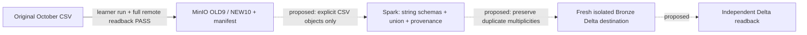
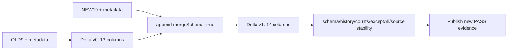

# Implementation roadmap and learning progress

This is the learning sequence and progress log: it records what to study next and what has actually been understood, changed and verified. It is not the canonical schema document ([DATA_CONTRACT.md](DATA_CONTRACT.md)), target design ([TARGET_ARCHITECTURE.md](TARGET_ARCHITECTURE.md)), current source map ([CURRENT_IMPLEMENTATION.md](CURRENT_IMPLEMENTATION.md)), or rubric checklist ([RUBRIC.md](RUBRIC.md)).

## How to learn one component

Use component names, optionally followed by roadmap order. Learning flow: Understand purpose → Input / Output → Native tech-stack concept → Minimal implementation → Tiny test → Small real-data runtime → Evidence → Learner can explain the flow → DONE. Before a new component’s code, explain its role, input/output, proposed files and native technology concepts, then STOP for learner approval.

For every milestone, first explain the component's purpose, problem, inputs/outputs and relevant files. Then show its real connections in Mermaid and separate source-declared edges from runtime-verified behavior. Confirm library versions from project config before version-specific explanations; trace only the current slice input → schema → processing → output → consumer. Compare source with the contract, rubric, tests and traceable evidence. Give the learner one short chance to predict output or explain a code section before revealing the answer.

Before code changes, explain a small example, the specific problem and invariant. Make one small, scoped change, then review each diff section together (purpose, caller/callee, input/output, debugging approach). Run appropriate checks and record exact command and actual result. Unit tests do not establish a pipeline run. End each milestone with paper-ready notes: purpose, input/output, diagram, important files, commands/checks, common failures, what was learned, change/reason and uncertainty. Update this file rather than creating a separate report for every small edit.

Use Vietnamese and beginner-friendly language. Novel Ideas giữ ở optional/bonus priority cuối, trừ khi course yêu cầu bắt buộc; không xóa khỏi rubric backlog. Preserve user changes. Do not read secrets or commit. Explain side effects before running commands; do not reset, delete volumes/topics/checkpoints/data, overwrite outputs, run large generation or incur cloud cost without an explicit agreement. Before cleanup, inspect imports, Makefile, Compose, DAGs, scripts, tests and docs references.

## Priority và milestone đã chốt

Nguồn: `rubic/EDAI K11 - DE.xlsx` / sheet `edai-1 (50%)` và `rubic/EDAI K11 - MLE.xlsx` / sheet `mle` (hai sheet hiển thị tương ứng `de` và `mle` trong workbook MLE). Không đưa sheet ẩn `rubic final-coursework (final -` vào scope. Số dòng dưới đây là dòng Excel; mapping là kế hoạch, không phải xác nhận đạt điểm.

Các phase biểu thị priority/milestone, không phải rào cản: testing, CI, monitoring và evidence bắt đầu sớm khi component sẵn sàng. Vẫn chỉ làm một scoped slice mỗi lần và xin learner approval trước code cho component mới. Không chờ cuối project mới kiểm chứng hoặc viết evidence.

DE foundation nghĩa là correctness trên dữ liệu nhỏ, không đồng nghĩa full DE rubric. Scale ≥100 GB, optimization benchmark và evidence đầy đủ giữ ở rubric hardening. Không bỏ item, không giảm yêu cầu hoặc tuyên bố small runtime thay thế scale. Ba tuần là mục tiêu ưu tiên CV-ready, không phải cam kết hoàn thành; lịch cụ thể phụ thuộc giờ học/ngày và tài nguyên.

Baseline E2E đã duyệt gồm October Medallion → features/labels → Feast → Kubeflow/MLflow → KServe và November timeline 1× → Kafka behavior → Flink → offline history + Feast-compatible Redis write → FastAPI → KServe. Không có feature topic/consumer riêng; stream chỉ inference. Đây là kế hoạch, không nâng runtime status.

## Phases theo dependency

Mỗi hàng là component scope, không phải giấy phép tự code. File mới là **đề xuất**, chỉ tạo khi learner duyệt slice. Giữ source/config/tests đang đúng; không chạy lại October hoặc thay dataset/evidence để refactor docs.

| Phase / mục tiêu | Input → output; owning files giữ/sửa hoặc đề xuất | Tests và acceptance; rubric |
| --- | --- | --- |
| 0. Contract/architecture | Source/docs audit → canonical decisions; root docs | Links/consistency; t, cadence, labels, cleaning rõ. Docs updated, runtime OPEN. DE/MLE documentation |
| 1. Batch Generator hardening | CSV/config → Raw; sửa `src/generator/batch_generator.py`, owning config/test/note | Tiny duplicate.enabled on/off fixture; empty schema benchmark không treo; không nuốt unrelated storage errors. Small isolated readback và learner giải thích. DE 5–8 |
| 2. Silver cleaning | Bronze → normalized accepted events; đề xuất `src/spark/bronze_to_silver.py` và owning tests | 10 business-column dedup; invalid/null/schema tests, count reconciliation; kiểm tra feature/label delta bằng tay. Không provenance recovery. DE 14,24–25 |
| 3. Gold/DWH | Silver → fact/dim/SCD2; đề xuất `src/spark/silver_to_gold.py` | Temporal join không mất/nhân event/future leakage; fact readback, dimension ties chốt trước code. DE 21,35,37 |
| 4. Historical features/labels | October Gold → shared MinIO offline features + riêng coverage-valid labels; đề xuất `src/spark/historical_features.py` | Four features [t-15m,t), label [t,t+1h); boundary/purge fixtures; thiếu coverage không label 0; small readback. DE 26–27,36 |
| 5. Feast offline/dataset | Shared October/November histories → chung contract/registry và source-scoped PIT training dataset; đề xuất `feature_store/` cohesive definitions/config | Feast 0.38.0 isolated supported environment; PIT source/run isolation fixtures (cùng user, October + ≥2 November runs), time split; incremental materialize source/run/time selection và readback, old timestamp giữ nguyên; không concurrent live writer. MLE 11 |
| 6. Kubeflow/MLflow | Dataset → load/split/train/evaluate → LightGBM artifact/version; đề xuất `pipelines/train.py` | ≥4 tasks, split/leakage fixtures; small pipeline runtime, model/data metadata/latest/production evidence. MLE 13–14 |
| 7. KServe | Registered artifact → model-inside-image endpoint; đề xuất serving image/manifest | Prediction/health + rollout/failure readback trên approved Kubernetes; không phát sinh cloud cost tự ý. MLE 15 |
| 8. Timeline Replay | November CSV → current-time behavior events 1×; sửa replay owner/config/tests/note | Fixed source/demo anchors, UTC/order/resume/duplicate/late fixtures; restart không reset clock; bounded ACK/readback. DE 9–10 |
| 9. Flink features/direct writes | Behavior → shared MinIO minute history + compatible online values; đề xuất `src/flink/online_features.py`, owning config/tests/note | Gate chi tiết bên dưới; không topic/consumer/stream labels. DE 16–19, MLE 12,36 |
| 10. FastAPI E2E | user_id → Feast eligible features → KServe probability; đề xuất `src/api/main.py` | Warm-up/freshness/unknown/zero/stale/future tests; on-demand native E2E readback + failure diagnosis. MLE 16–17 (user part, chưa chunk/agent) |
| 11. Orchestration/rubric hardening | Stable components → Airflow DP1–DP3/materialization, DataHub lineage/validation + ops evidence; đề xuất owning DAGs/governance | Actual outputs/retries, source-to-table lineage; optimization baseline-vs-improved benchmarks/scale ≥100 GB. DE 4,12,20–38; MLE testing/CI/ops. LLM/RAG/agents/IaC/bonus backlog giữ nguyên full-rubric gate |

## Phase 9 — Flink features và direct writes

Prerequisites: Phase 5 registration/materialization và Phase 8 timeline contracts; kiểm tra Flink/Python/connector versions trước chọn sink. Source audit Feast 0.38.0 đã thực hiện, **không phải integration runtime**; [API limitations và invariants](DATA_CONTRACT.md#feast-0380--source-audit-và-write-invariants).

| Slice / input → output | Files và native concept | Tests / acceptance |
| --- | --- | --- |
| HOP correctness: tiny behavior records → finalized minute snapshots | Owning Flink job/config/tests; native HOP 15m/slide1m, event-time watermark/dedup, demo/rubric profiles | Tính tay bốn features/UTC/boundaries/duplicates; assigned-window late handling, idle partitions và stream stop; Spark parity trên cùng accepted records; restart. Watermarks 10s/11min là đề xuất; rubric profile không serving |
| Offline sink: finalized snapshots → shared MinIO history | Cùng job; chọn native checkpoint-aware sink/format **sau feasibility**; Feast readable mapping ở owning definition | Scoped key (dataset/source, replay run khi có, user_id,feature_as_of), chung contract/registry, readable schema; crash trước/sau commit và replay không multiply logical rows; readback history/time/key/source/run; Feast retrieval không trộn timelines/runs; không dùng File offline append SDK như idempotent sink |
| Compatible online sink: snapshots → Feast Redis retrieval | Cùng job, minimal SDK adapter nếu đủ an toàn; `write_to_online_store` hoặc ONLINE push với registered definition | Feast 0.38.0 actual retrieval four features/as_of; equal/older retry, mỗi entity ≤1 snapshot/batch, ordered single writer và failover fencing; SDK không atomic CAS/checkpoint transaction |
| Two-store recovery: controlled sink failures → complete reconcilable output | Cùng job/config/tests, không service mới | Offline-only/online-only failures, timeout-after-write và crash quanh checkpoint; xác định ack/retry/backpressure/recovery order; online không phục vụ snapshot chưa đủ history theo policy đã duyệt. Stop/drain materializer trước live writer; replay snapshot cũ không overwrite mới |

**Exit gate:** small runtime + readback cả stores chứng minh ordering, idempotency, recovery/partial-failure policy và demo freshness; learner giải thích được. Không claim dual-write atomic/exactly-once vì checkpoint có tồn tại. Nếu không chứng minh được fencing/commit coordination bằng giải pháp đơn giản, đánh dấu BLOCKER và dừng direct-write implementation. Đề xuất offline commit → existing incremental materialization, đánh giá freshness và xin duyệt architecture delta; không tự thêm Kafka topic trở lại.

## CV-ready acceptance checklist — chưa đạt

**CV-ready = ML E2E + testing + CI/CD/deployment cơ bản + observability cơ bản + demo/docs.**

- DE correctness trên input nhỏ; feature/label provenance và temporal semantics rõ. Dataset giữ `(user_id,feature_as_of)`, labels pending khi coverage chưa đủ; benchmark samples/replicas không tự là historical truth.
- Demo offline retrieval → time split → train/evaluate → MLflow version → online features → FastAPI/KServe prediction. Giải thích metric/model, leakage và offline/online consistency; không bắt buộc accuracy cao nhưng task/model phải phù hợp.
- Testing: fixture/mock, equivalence/boundary cases, property-based idempotency; API coverage >90%, changed-code mutation score >80%, Locust latency/throughput và HTML report (MLE 28–32). Định nghĩa phạm vi đo rõ; không suy ra pipeline runtime từ unit tests.
- CI/CD: test → build → auto-deploy một môi trường thử nghiệm → health/prediction smoke readback; Helm rollout/failure recovery được kiểm chứng; CI/CD offline/online stream feature jobs (MLE 36). CI/CD ML/API là engineering milestone, không thay thế RAG/agent CI/CD MLE 33–35.
- Observability cơ bản: Prometheus/Grafana API request/error/latency và CPU/RAM; structured logs có request ID/model version; trace FastAPI → feature retrieval → KServe. Có một controlled failure demo và bằng chứng tìm được nguyên nhân qua dashboard/log/trace. Không yêu cầu thu thập toàn hệ thống ở mốc này; MLE 46–49 chỉ được nâng trạng thái theo evidence/phạm vi thật.
- Demo/docs: lệnh tái lập, config/version, diagram phân biệt runtime verified với planned links, test/deploy/telemetry evidence và limitations. README business domain/repo structure/TOC; deployable-unit diagram có mô tả, thứ tự flow; docs/code docstrings theo DE 2 và MLE 2,55. Không dùng sơ đồ logical target thay deployment diagram thực tế.

Cloud: local correctness trước; đánh giá RAM/CPU/disk, cloud budget và Kubernetes compatibility trước serving deployment. Mục tiêu có điều kiện là cloud serving demo nhỏ; không mặc định đưa toàn stack lên cloud. VM/Compose không thay thế KServe/Kubernetes/Helm. Không tạo tài nguyên tính phí khi chưa giải thích và được đồng ý. Full-rubric giữ Terraform cloud services và Ansible VM evidence (MLE 44–45), kể cả nếu CV-ready demo mới chạy local.

Phần chưa đủ rubric phải ghi PARTIAL: FastAPI user API chưa đủ chunk/agent deliverables dòng 16; deployment API chưa đủ MCP dòng 18; monitoring cơ bản chưa đủ telemetry toàn hệ thống/LLM/agents; pipeline ML CI/CD chưa đủ RAG/agents. Không tự thêm distributed training, drift API riêng hoặc service mesh từ sheet ẩn.

## Full-rubric evidence gate — chưa đạt

Mỗi item cần link code/config, command/input/version/time, actual result, screenshot/readback hoặc benchmark đúng loại và limitations. Airflow/Kubeflow trigger, pod/container tồn tại hoặc CI xanh không thay output readback. Full gate bao gồm các yêu cầu còn lại: LLM platform optimization; RAG governance; agent registry/sandbox/autoscale/gateways/fleet; RAG/MCP/agent CI/CD và managed prompts; NGINX metric/log/trace/agent/registry routing, UI auth/rate limit, API HTTPS; Terraform/Ansible; telemetry nâng cao; A/B; centralized secrets; docs và bonus nếu claim toàn rubric.

Đây là kế hoạch, chưa có milestone mới nào DONE. Evidence/status chi tiết thuộc RUBRIC.md và owning docs; việc sửa roadmap không nâng trạng thái các file đó. Nếu deadline tới trước full gate, ghi rõ đạt/partial/deferred thay vì hạ exit criteria.

## Current status

- **Current stop (2026-10-08): Spark Raw → Bronze Delta Schema Evolution smoke/full runtime READBACK_PASS.** [Full evidence](docs/evidence/spark_raw_to_bronze_evolution_full.json): 43,297,739 rows, Delta v0/13 → v1/14. [Smoke evidence](docs/evidence/spark_raw_to_bronze_evolution_smoke.json): 1,000 OLD + 1,000 NEW. Superseded single-write evidence/output cleaned by learner request; historical results retained below. Learner final explanation remains; no blanket component/rubric DONE.
- **Kafka:** bounded replay/recovery/readback remains verified; unchanged, no rerun. [Evidence](docs/kafka_stream_replay.md).
- **Next:** đọc [session handoff](docs/SESSION_HANDOFF.md) rồi canonical docs; chuẩn bị một slice **Batch Generator hardening (Phase 1)**: review `duplicate.enabled` trong sample/benchmark, ví dụ input/output, proposed diff và tiny on/off test; STOP xin learner duyệt trước sửa code. Không tự chạy lại October.
- **Remaining:** ≥100 GB/skew, downstream, Feast/Flink sink binding, fencing/partial failure và freshness đều chưa runtime-verified. Cadence/cleaning/timeline/label đã chốt tại contract; không coi historical rate replay là timeline implementation.

## Component learning log

Batch Generator record is below. For later milestones, use the same concise record format:

- **What I can now explain:** component purpose and its place in the full data flow.
- **Change and reason:** exact scoped code/doc change, or “no code change”.
- **Verification:** exact command and real exit/output summary; specify unit, runtime readback or benchmark.
- **Docs updated:** links to changed source-of-truth/component notes.
- **Still uncertain:** questions that require a later fixture, source inspection or runtime check.


### Batch Generator (milestone 1) — October batch selection and schema boundary (2026-10-05)

- **Purpose / what I can now explain:** read → parse/validate UTC event_time → classify → independently sample OLD/NEW → existing transformation. October is batch; November is the stream target. OLD `[Oct 01,Oct 16)`, NEW `[Oct 16,Nov 01)`. INVALID and EXCLUDED belong to neither. Source order does not change membership; it may change sampled identities.
- **Diagram:** [Batch Generator component flow](docs/batch_generator.md). Inputs are nine-column REES46 CSV events; outputs are selected source rows, classification counts, then local OLD nine-column / NEW ten-column CSV.
- **Inspected/changed:** `src/generator/batch_generator.py`, `config/generator_config.yaml`, `tests/test_batch_generator.py`, `tests/fixtures/batch_generator_october_boundaries.csv.fixture`; inspected relevant existing tests and Makefile/rehearsal calls. Previously added `tests/m1_readback.py` (historical filename, now removed); that script was removed during rebuild cleanup.
- **Change and reason:** remove row-offset/schema coupling and independent hard-coded dates; validate sole UTC config; random-priority reservoir sampling per population. Shortages return available rows without quota transfer/duplication. Add isolated local destination, counts in manifest. Benchmark retains scale/replica semantics and uses shared classifier; no benchmark run.
- **Exact checks/results:** `python -m pytest tests/test_batch_generator.py -q -s` → 9 passed, 12/12 fixture classifications match (OLD=4, NEW=5, EXCLUDED=2, INVALID=1); reordered-source membership, deterministic sampling, chunk-size sampling, shortage, empty population and invalid-input checks pass. Final renamed-fixture run `python -m pytest tests/test_batch_generator.py -q` → 9 passed. `python -m pytest tests/test_generator.py -q -k 'schema_evolution_part or seed_sequence_reproducibility'` → 3 passed, 15 deselected.
- **Small runtime:** `python src/generator/batch_generator.py --mode small --sample-size 1000 --local-output-dir /tmp/ecom-m1-runtime-kWrAz2` → exit 0. Source counts OLD=20,442,805; NEW=22,005,959; INVALID=0; EXCLUDED=0. Selected 500+500, output 510+510 after existing transformation. `python tests/m1_readback.py /tmp/ecom-m1-runtime-kWrAz2` → exit 0; independent parse confirms bounds and exact schemas, no wrong membership. Historical result only: evidence JSON/manifest/log and the readback script were removed during cleanup; no fresh runtime run is claimed.
- **Common failures/debug:** invalid config order or UTC notation raises; malformed event_time increments INVALID; CSV structural errors raise; insufficient schema population logs shortage. Inspect classification before sampling, then manifest counts, then read back output independently. Small output still requires a full source scan.
- **Docs updated:** target design, data contract, current implementation, this roadmap, [component evidence](docs/batch_generator.md) and docs index. Rubric not marked complete: Batch Generator does not verify all generator requirements.
- **Still uncertain / stop:** full October output, medium/full scale and replication, duplicate/skew/distribution correctness, MinIO delivery, November stream and downstream systems are NOT YET VERIFIED. No Batch Generator — schema and deterministic fields work; awaiting learner review.


### Final rebuild cleanup — 2026-10-05

- **Scope:** cleanup đã được learner approve; giữ Batch Generator generator/config/tests/fixture, source CSV, workbook, requirements và tài liệu đã chốt. Không sửa logic Batch Generator hoặc bắt đầu Batch Generator — schema and deterministic fields.
- **Artifact references:** evidence JSON/log và readback script cũ đã dọn; ghi chú Batch Generator giữ lịch sử, không chứng nhận một runtime mới. `CURRENT_IMPLEMENTATION.md` chỉ mô tả source còn trong baseline.
- **Checks:** `git diff --check` → exit 0; `PYTHONDONTWRITEBYTECODE=1 python -m pytest tests/test_batch_generator.py -q -p no:cacheprovider` → 9 passed in 1.22s (final rerun after learner removed logs). Local Markdown link check → 0 broken links. Protected source/config/tests/fixture/workbook/requirements, DATA_CONTRACT, TARGET_ARCHITECTURE và RUBRIC byte-identical với HEAD. Hai CSV còn trên disk, không tracked và được ignore.
- **Cleanup completed:** learner removed the permission-blocked Airflow logs; final inspection confirms `logs/` and every approved artifact are absent. The earlier temporary copy was removed. No cleanup blocker remains. Baseline commit authorized with message `chore: establish clean rebuild baseline`; no push, no Batch Generator — schema and deterministic fields.


### Batch Generator naming consistency — 2026-10-05

- **Change / purpose:** rename the component note, test module and October boundary fixture to functional Batch Generator names; update links, fixture path and milestone wording. Roadmap order remains unchanged. Historical deleted script/runtime paths and fixture session IDs retain their original values.
- **Scope:** naming/documentation only; generator error text changes its component label. No processing logic, fixture data, architecture, contract semantics or rubric criteria change. Batch Generator learning remains not DONE; no subsequent component work and no commit.
- **Verification:** `PYTHONDONTWRITEBYTECODE=1 python -m pytest tests/test_batch_generator.py -q -p no:cacheprovider` → 9 passed in 1.20s; `git diff --check` → exit 0; local Markdown links → no broken links. Fixture bytes unchanged; generator diff changes only the error-message component name.

### Batch Generator → MinIO Raw Storage — 2026-10-06

- **Purpose / input → output:** October CSV → sample 1.000.000 → OLD/NEW transformation → 1.020.000 dòng trong MinIO raw và local; [diagram/key files/evidence](IMPLEMENTATION_ROADMAP.md#batch-generator--minio-raw-storage--2026-10-06).
- **Changes/reasons:** Compose chỉ MinIO với named volume và bash HTTP healthcheck (image thiếu curl); CLI nạp root `.env` bằng python-dotenv 1.2.1 trước constructor, giữ `os.environ` và shell precedence. Không đổi upload logic.
- **Run:** learner chạy `python src/generator/batch_generator.py --mode small`, log 14:33:29–14:36:09 Asia/Ho_Chi_Minh, report 159,69s; đây không phải benchmark.
- **Verification:** `docker inspect --format '{{.State.Health.Status}}' ecom_ml_system-minio-1` → healthy. Inline Python + container mc stat/ls/cat → exit 0: bucket/3 objects/manifest PASS, mỗi CSV 510.000 dòng, 9/10 cột, remote CSV SHA-256 bằng local, tổng 137.333.941 bytes khớp manifest. `PYTHONDONTWRITEBYTECODE=1 python -m pytest tests/test_batch_generator.py -q -p no:cacheprovider` → 9 passed in 1.07s.
- **Learning/debug:** healthcheck thiếu công cụ có thể báo unhealthy dù API 200; readback mới xác nhận dữ liệu. Duplicate injection 2% input là 1,9608% output; chưa audit duplicate thực tế.
- **Docs updated:** CURRENT_IMPLEMENTATION, DATA_CONTRACT (runtime status, không đổi schema), RUBRIC chỉ dòng liên quan, README, component/index/evidence.
- **Still uncertain / stop:** ≥100 GB, medium/full, downstream Bronze, persistence sau recreate có dữ liệu, retry/restart và timestamp membership toàn bộ output chưa kiểm chứng. Runtime PASS; learner explanation chưa ghi nhận, chưa chốt toàn bộ component DONE. Không chuyển component.

### Kafka Stream Replay — quickstart and Compose broker setup (2026-10-07)

- **Purpose / flow / files:** `2019-Nov.csv → Replay Producer → Kafka → bounded consumer/readback`; producer/readback are not implemented yet. `compose.yaml` declares the broker; `config/generator_config.yaml` uses November UTC `[2019-11-01,2019-12-01)`, broker `localhost:9092`, topic `ecommerce_stream_events`. Architecture/contract are in the owning root docs; no separate checkpoint.
- **Source inspection (earlier session, not pipeline runtime):** read-only full scan of first CSV field reported 67,501,979 November rows, min `2019-11-01 00:00:00 UTC`, max `2019-11-30 23:59:59 UTC`, zero timestamp-format mismatches. This is session-recorded inspection, not a persisted audit artifact, sort/overlap audit or proof of replay.
- **Quickstart only — learner terminal readback:** `docker run -d --name kafka-quickstart -p 127.0.0.1:9092:9092 apache/kafka:4.1.2`; `docker exec kafka-quickstart /opt/kafka/bin/kafka-topics.sh --bootstrap-server localhost:9092 --create --topic quickstart-events --partitions 1 --replication-factor 1` → created. Topic describe showed partition 0, leader/replica/ISR broker 1. Console producer received `event-1: view`, `event-2: cart`, `event-3: purchase`; bounded console-consumer readback (`--partition 0 --offset earliest --max-messages 3 --timeout-ms 10000`) returned those three messages at offsets 0/1/2, `Processed a total of 3 messages`. The pasted consumer command contained a typo; its output establishes the readback result, not exact flag reproducibility. Outputs were supplied in chat, no new evidence artifact or project runtime PASS is claimed.
- **Quickstart cleanup — learner confirmation:** after instructed `docker stop kafka-quickstart` and `docker rm -v kafka-quickstart`, `docker ps -a --filter name=kafka-quickstart` returned only headers; `docker volume inspect` of the three previously inspected anonymous volumes returned `no such volume` for each. Image retained; quickstart is separate from project state.
- **Approved change:** Kafka `apache/kafka:4.1.2`, single-node KRaft broker/controller, host `localhost:9092`, internal `kafka:29092`, controller `kafka:29093`, named volume `kafka_data`, Kafka API healthcheck. MinIO configuration unchanged. Listener separation lets host Python and Compose clients receive reachable broker addresses; healthcheck tests API rather than process existence.
- **Static verification already run:** `env MINIO_ACCESS_KEY=compose-validation-only MINIO_SECRET_KEY=compose-validation-only docker compose --env-file /dev/null config --quiet` → exit 0; `git diff --check` → exit 0. Dummy values and `/dev/null` avoided reading secrets. No project Kafka container/topic/volume was created by these checks. Tại thời điểm static setup này, project Kafka runtime còn **NOT VERIFIED**; trạng thái mới nằm ở Current status và CURRENT_IMPLEMENTATION.md.
- **Docs synced:** [TARGET_ARCHITECTURE.md](TARGET_ARCHITECTURE.md), [DATA_CONTRACT.md](DATA_CONTRACT.md), [CURRENT_IMPLEMENTATION.md](CURRENT_IMPLEMENTATION.md), this roadmap. Target design is separate from static config and runtime evidence; no rubric/runtime claim upgraded.
- **Documentation-only verification:** inline Python local-link/anchor checker → 37 links checked, PASS; consistency assertions for feature/label contracts, OPEN items and Kafka runtime status → PASS; SHA-256 checks confirm existing Compose/config changes unchanged. `git diff --check` → exit 0. No service or unrelated test run.
- **Next / stop (superseded):** đây là điểm dừng lịch sử sau Compose setup. Broker/internal/host metadata API đã được learner kiểm chứng sau đó; xem Current status cho điểm dừng hiện tại. Produce/consume, Replay Producer và persistence vẫn chưa verify/implement theo phạm vi tương ứng; mọi OPEN decisions giữ nguyên.


### Kafka Stream Replay — implementation and static/unit review (2026-10-07)

- **Purpose / scope:** November CSV → validation/schema/key → event-time-progress late + duplicate → rate-limited Kafka delivery → ACK checkpoint → bounded readback. This is the approved Kafka slice only; no Flink, Lakehouse persistence, replay time scaling or burst implementation.
- **Files / source flow:** `src/generator/replay_producer.py` (CSV + CLI) → `src/generator/replay_runtime.py` (scheduler/delivery/recovery) → Kafka; `scripts/verify_kafka_replay.py` reads ACK positions. Config adds replay limits and disables burst; Batch Generator logic unchanged. Diagram: [current source map](CURRENT_IMPLEMENTATION.md#source-declared-flow).
- **Review / change:** pending late events are checkpointed rather than flushed at checkpoint boundaries. End-of-input flush is separate from full-delay late evidence. Recovery is at-least-once; changed source/config/topic identity refuses resume. ACK audit is bounded and reports sample_only above cap. Review tightened verifier timeout to require a finite positive value.
- **Static/unit checks:** `PYTHONDONTWRITEBYTECODE=1 python -m pytest tests/test_replay_producer.py tests/test_replay_runtime.py tests/test_batch_generator.py -q -p no:cacheprovider` → 55 passed (46 Replay cases + 9 Batch Generator), Python 3.13.12. `python -m ruff check src/generator/replay_producer.py src/generator/replay_runtime.py scripts/verify_kafka_replay.py tests/test_replay_runtime.py tests/test_replay_producer.py` → PASS. Compose config validation with dummy MinIO values and `/dev/null` env file, local Markdown links/anchors and `git diff --check` are static checks only.
- **Environment limitation:** ecom-rebuild Python 3.11.17 has no pytest; no package installation performed. Python 3.11 import/config/CLI smoke checks passed without Kafka calls; the unit suite result above belongs to Python 3.13, not the learner environment.
- **Documentation:** CURRENT_IMPLEMENTATION and DATA_CONTRACT now describe existing source accurately; RUBRIC rows 9–10 show implemented/unit-tested and runtime unverified. No new runtime evidence artifact or runtime rubric PASS.
- **Common failures / limitations:** CSV malformed/unsorted fails with location; late queue cap fails rather than drops events; ACK error/timeout prevents checkpoint advance. Resume reparses prefix; crash may duplicate uncheckpointed sends. Source binding is path/size/mtime, not a full-file hash. Readback compares producer journal and does not prove downstream event-time processing or absence of crash duplicates.
- **Learning / stop:** learner understands basic key/partition/offset and requested implementation review before returning to runtime learning. Full component explanation and native CLI verification are not complete. Runtime verification deferred by learner; no Kafka service calls, full replay or next component in this review.


### Kafka Stream Replay — bounded runtime, producer resume and session handoff (2026-10-08)

- **Purpose / input-output:** bounded November CSV → JSON 10 fields/key user_id → late/duplicate scheduler → Kafka → ACK journal → native consumer readback. [Commands, diagram, versions, exact counters and limitations](docs/kafka_stream_replay.md); [tracked artifact snapshot](docs/evidence/kafka_stream_replay.json).
- **Runtime results (learner-run, not agent rerun):** 2.000 accepted + 31 duplicate = 2.031 ACK/readback; 99 late selected = 51 due + 48 end_flush. Recovery run Ctrl+C after checkpoint 500/24 pending, resume completes total 3.000 accepted + 41 duplicate = 3.041 ACK/readback; 150 selected = 91 due + 59 end_flush. Journals scope all; this does not count the whole topic or exclude crash duplicates.
- **Broker restart observation:** learner reported machine shutdown/restart, initially Connection refused, then docker compose up -d; same existing Kafka container started. Run restart verifier returned 3.041 READBACK_PASS afterwards. Limited persistence observation, not recreate, abrupt power-loss or HA proof.
- **Agent verification:** local summaries/readbacks/checkpoint state and all journal records agree; paired-copy key/value and due thresholds checked, SHA-256 snapshots retained. No Kafka/service/generator rerun in documentation task; no unrelated tests. Raw artifacts remain ignored and source CSV remains local.
- **Learning:** learner explained partition-local offset, end_flush when bounded progress stops, ACK versus readback; questions about callbacks, code/test syntax remain. Bounded verification completed; no claim learner can independently explain full component, no blanket component/full-rubric DONE.
- **Docs changed:** CURRENT_IMPLEMENTATION, DATA_CONTRACT status only, RUBRIC rows 9–10 bounded evidence only, this roadmap, docs index and Kafka component note/snapshot. TARGET_ARCHITECTURE and code/config unchanged. Documentation checks: local links/anchors and git diff --check; actual results reported with commit handoff.
- **Current state / next:** preserve existing topic and both artifacts. Two runs overlap source prefix; journal ACK total 5.072 is not measured topic count. Flink test topic or cleanup is not approved. Continue only with learner-scoped Flink proposal or remaining Kafka question; never auto-run full replay or delete state.


### Batch Generator — complete October source mode (2026-10-08)

- Learner-approved consolidation: one Batch Generator CLI/config/test module/component note. Preserve complete October as historical source; benchmark lane retains fault/scale requirements. No additional source.csv upload; keep original local and hash.
- Flow: configured CSV → source prepare → local OLD/NEW + manifest → fresh MinIO prefix → streaming hash readback. Diagram/commands/common failures in [Batch Generator guide](docs/batch_generator.md).
- Source implementation only; no full October prepare/upload/readback, Kafka workload, bucket cleanup or commit. Learner explanation pending; not DONE.
- Verification: initial consolidation test run had 9 passed/3 failed due to helper rename; corrected before final checks. Final check: `PYTHONDONTWRITEBYTECODE=1 python -m pytest tests/test_batch_generator.py -q -p no:cacheprovider` → 12 passed in 1.40s, Python 3.13.12; `python -m src.generator.batch_generator --help` → exit 0; local file links and `git diff --check` PASS.
- Docs ownership: architecture source direction, contract/schema, implementation source map, this progress log, existing component guide. Rubric not upgraded; no new external evidence.

### Batch Generator — generated local output cleanup (2026-10-08)

- Learner explicitly authorized cleaning `data/` before a future complete October run. Inspected files/references; removed six generated CSV/manifest files and empty subdirectories, retained empty `data/`. Freed 137,474,679 bytes. No source CSV, MinIO, Kafka artifact, tracked evidence or user source changes removed.
- Historical small-run OLD/NEW hashes matched evidence before removal; local cleanup status added to existing MinIO evidence note. Full October execution/readback still pending; sampled evidence remains historical, ≥100 GB still unverified.
- Verification: filesystem assertion confirms `data/` empty; documentation-only cleanup, no tests or services run. `git diff --check` checked after update.

### Batch Generator — direct full October MinIO workflow (2026-10-08)

- Supersedes the earlier unexecuted source prepare/upload CLI: only `--action ingest|verify`, same generator/config/tests/component note. Reads complete source into two bounded RAM multipart buffers, creates two final schema-versioned CSV objects and manifest. No full local CSV outputs or new files/components.
- Invariants: preserve source fields/multiplicity, UTC OLD/NEW boundary, no sampling/replicas/fault injection; abort unfinished uploads on caught failure, never overwrite existing prefix/local run directory. Manifest after both objects complete; independent full hash readback required. No resume; abrupt power loss can leave incomplete uploads, completed objects never auto-deleted.
- Tests: 14 cases PASS on Python 3.13.12 including prior nine cases, multipart assembly, boundary/conservation, corruption and abort paths with simulated S3. CLI help PASS. Source/config docs synchronized; no October/service workload, no commit; learner runtime/explanation pending.
- Old source preparation instructions are superseded and must not be run. Small/medium/full output behavior unchanged. Full October does not satisfy ≥100 GB benchmark criterion. Actual runtime evidence not yet recorded.

### Batch Generator — correct duplicate fault scope and replace run (2026-10-08)

- Learner clarified that full October must include requested rubric faults. Previous no-injection source instructions above are superseded; do not follow them. Preserve every source record plus UTC schema evolution, configured exact per-schema duplicate rate 2%, natural skew. No sampling/replicas/synthetic skew/drift. Copy already-adapted rows verbatim; manifest separates source/injected/output counts. Downstream business identity/dedup and coverage still OPEN.
- Learner completed original full ingest 42,448,764 records and byte/hash verify; missing injection makes it insufficient for requested scope. Superseded run summarized in [pending corrected evidence](docs/evidence/batch_generator_october.json); learner later authorized dropping raw historical snapshots. Exact-prefix cleanup: inspected three keys/sizes, no incomplete multipart, deleted three objects and list readback empty. Removed only corresponding local manifest/readback and empty directory; no bucket/Kafka/source/sampled changes.
- Updated same generator/test/config/component docs. Verify now parses remote schema/date/field/discount/count and scheduled identical copy pairs in the same pass as hashes; natural duplicates explicitly NOT_AUDITED. No extra code/test module.
- Exact test: `PYTHONDONTWRITEBYTECODE=1 python -m pytest tests/test_batch_generator.py -q -p no:cacheprovider` → 16 passed in 1.46s, Python 3.13.12, simulated S3 only. Corrected full runtime and learner explanation pending; no rubric PASS upgrade/no commit. Expected future source 42,448,764 + injected 848,975 = output 43,297,739, not an observed result.

### Batch Generator — consolidate evidence and measure runtime (2026-10-08)

Learner authorized removal of old Batch Generator MinIO note/manifest evidence and reduction of no-injection run to one superseded line. Removed those two files; retained historical commands/results here, redirected links, downgraded affected rubric entries to historical record/current verification pending. One Batch Generator component note and one pending current evidence JSON remain; Kafka evidence unchanged. Ingest and verify now measure separate start/end UTC timestamps and monotonic elapsed seconds with explicit scopes. No new workload run, commit or full-rubric claim.

Verification: `PYTHONDONTWRITEBYTECODE=1 python -m pytest tests/test_batch_generator.py -q -p no:cacheprovider` → 16 passed in 1.47s (Python 3.13.12, simulated S3); local file links and `git diff --check` PASS. No external workload.

### Batch Generator — automatic verified evidence export (2026-10-08)

- Learner requested completion before corrected full run. Same generator/test/note only: optional source verify `--evidence-output` atomically publishes manifest + readback, audit ratios/timing, versions and code/artifact hashes after all remote checks pass. Failed verification leaves previous evidence unchanged; no manual measurements/auto-commit.
- Exact check: `PYTHONDONTWRITEBYTECODE=1 python -m pytest tests/test_batch_generator.py -q -p no:cacheprovider` → 18 passed in 1.45s, Python 3.13.12, simulated S3. CLI help PASS, local file links and `git diff --check` PASS. Corrected full ingest/readback/explanation pending; no Kafka or full October workload run by agent.

### Batch Generator — full October actual runtime handoff (2026-10-08)

- Learner ran the ingest/verify commands in [component guide](docs/batch_generator.md), run `20261008-04`, bucket ecommerce-raw, prefix source/rees46/2019-10/20261008-04. Actual automatically generated [evidence](docs/evidence/batch_generator_october.json) is authoritative; agent inspected local reports/hashes, did not rerun workload.
- Input/output: source 42,448,764 (OLD 20,442,805; NEW 22,005,959); injected 848,975 (408,856/440,119); outputs 43,297,739 (20,851,661/22,446,078). Two CSVs total 5,879,140,530 bytes; no local CSV output. Remote hash/bytes, header/field count, UTC membership, discount membership and scheduled identical-copy pairs PASS.
- Learner environment Python 3.11.17, boto3 1.34.0, botocore 1.34.162. Ingest 10:33:26–10:43:10 local (583.4097s); verify 10:43:28–10:50:00 local (391.7169s), 2026-10-08 Asia/Ho_Chi_Minh, per artifact clocks. Scopes exclude final report publication, not benchmark.
- Checks: evidence manifest/readback equal actual local JSON; code/artifact SHA-256 match; count/quota/ratio/time assertions PASS, source file size matches (no fresh source hash scan); git diff --check and local file links PASS. 18 simulated-S3 tests previously PASS, distinct from learner actual runtime.
- Docs: component/index, CURRENT_IMPLEMENTATION, DATA_CONTRACT status, README, rubric rows 6–8, this log updated. Design source direction unchanged in this handoff. Do not claim natural-duplicate/skew/scale/Spark verification. Stop before Spark; no commit by agent per AGENTS.md.

## Batch Generator → Spark Raw → Bronze handoff review — 2026-10-08

- **Purpose/baseline:** review learner-pushed `d890e26`; synchronize current status without rewriting historical results. No generator/config/Spark code changed, no cleanup, ingestion or Kafka runtime rerun; existing evidence untouched.
- **Input/output:** verified prefix `ecommerce-raw/source/rees46/2019-10/20261008-04`; OLD 20,851,661 + NEW 22,446,078 output rows. These include 848,975 injected copies, which Bronze must retain. Exact URIs, schema and limits are in the [handoff contract](DATA_CONTRACT.md#spark-raw--bronze-handoff--current-input-proposed-consumer).
- **Checks (default Python 3.13.12):** `PYTHONDONTWRITEBYTECODE=1 python -m pytest tests/test_batch_generator.py tests/test_replay_producer.py tests/test_replay_runtime.py -q -p no:cacheprovider` → **64 passed in 1.54s**. `python -m ruff check --no-cache src/generator scripts/verify_kafka_replay.py tests/test_batch_generator.py tests/test_replay_producer.py tests/test_replay_runtime.py` → **All checks passed**. `env MINIO_ACCESS_KEY=compose-validation-only MINIO_SECRET_KEY=compose-validation-only docker compose --env-file /dev/null config --quiet` → exit 0; dummy values, no service mutation.
- **Read-only inspection:** learner Python 3.11.17, existing S3 client: ListObjectsV2 exact three keys, HeadObject CSV sizes, GetObject Range bytes=0-2047 for each header, complete small remote manifest SHA-256 → PASS. Local manifest/readback and generator code SHA-256 match tracked evidence. No repeated full CSV hash audit; no independent reconstruction of original source content. Inline inspection created no report file.
- **Environment gap:** import availability check in `ecom-rebuild`: boto3 present; pytest/ruff/PySpark/Delta absent. Test results above are from default Python, not learner Python. No packages installed. Spark 3.5.0 / Delta 3.0.0 are requirements declarations, not a verified runtime; Java and matching Hadoop S3A dependencies still require inspection.
- **Docs/reasons:** README, CURRENT_IMPLEMENTATION, DATA_CONTRACT and Batch Generator note now distinguish current full October PASS, historical small/cleanup stages, declared evidence limits and proposed Spark consumer. No rubric promotion or design decision. Full October does not establish feature/label completeness at month boundaries or natural duplicate identity.



**Smallest proposed next milestone, awaiting learner approval:** Spark Raw → Bronze correctness smoke test, not full October processing. Add one cohesive job `src/spark/raw_to_bronze.py` and one test module `tests/test_raw_to_bronze.py`; only add config/package support if genuinely needed. Inspect/install learner runtime dependencies first. Explain CSV schemas, DataFrame union, S3A versus boto3, and Delta transaction log before implementation. Read OLD/NEW separately with explicit string schemas and checked header/quoting/null policy; add missing OLD discount and source-object/schema metadata. No dedup, cast of raw values, aggregation or overwrite of existing destinations.

**Verification proposal:** tiny fixtures cover OLD/NEW boundary, blank fields, escaped quotes, identical repeated rows and malformed input. Then native S3A reads from the exact two verified object URIs, bounded output (e.g. up to 1,000 rows per object; `limit` is not an I/O-byte guarantee), cache the selected input and write a fresh isolated MinIO Bronze Delta destination chosen before the run. Read Delta back in a separate read operation and compare schema, per-source counts, original-field values and row multiplicities (`exceptAll` both directions), OLD discount null and NEW discount preserved. Fixture explicitly proves repeated rows survive even if the bounded source selection contains no pair. Record versions, commands, input scope, output URI, Delta version, checks and timings only after actual success. Full 43,297,739-row reconciliation is a later approved run; bounded smoke test cannot claim it.

**Rubric:** prepares Spark baseline/schema handling (DE rows 11/13) and DP1 ingest/validate (22/23), without claiming Airflow orchestration, optimization, governance, full-scale or complete rubric success. Common failures to debug in order: missing Java/JARs → S3A endpoint/auth/path-style → header/CSV semantics → Delta persistence/readback. Learner explanation and approval pending; do not code Spark yet.

## Spark Raw → Bronze — initial code, native runtime pending — 2026-10-08

Learner authorized code after reviewing the detailed proposal. Added one cohesive job, its config, package marker and test module; no common helper module, standalone verifier or new component report. Flow: explicit OLD/NEW CSV → string schema/empty fields → union/provenance → fresh MinIO Delta destination → independent readback. Input evidence is inherited, not replaced by a new full SHA audit. Cache is not an immutable snapshot; single-writer and unchanged input assumptions apply.

Checks: `PYTHONDONTWRITEBYTECODE=1 python -m pytest tests/test_raw_to_bronze.py tests/test_batch_generator.py tests/test_replay_producer.py tests/test_replay_runtime.py -q -p no:cacheprovider` → **74 passed, 2 skipped in 1.96s** (Python 3.13.12). `python -m ruff check --no-cache src/spark tests/test_raw_to_bronze.py` → **All checks passed**. `python -B -m src.spark.raw_to_bronze --help` → exit 0. The two skipped cases require pinned Spark 3.5.0/Delta 3.0.0 and provisioned JARs; no native Spark or MinIO write was attempted. No dependencies installed. Existing generator and Kafka evidence unchanged; no commit.

Job CLI requires run-id and a new evidence path; default limit 1,000 per source, maximum 1,000. Report states STARTED/PREFLIGHT_PASS/WRITE_SUCCEEDED/READBACK_PASS or FAILED with exception type only. A failed run leaves artifacts for debugging; evidence is published atomically without overwrite only after successful readback. Bucket must exist; do not run the runtime command before provisioning compatible Java/Delta/S3A dependencies. Common failures: missing JARs/versions, endpoint credentials, occupied prefix, CSV semantics or Delta readback differences.

Next: explain each added file, prepare learner environment, run native local fixtures, then approved bounded MinIO runtime and evidence. Not DONE; no rubric runtime promotion. Raw source, generator config, existing MinIO objects and Kafka remain untouched.

## Spark Raw → Bronze — automatic destination bucket — 2026-10-08

Learner authorized destination provisioning after smoke run 01 failed before Spark startup; read-only checks found source HeadBucket PASS and destination HeadBucket 404. Added `ensure_output_bucket` in the existing job: HeadBucket → create only for missing-bucket code + HTTP 404 → HeadBucket confirmation. AccessDenied, server and connection errors propagate; create failure is not ignored. Raw input is never provisioned and populated output prefixes remain rejected. This supersedes the earlier bucket-must-exist restriction; no bucket was created by the agent.

`PYTHONDONTWRITEBYTECODE=1 /home/nhan/miniconda3/envs/ecom-rebuild/bin/python -m pytest tests/test_raw_to_bronze.py -q -ra -k 'not native' -p no:cacheprovider` → **20 passed, 2 deselected in 0.47s**. Ruff scoped checks PASS; native local Delta tests were not repeated because CSV/Delta logic did not change (learner's prior result: 12 passed in 39.92s). No MinIO workload or Kafka run. Preserve failed report 01 and use a fresh run-id on retry; job may now create the configured destination bucket on that run. No commit or evidence overwrite.

## Spark Raw → Bronze — explicit full mode and detailed evidence — 2026-10-08

Learner authorized full-mode implementation, but will run the real workload themselves. Existing smoke 02 READBACK_PASS is preserved. Added `--mode smoke|full` (default smoke), full rejects --limit-per-schema, exact manifest output-count reconciliation before write and after readback, named check results in JSON, source-evidence SHA and sanitized S3 operation/code for failure reports. Full uses disk-only cache/64 shuffle partitions; two task slots remain. Full tables use configured short `bronze/raw_events/<run-id>` path; verification tables remain isolated. Dependencies now configured in existing YAML/job (Delta 3.0.0, hadoop-aws 3.3.4); no separate launcher or new code files. Full exact exceptAll is expensive and may spill to local disk; no runtime/scale benchmark or completion claim.

Before learner full run, fixture checks cover unbounded reader beyond 1,000 rows, smoke bound, full count mismatch, changed values, evidence refusal and contradictory CLI flags. Pure/mock tests: 22 PASS, 3 native deselected in 0.31s on ecom-rebuild Python 3.11.17. Ruff PASS. Native fixture rerun result recorded after completion below. Full workload not launched by agent; CSV/MinIO raw/Kafka and prior JSON unchanged.

Native rerun: `PYTHONDONTWRITEBYTECODE=1 /home/nhan/miniconda3/envs/ecom-rebuild/bin/python -m pytest tests/test_raw_to_bronze.py -q -ra -p no:cacheprovider` → **25 passed in 40.54s**, no skipped cases, no manual PYSPARK_SUBMIT_ARGS. Spark fixture uses configured Delta coordinate; no S3A full run. `python -m ruff check --no-cache src/spark tests/test_raw_to_bronze.py`, CLI help and `git diff --check` PASS.

## Spark Raw → Bronze — full runtime PASS — 2026-10-08

**Lịch sử single-write, không phải hướng dẫn chạy hiện tại.** Evidence JSON và output tương ứng đã được dọn theo yêu cầu sau evolution full PASS. Các lệnh, số liệu và đường dẫn dưới đây giữ nguyên để truy vết lịch sử.

- **Purpose/flow:** verified October OLD9/NEW10 CSVs → explicit string schemas → OLD discount null + union/provenance → Bronze Delta → full readback. Keeps empty source fields as strings and all row multiplicities; no casts/dedup, Silver or feature/label processing.
- **Files:** `src/spark/raw_to_bronze.py`, `config/spark_config.yaml`, `tests/test_raw_to_bronze.py`, package marker. Config supplies Delta/S3A dependencies; no manual export required. Destination bucket created only if confirmed missing; existing prefixes/evidence refused.
- **Learner command:** below. Input is the exact two CSVs under `ecommerce-raw/source/rees46/2019-10/20261008-04`; output `s3a://ecommerce-lakehouse/bronze/raw_events/october-full-01`.

```bash
conda activate ecom-rebuild
python -m src.spark.raw_to_bronze \
  --config config/spark_config.yaml \
  --mode full \
  --run-id october-full-01 \
  --evidence-output docs/evidence/spark_raw_to_bronze_full.json
```

- **Actual result:** `docs/evidence/spark_raw_to_bronze_full.json` (evidence single-write lịch sử; đã dọn theo yêu cầu), READBACK_PASS; OLD 20,851,661 + NEW 22,446,078 = **43,297,739**; Delta version 0. UTC 12:26:11.448307–12:43:51.548767, 1060.1005s including preflight/cache/write/exact readback, excluding final report publication/cleanup; not an optimization benchmark. Evidence equals local report and current code SHA-256. Spark 3.5.0, Delta 3.0.0, boto3 1.34.0; local[2], driver 2g, 64 shuffle partitions.
- **Checks/meaning:** schema names/types/order, per-schema counts and producer manifest counts, bidirectional exceptAll values/multiplicities, OLD discount null, source metadata unchanged and Delta readback PASS. exceptAll requires shuffle to compare repeated rows across partitions; multiple stages do not mean Silver/Gold ran. It compares parsed/transformed input to Bronze, not an independent reconstruction or full rehash of original CSV. Delta nullability may widen.
- **Earlier checks/history:** native fixture module 25 PASS in 40.54s; Ruff/CLI checks PASS. Smoke 02: 2,000 rows READBACK_PASS (`docs/evidence/spark_raw_to_bronze.json` (evidence single-write lịch sử; đã dọn theo yêu cầu)). Smoke 01 failed before Spark on missing destination bucket; report retained. Final full-run cache-removal WARNs followed READBACK_PASS; no failed result recorded. No workload rerun for this documentation update.
- **Progress/limits:** Raw → Bronze implementation/runtime complete within this scope; learner final explanation/diff review remains. Silver identity/dedup, features/labels/completeness, Airflow/governance, optimization and ≥100 GB not completed by this run. Docs and relevant rubric rows updated; architecture unchanged. Existing source, raw objects, Kafka artifacts and evidence preserved; no commit.

## Spark Raw → Bronze — review hardening (tests/docs only) — 2026-10-08

- Corrected current Raw physical paths to `source/rees46/2019-10/20261008-04`; old `batch/` is learner-deleted historical storage, not current input. Distinguished Batch full hash/date/copy audit from Spark parsed-input/Delta readback.
- Native fixture now fails on missing/wrong pinned runtime instead of skipping. Added OLD/NEW missing/extra fields, header 11, quoted/unquoted empty, literal null, malformed quote/unsupported multiline, readback schema/data/multiplicity/OLD-discount errors and failure-after-write/no-PASS-export tests. Materialize all CSV columns rather than treating count alone as validation. Spark job/config/provisioning unchanged; old evidence preserved.
- First native run: 46 PASS / 1 FAIL (new header-11 test expected the wrong message; Spark rejected correctly). Assertion corrected to actual header/schema lengths; final rerun result below. Expected-environment-negative check: default Python missing Delta returns exit 1 / setup ERROR, not SKIP. No full October/MinIO run, no commit; learner review pending.

Final: `PYSPARK_PYTHON=/home/nhan/miniconda3/envs/ecom-rebuild/bin/python PYTHONDONTWRITEBYTECODE=1 /home/nhan/miniconda3/envs/ecom-rebuild/bin/python -m pytest tests/test_raw_to_bronze.py -q -ra -p no:cacheprovider` → **47 passed in 52.76s, no SKIP**. `python -m ruff check --no-cache tests/test_raw_to_bronze.py` PASS; 145 local/external Markdown link occurrences scanned, all local targets/anchors valid (external URLs not fetched). `git diff --check` PASS. Verified job/config and all tracked evidence byte-identical to HEAD. These are tests/docs checks, not a new MinIO run.

Handoff: Raw → Bronze full runtime remains complete in its declared scope; review-hardening changes affect tests/docs only. Learner prefers concise, beginner-readable tests focused on data/rubric requirements; recorded in AGENTS.md for future slices. Next is a separately approved Bronze → Silver proposal, not implementation. Existing 47 cases are retained in this commit; no test-simplification or new runtime claim.

## Spark Raw → Bronze — Delta Schema Evolution — 2026-10-08

- **Purpose/input/output:** replace manual union-for-write with Delta-native additive schema evolution. Verified-source OLD9/NEW10 CSVs → metadata → isolated Delta table v0 (13 columns) / v1 (14). No business casts, dedup or change to CSV representation.
- **Files/reasons:** owning job splits create/append and expected-only union, adds snapshot/history checks and failure stages; owning tests use tiny local CSV/Delta fixtures and conservative failure simulations. YAML/dependencies unchanged. Contract/source map/rubric/index distinguish new source from immutable historical full evidence.



The diagram describes current source; local fixture checks cannot establish MinIO runtime. `build_expected` is verification-only and does not feed either writer. Native CSV parsing and Delta table schema evolution are distinct responsibilities.

- **Failure/debugging path:** inspect `artifacts/spark-raw-to-bronze/<run-id>/report.json`, `failed_after`, transaction outcomes and Delta history. OLD-only output can remain; append exception may follow a successful commit; no automatic retry/delete/overwrite. Hard interruption may leave the report stale. Fresh run-id required; consume only a published PASS version.
- **Checks:** first sandbox attempt: 27 PASS / 22 setup ERROR in 4.97s because JVM local socket creation was forbidden. Authorized local run outside sandbox: 48 PASS / 1 FAIL in 60.20s; fixture assertion compared a Python local-time datetime to naive UTC. Fixed only the test to compare Spark epoch seconds against explicit UTC. Final checks recorded below.
- **Learning/limits:** Delta adds the column during NEW commit and reads OLD discount as null; expected union only supplies the comparison oracle. Two commits do not provide batch atomicity, cache is not a source snapshot, metadata checks do not enforce object immutability. No MinIO/full run, no Silver, no commit/push, no blanket component DONE. Existing success evidence unchanged.

Final local verification (Python 3.11.17, PySpark 3.5.0, Delta 3.0.0; local filesystem only):

```bash
PYSPARK_PYTHON=/home/nhan/miniconda3/envs/ecom-rebuild/bin/python PYTHONDONTWRITEBYTECODE=1 /home/nhan/miniconda3/envs/ecom-rebuild/bin/python -m pytest tests/test_raw_to_bronze.py -q -ra -p no:cacheprovider --tb=short
python -m ruff check --no-cache src/spark/raw_to_bronze.py tests/test_raw_to_bronze.py
git diff --check
```

Results: **50 passed in 72.44s, no SKIP**; Ruff PASS; diff whitespace PASS. Native test uses two identical OLD rows and one NEW row, verifies v0/13 and v1/14, exact WRITE history, OLD null/NEW discount, literal CSV values and UTC ingestion epoch, metadata, multiset equality and refusal to recreate an existing destination. Failure simulations cover OLD write, append before/after simulated commit and final verification; these verify job failure handling, not actual process-kill recovery. JVM tests required authorized execution outside the socket-restricted sandbox; cached JARs reused, no dependency installation. Config and tracked evidence remain unchanged. Local links checked separately; no MinIO smoke/full executed. Next: learner review/understanding, then separately authorized smoke using fresh destination/evidence.

## Spark Raw → Bronze — Delta Schema Evolution smoke/full runtime PASS — 2026-10-08

- **Mục đích:** chứng minh schema bảng Delta được mở rộng bởi NEW append `mergeSchema=true`, không phải frame union đã chuẩn hóa trước write.
- **Input:** hai CSV OLD9/NEW10 trong `ecommerce-raw/source/rees46/2019-10/20261008-04`; manifest output_counts là 20,851,661 / 22,446,078. Không tạo/sửa Raw, không cast nghiệp vụ hoặc dedup.
- **Files:** `src/spark/raw_to_bronze.py` (`read_csv`, `build_bronze`, `write_bronze`, `append_bronze`, `build_expected`, `verify_old`, `verify_bronze`, `verify_history`), YAML và owning tests. [Giải thích từng bước](docs/spark_raw_to_bronze.md).
- **Lệnh learner thực sự chạy** (lịch sử; không chạy lại cùng run-id):

```bash
conda activate ecom-rebuild
python -m src.spark.raw_to_bronze \
  --config config/spark_config.yaml \
  --mode smoke \
  --limit-per-schema 1000 \
  --run-id october-evolution-smoke-01 \
  --evidence-output docs/evidence/spark_raw_to_bronze_evolution_smoke.json

python -m src.spark.raw_to_bronze \
  --config config/spark_config.yaml \
  --mode full \
  --run-id october-evolution-full-01 \
  --evidence-output docs/evidence/spark_raw_to_bronze_evolution_full.json
```

| Run | Thời gian UTC trong evidence (2026-10-08) | Kết quả |
| --- | --- | --- |
| Smoke | 14:51:25.097167–14:52:21.295236; 56.1980s | READBACK_PASS; v0 OLD 1,000, v1 OLD/NEW 1,000/1,000 |
| Full | 14:56:36.162803–15:23:20.016196; 1603.8534s | READBACK_PASS; v0 OLD 20,851,661, v1 OLD/NEW 20,851,661/22,446,078 |

Full local time +07: 21:56:36–22:23:20. Timings include materialization, writes and exact readback, not final evidence publication/cleanup; no performance comparison claim. Spark 3.5.0, Delta 3.0.0, boto3 1.34.0; local[2], driver 2g; shuffle partitions smoke 2/full 64.

- **Checks:** schema v0 13/v1 14, exact order/types, history `ErrorIfExists` → `Append`, both-direction `exceptAll`, OLD discount null, source binding/stability PASS. Full also matches manifest; smoke marks full_manifest_counts NOT_APPLICABLE correctly. NEW discount and all four metadata columns are covered by full-row comparison. Evidence equals local report; current source hash and source-evidence hash match both runs.
- **Agent follow-up:** no Spark rerun. S3 API listing and four small remote `_delta_log` JSON reads verified schemas, modes and commit counts; full v0 adds 21 files / 20,851,661 rows, v1 adds 23 / 22,446,078; smoke adds one file / 1,000 rows per version. Counts from Delta statistics are cross-checks, not independent rereads of data files. Read-only local evidence consistency audit PASS.
- **WARNs:** learner full log includes RowBasedKeyValueBatch spill warnings and one BlockManager removal warning after READBACK_PASS. The submitted log has no exception; evidence checks completed. No claim that WARNs are universally harmless or that this run is optimized.
- **Học được/giới hạn:** CSV reader uses explicit string schemas; Delta evolves table metadata and exposes OLD discount as null. Expected union is never writer input. Two commits are not batch-atomic; commit uncertainty requires history inspection, no automatic retry. Raw metadata checks do not enforce immutability; no independent full hash/business identity audit, Silver or feature/label completeness.
- **Docs updated:** README, contract, implementation map, relevant rubric rows and docs index now point to evolution evidence. Added one reusable component note for native concepts, code connections, debugging and evidence; architecture only had its evidence link repaired, no design decision changed. Historical progress is retained; no code change/test rerun or commit/push during this documentation task.

### Cleanup single-write evidence — learner-authorized

New full PASS was verified before retirement. Removed only the two historical JSON paths below; historical local artifacts/reports remain unchanged.

- `docs/evidence/spark_raw_to_bronze.json` — SHA-256 before removal `940bc0a74c462b339371040912d6b5a0dec780ab41910b611f0b7f710a2592dc`.
- `docs/evidence/spark_raw_to_bronze_full.json` — SHA-256 before removal `fd29358aa68c77054298b2e649874258b7cb9a5923bbdd661417ac31af0730bd`.

### Cleanup Bronze cũ — readback PASS

Learner explicitly authorized removing superseded evidence/data after the new smoke/full runs. Inspected current imports/config/tests/scripts/Compose and documentation references first; no active code consumer of either old table/evidence was found. No Makefile or active DAG exists in the inspected rebuild source. Updated active links to new evidence and rendered old historical links as literal retired paths; original commands/results remain historical.

Exact temporary local inspection/cleanup commands (agent, not a pipeline run):

```bash
/home/nhan/miniconda3/envs/ecom-rebuild/bin/python /tmp/audit_bronze_cleanup.py inspect
/home/nhan/miniconda3/envs/ecom-rebuild/bin/python /tmp/audit_bronze_cleanup.py delete-approved-old
```

The temporary script used `docker exec ecom_ml_system-minio-1` with the container's existing environment and `mc ls --recursive --json`, `mc cat` for four small commit logs, and `mc rm --recursive --force --json` against an explicit two-prefix allowlist. No .env/secret file or credential value was read into agent output. Container/environment discovery and S3 access required authorized Docker socket execution outside the sandbox; no container restart, volume deletion or Spark run.

| Deleted prefix in `ecommerce-lakehouse` | Objects before | Listed object bytes before | Readback after |
| --- | ---: | ---: | --- |
| `bronze/raw_events/october-full-01/` | 45 | 1,567,179,555 | 0 current objects |
| `bronze/raw_events/verification/october-bronze-smoke-02/` | 3 | 89,940 | 0 current objects |

**Total removed: 48 objects / 1,567,269,495 listed object bytes.** This is object-size accounting, not a filesystem free-space measurement. Prefix slashes were retained to prevent matching neighboring run names. Before deletion the full/smoke evolution logs and local evidence were rechecked and all five inventories were required to match inspection. After deletion, Raw prefix (3 objects) and full/smoke evolution prefixes (46/4 objects) have identical key/size/ETag inventory hashes to before. No claim of a new full source SHA or Parquet scan. Local old artifacts/reports were retained; only the two retired docs/evidence JSONs were removed. Both new evidence JSONs and generator/Kafka evidence unchanged; no source/config/tests modified in this documentation/cleanup step, no commit/push.

Documentation-only final checks: `git diff --check` PASS; all 139 local Markdown link targets/anchors in the nine updated notes validated. Both evolution evidence JSONs still equal local reports and current source hash; Batch Generator/Kafka evidence and Spark YAML byte-identical to HEAD. No unrelated tests rerun.

### Cleanup local Raw → Bronze reports — 2026-10-08

Learner requested removal of the retained obsolete artifacts/reports after MinIO cleanup. Inspected source/config/tests/scripts/Compose/docs references and exact directory contents: each of `artifacts/spark-raw-to-bronze/october-bronze-smoke-01/`, `october-bronze-smoke-02/`, `october-full-01/` contained only its own report.json (FAILED, READBACK_PASS, READBACK_PASS respectively). Removed exactly those three report files and now-empty directories using Path.unlink/rmdir after checking run-id, contents and rejecting symlinks. Total file content 8,678 bytes; pre-cleanup du showed about 28 KiB including directories. This supersedes the earlier retention decision; historical commands/results above remain historical.

Readback: only october-evolution-smoke-01/ and october-evolution-full-01/ remain under the Raw → Bronze artifact root. Their reports match current evidence; both reports and both evolution evidence files have unchanged SHA-256 before/after deletion. No Raw/MinIO/Kafka/source/config/tests touched, no broad cache/temp removal, no tests rerun for cleanup. Historical records in Git/roadmap are not current runtime reports and are retained. No automatic commit/push.

## Architecture/session handoff — 2026-10-10

- **Purpose/change:** Markdown-only architecture decision: bỏ feature topic/consumer riêng, same Flink job ghi offline history + Feast-compatible online; Phase 9 có source compatibility/recovery gate, không claim atomic dual-write. Offline October E2E và các boundary/cadence/timeline decisions giữ trong canonical docs.
- **Inspection:** đọc official Feast tag `v0.38.0` qua HTTPS bằng `urllib.request`, chỉ đọc source `feature_store.py`, `infra/online_stores/redis.py`, `infra/offline_stores/file.py`; không install/package/runtime. API support và limitations ghi ở contract; sink binding/fencing/partial failure vẫn OPEN.
- **Docs:** target/contract/roadmap/rubric/current map, AGENTS, root/component indexes, README và session handoff; lịch sử Component learning log không sửa.
- **Checks:** `git diff --check` PASS; `git diff --stat`, `git diff --numstat`, `git status --short` reviewed: chỉ Markdown. Python inline validator kiểm local Markdown paths + heading anchors: 186 links, 0 errors; SHA-256 so với baseline `/tmp/ecom_docs_before_hashes.json`: protected source/config/tests/evidence không đổi. Không chạy tests/dataset/infrastructure; không tạo runtime evidence mới.
- **Next:** Batch Generator hardening (Phase 1), review duplicate.enabled sample/benchmark và tiny fixture proposal; STOP xin learner duyệt trước code. Phase 9 direct writes chưa được phép triển khai chỉ vì tài liệu đã cập nhật.

### Shared Offline Feature Store clarification — 2026-10-10

Quyết định: một logical MinIO Offline Feature Store chung Spark October/Flink November, một contract/registry; physical tables/partitions có thể riêng. Cập nhật target/contract, Phase 4–5/9 và handoff. Source/run scope phân biệt original event time với replay snapshot time; không thêm model features hoặc hai definition sets. Physical binding/filter và runtime vẫn OPEN; không chạy lại dữ liệu. Verification: `git diff --check` PASS; Python local-link/heading validator: 188 links, 0 errors; protected source/config/tests/evidence SHA-256 không đổi. Diff review: lượt này chỉ sửa bốn Markdown đã yêu cầu, giữ mọi thay đổi trước đó.
