# Nen Tang Ky Thuat Du Lieu Du Doan Kha Nang Mua Hang (ecom_ML_system)

He thong ky thuat du lieu lon (Data Engineering) va Feature Store phuc vu bai toan du doan xac suat mua hang trong vong 1 gio tiep theo tu hanh vi duyet web (clickstream) tren san thuong mai dien tu REES46. He thong ket hop ca xu ly theo lo (Spark + Delta Lakehouse + PostgreSQL DWH) va xu ly thoi gian thuc (Flink + Kafka + Redis Online Store), dieu phoi tu dong bang Airflow va quan tri bang DataHub.

---

## 1. So Do Trien Khai He Thong (Deployment Diagram)

Moi khoi la mot don vi trien khai doc lap (Deployable Unit) tren Docker. Mui ten danh so theo chieu luu chuyen cua dong du lieu:

```mermaid
flowchart TD
    G1["1. Batch Generator\n(CSV Chunked Replay)"] -->|"[1] Upload S3 CSV"| MINIO["MinIO S3 Storage\n(:9000 / Console :9001)"]
    G2["2. Stream Generator\n(Kafka Producer)"] -->|"[2] Publish Clickstream"| KAFKA["Kafka Broker\n(:9092 / internal :29092)"]
    
    KAFKA -->|"[3] Consume Stream"| FLINK["Flink Cluster\n(JobManager :8081 / TaskManager)"]
    FLINK -->|"[4] Write Staging JSON"| MINIO
    FLINK -->|"[5] Write 15m Features"| REDIS["Redis Online Store\n(:6379)"]

    AIRFLOW["Airflow Cluster\n(Webserver :8080 / Scheduler / PG)"] -->|"[6] Trigger Spark DP1-DP3"| SPARK["Spark Batch Engine\n(PySpark 3.5 / Delta Lake 3.0)"]
    MINIO -->|"[7] Read Raw / Write Bronze & Silver"| SPARK
    SPARK -->|"[8] Write Star Schema"| DWH["PostgreSQL DWH\n(Port :5432, DB: ecom_dwh)"]
    SPARK -->|"[9] Export Clean Parquet"| MINIO
    
    AIRFLOW -->|"[10] Trigger DP4 Materialize"| FEAST["Feast Engine (Python SDK)\n(dags/dp4_feast_materialize.py)"]
    MINIO -->|"[11] Read Feast Parquet"| FEAST
    FEAST -->|"[12] Incremental Load"| REDIS

    AIRFLOW -.->|"[13] Send Lineage & Assertions"| DATAHUB["DataHub Platform\n(GMS :8089 / Frontend :9002)"]
```



---

## 2. Khoi Dong Nhanh (Quick Start)

He thong cung cap cac lenh tu dong hoa qua `Makefile` de khoi dong va van hanh:

```bash
# 1. Thiet lap bien moi truong tu mau
cp .env.example .env

# 2. Khoi dong toan bo ha tang Docker
make up-all

# 3. Kiem tra trang thai hoat dong cac dich vu
make check

# 4. Khoi tao co so du lieu DWH va ket noi Airflow
make init-airflow

# 5. Sinh du lieu mau che do nho (small mode)
make gen-data

# 6. Chay chuoi pipeline Airflow (DP1 -> DP2 -> DP3 -> DP4)
make all-small

# 7. Kiem tra tien do minh chung theo rubric
make check-evidence
```

---

## 3. Cau Truc Thu Muc Du An

- `config/`: Tep cau hinh he thong va bo sinh du lieu (`generator_config.yaml`).
- `dags/`: Cac pipeline Airflow tu dong (`dp1_raw_to_bronze`, `dp2_bronze_to_silver_and_gold`, `dp3_compute_offline_features`, `dp4_feast_materialize`).
- `docker/`: Cac tep Docker Compose tung stack va Dockerfile toi uu multistage.
- `docs/`: Toan bo bao cao ky thuat theo rubric, huong dan van hanh va checklist minh chung.
- `docs/evidence/`: Cac tep so lieu thuc nghiem duoc sinh ra tu script tu dong.
- `feature_store/`: Dinh nghia thuc the, Feature Views va ma nguon dong bo Feast.
- `governance/`: Danh muc sieu du lieu khai bao (`catalog.py`) va kiem dinh hop dong (`verify_contracts.py`).
- `scripts/`: Cac tap lenh tien ich van hanh DWH, Lakehouse, benchmark va kiem tra.
- `src/`: Ma nguon chinh gom bo sinh du lieu (`generator/`), Spark jobs (`spark/`), Flink jobs (`flink/`).
- `tests/`: Bo kiem thu tu dong (unit tests, property-based tests bang hypothesis, DAG validation).

---

## 4. Bang Tong Hop Cong Nghe (Tech Stack Summary)

Chi tiet phien ban, can cu ky thuat va bang cong dich vu xem tai [docs/TECH_STACK.md](docs/TECH_STACK.md).

| Tang | Cong nghe | Phien ban | Vai tro cot loi |
| :--- | :--- | :--- | :--- |
| Message Streaming | Apache Kafka | 7.5.0 | Hang doi tiep nhan clickstream thoi gian thuc |
| Stream Processing | Apache Flink | 1.17.1 | Tinh dac trung 15m, xu ly late arrival va deduplication |
| Batch Processing | Apache Spark | 3.5.0 | Bien doi Bronze/Silver/Gold Lakehouse va DWH |
| Lakehouse Storage | Delta Lake + MinIO | 3.0.0 / S3 | Luu tru bang ACID, quan ly schema evolution va z-order |
| Data Warehouse | PostgreSQL | 15-alpine | Luu tru Kimball Star Schema, chi muc B-Tree tang toc |
| Online Feature Store | Redis | 7-alpine | Luu tru dac trung phuc vu du doan voi do tre duoi 2ms |
| Feature Store | Feast | 0.38.0 | Quan ly dac trung tap trung, chong ro ri du lieu |
| Orchestration | Apache Airflow | 2.7.3 | Dieu phoi tu dong theo chuoi Ingest >> Validate >> Trigger |
| Governance | Acryl DataHub | 0.13.0 | Quan ly catalog, phao he lineage va kiem dinh chat luong |

---

## 5. Danh Muc Tai Lieu Ky Thuat (Documentation)

Moi tai lieu duoc to chuc theo mau 5 phan ngan gon, khong bia so lieu, di kem link code va minh chung:

- [docs/INDEX.md](docs/INDEX.md): Muc luc toan bo tai lieu sap xep theo dung thu tu rubric.
- [docs/RUNBOOK.md](docs/RUNBOOK.md): Huong dan chi tiet 11 buoc chay lai he thong va chup minh chung E01-E30.
- [docs/EVIDENCE_TODO.md](docs/EVIDENCE_TODO.md): Bang theo doi 30 anh minh chung can chup tu giao dien UI.
- [RUBRIC.md](RUBRIC.md): Bang theo doi tien do 38 tieu chi rubric goc tu file Excel.
- [docs/Docker_Optimization.md](docs/Docker_Optimization.md): Bao cao toi uu Dockerfile multistage giam 1.95 GB.
- [docs/Data_Generator.md](docs/Data_Generator.md): Bao cao mo phong skew, cardinality, evolution, duplicate, late arrival.
- [docs/Spark_Baseline_Report.md](docs/Spark_Baseline_Report.md) & [docs/Spark_Optimization_Report.md](docs/Spark_Optimization_Report.md): Thuc nghiem Spark Skew Join va AQE.
- [docs/Flink_Baseline_Report.md](docs/Flink_Baseline_Report.md) & [docs/Flink_Optimized_Report.md](docs/Flink_Optimized_Report.md): Thuc nghiem Flink backpressure va late arrival.
- [docs/Data_Storage_Optimization.md](docs/Data_Storage_Optimization.md): Toi uu Lakehouse compaction va DWH indexing (148x).
- [docs/Airflow_Orchestration_Report.md](docs/Airflow_Orchestration_Report.md): Dieu phoi 4 DAGs tu dong theo chuoi.
- [docs/Data_Governance_Report.md](docs/Data_Governance_Report.md): Quan tri DataHub lineage da tang va data contracts.
- [docs/Schema_Design.md](docs/Schema_Design.md): Thiet ke Medallion 4 zones, SCD Type 2, va Kimball Star Schema.
- [docs/Feature_Store_TTL_Report.md](docs/Feature_Store_TTL_Report.md): Kien truc Feast Feature Store, thiet ke TTL va do tre Redis.
