# E-Commerce Real-Time Purchase Propensity Prediction Platform (`ecom_ML_system`)

> **Dự án:** Hệ thống kỹ thuật dữ liệu lớn (Data Engineering) & Feature Store phục vụ bài toán dự đoán xác suất chốt đơn hàng (Purchase Propensity Prediction) theo thời gian thực trên nền tảng Thương mại Điện tử.  
> **Chuẩn đánh giá:** Đáp ứng đầy đủ các tiêu chuẩn kỹ thuật của Rubric `rubic/EDAI K11 - DE.xlsx` (Sheet `edai-1 (50%)`, thang điểm 100).  
> **Kiến trúc:** Triển khai theo mô hình Three-Plane Architecture (Data Plane, Orchestration Plane, Governance Plane) với các đơn vị triển khai thực tế (Deployable Units) độc lập trên nền tảng Docker Container.

---

## 📑 MỤC LỤC (TABLE OF CONTENTS)

1. [Bối Cảnh Nghiệp Vụ (Business Domain)](#-1-bối-cảnh-nghiệp-vụ-business-domain)
2. [Sơ Đồ Triển Khai Hệ Thống Cấp Cao (High-Level System Deployment Diagram)](#-2-sơ-đồ-triển-khai-hệ-thống-cấp-cao-high-level-system-deployment-diagram)
3. [Cấu Trúc Thư Mục Dự Án (Repository Structure)](#-3-cấu-trúc-thư-mục-dự-án-repository-structure)
4. [Mô Tả Chức Năng Từng Tệp & Gói Mã Nguồn (File & Module Descriptions)](#-4-mô-tả-chức-năng-từng-tệp--gói-mã-nguồn-file--module-descriptions)
5. [Cấu Hình & Địa Chỉ Dịch Vụ Mạng (Service Endpoints & Networking)](#-5-cấu-hình--địa-chỉ-dịch-vụ-mạng-service-endpoints--networking)
6. [Hệ Thống Tài Liệu Kỹ Thuật (Documentation Suite)](#-6-hệ-thống-tài-liệu-kỹ-thuật-documentation-suite)
7. [Điểm Nhấn Kỹ Thuật Cốt Lõi (Key Architectural Highlights)](#-7-điểm-nhấn-kỹ-thuật-cốt-lõi-key-architectural-highlights)

---

## 🎯 1. BỐI CẢNH NGHIỆP VỤ (BUSINESS DOMAIN)

Trong các sàn thương mại điện tử quy mô lớn, hành vi khách hàng diễn ra liên tục qua hàng triệu sự kiện clickstream (xem hàng `view`, thêm vào giỏ `cart`, mua hàng `purchase`). Bài toán kinh doanh cốt lõi đặt ra là:

> **Xác định xác suất một khách hàng đang hoạt động sẽ chốt đơn (`purchase`) trong vòng 1 giờ tiếp theo (`target_purchase_1h` $\in \{0, 1\}$).**

Để giải quyết bài toán này, hệ thống kỹ thuật dữ liệu phải đáp ứng các yêu cầu khắt khe:
1. **Độ trễ thấp & Tín hiệu tức thời (Near Real-time Intent):** Nắm bắt hành vi tương tác trong 15 phút gần nhất qua Apache Flink để phát hiện ý định mua hàng đang nung nấu (*shopping session intent*).
2. **Hồ sơ hành vi dài hạn (Historical Baseline):** Tính toán tổng hợp hành vi 30 ngày qua Apache Spark (tần suất xem hàng, tỷ lệ bỏ giỏ, tổng chi tiêu, độ đa dạng danh mục) theo chuẩn Medallion Lakehouse.
3. **Phục vụ mô hình nhất quán (Point-in-Time Correctness & Low Latency):** Cung cấp vector đặc trưng kết hợp (5 batch features + 4 stream features) qua Feast Feature Store với độ trễ truy xuất trên RAM Redis dưới 5ms mà không xảy ra rò rỉ dữ liệu (*Data Leakage*).
4. **Quản trị dữ liệu & Hợp đồng chất lượng (Data Governance):** Kiểm soát phả hệ dữ liệu toàn diện (Lineage End-to-End) và hợp đồng dữ liệu (Data Contracts) thông qua DataHub.

### 📦 Nguồn Dữ Liệu (Dataset Source)

Dữ liệu nền tảng của dự án sử dụng bộ dữ liệu thương mại điện tử thực tế **REES46 eCommerce Events History**:
- **Dataset:** `eCommerce behavior data from multi category store` (REES46)
- **Nguồn tải:** [Kaggle Dataset](https://www.kaggle.com/datasets/mkechinov/ecommerce-behavior-data-from-multi-category-store)
- **Tập tin:** `2019-Oct.csv` (~5.6 GB chưa nén, ~42.4 triệu dòng sự kiện clickstream: `view`, `cart`, `purchase`).
- **Đường dẫn quy định trong repo:** Đặt file gốc tại `data/raw/2019-Oct.csv` (hoặc `2019-Oct.csv` ở thư mục gốc repo theo cấu hình tại `config/generator_config.yaml`). Bộ sinh `src/generator/batch_generator.py` sẽ tự động đọc từ đường dẫn này theo cơ chế chunked streaming.

---

## 🏗️ 2. SƠ ĐỒ TRIỂN KHAI HỆ THỐNG CẤP CAO (HIGH-LEVEL SYSTEM DEPLOYMENT DIAGRAM)

> **Nguyên tắc thiết kế Rubric:** Mỗi thành phần chính trong sơ đồ triển khai đều đại diện cho một **đơn vị triển khai thực tế (Deployable Unit)** được quản lý qua Docker Compose.  
> *Lưu ý quan trọng:* **Feast là một thư viện SDK Python**, không phải là một server daemon độc lập. Feast chạy bên trong tiến trình Airflow/Python để thực thi `materialize.py` và nạp dữ liệu trực tiếp vào dịch vụ lưu trữ online là **Redis**.

```mermaid
flowchart TD
    %% ==========================================
    %% CLIENT & GENERATOR LAYER
    %% ==========================================
    subgraph CLIENT_LAYER["Nguồn Cấp Dữ Liệu (Data Generators)"]
        GEN_BATCH["Batch Generator\n(Chunked Streaming Replay\n01/10 - 25/10/2019)"]
        GEN_STREAM["Stream Generator\n(Kafka Producer\n26/10 - 31/10/2019)"]
    end

    %% ==========================================
    %% DOCKER DEPLOYABLE UNITS
    %% ==========================================
    subgraph DOCKER_STACK["Hạ Tầng Dịch Vụ Độc Lập (Docker Compose Services)"]
        
        subgraph BROKER_STORE["Lưu Trữ Sự Kiện & Đệm Dữ Liệu"]
            KAFKA["Kafka Broker\n(ecom_kafka:29092 / :9092)\nTopic: ecommerce_stream_events"]
            MINIO["MinIO S3 Object Storage\n(ecom_minio:9000 / UI: 9001)\ns3://ecommerce-raw/\ns3://ecommerce-lakehouse/"]
            POSTGRES_DWH["PostgreSQL 15 DWH\n(ecom_postgres:5432 / Host: 5433)\nStar Schema DWH"]
            REDIS["Redis In-Memory Key-Value\n(ecom_redis:6379)\nFeast Online Store"]
        end

        subgraph STREAM_ENGINE["Động Cơ Xử Lý Luồng (Streaming Engine)"]
            FLINK_JM["Flink JobManager\n(ecom_flink_jobmanager:8081)"]
            FLINK_TM["Flink TaskManager\n(ecom_flink_taskmanager: 4 slots)\nJob: stream_optimized.py\n(Watermark 15m, Dedup, Hopping Window)"]
            FLINK_JM --- FLINK_TM
        end

        subgraph ORCHESTRATION["Điều Phối & Môi Trường Chạy Spark/Feast"]
            AIRFLOW_SCHED["Airflow Scheduler\n(airflow_scheduler)"]
            AIRFLOW_WEB["Airflow Webserver\n(airflow_webserver:8080)"]
            AIRFLOW_PG["Airflow Metadata DB\n(airflow_postgres:5432)"]
            
            subgraph AIRFLOW_RUNTIMES["Tiến Trình Thực Thi Do Airflow Khởi Chạy"]
                SPARK_EXEC["Spark 3.5.0 Execution Runtime\n(Delta Lake 3.0.0, PySpark)\nDP1, DP2, DP3 Batch Pipelines"]
                FEAST_JOBS["Feast Feature Store Jobs\n(feature_store/materialize.py)\nDP4 Materialization Job"]
            end

            AIRFLOW_WEB --- AIRFLOW_PG
            AIRFLOW_SCHED --- AIRFLOW_PG
            AIRFLOW_SCHED --> SPARK_EXEC
            AIRFLOW_SCHED --> FEAST_JOBS
        end

        subgraph GOVERNANCE_STACK["Nền Tảng Quản Trị Dữ Liệu (DataHub Platform)"]
            DH_GMS["DataHub GMS (Metadata Server)\n(datahub-datahub-gms:8080 / Host: 8089)"]
            DH_FRONT["DataHub Frontend UI\n(datahub-frontend:9002)"]
            DH_STORE["DataHub Backend Storage\n(MySQL, OpenSearch, Kafka Broker)"]
            
            DH_FRONT --- DH_GMS
            DH_GMS --- DH_STORE
        end
    end

    %% ==========================================
    %% STANDALONE / CONSUMER PROCESSES
    %% ==========================================
    subgraph STANDALONE_PROCESSES["Tiến Trình Độc Lập Bổ Trợ (On-Demand Processes)"]
        STREAM_PUSHER["Feast Stream Pusher Process\n(feature_store/stream_push_job.py)"]
        GOV_SYNC["Governance Metadata Sync\n(governance/sync_catalog.py)"]
        GOV_AUDIT["Governance Contract Audit\n(governance/verify_contracts.py)"]
    end

    %% ==========================================
    %% DATA FLOW CONNECTIONS
    %% ==========================================
    GEN_BATCH -->|"1. Upload Part Files (CSV)"| MINIO
    GEN_STREAM -->|"2. Publish Events (JSON)"| KAFKA

    KAFKA -->|"3. Consume Raw Events"| FLINK_TM
    FLINK_TM -->|"4a. Stream Staging (JSON)"| MINIO
    FLINK_TM -->|"4b. Publish 15m Features"| KAFKA

    MINIO -->|"5. Read Raw Batch & Staging"| SPARK_EXEC
    SPARK_EXEC -->|"6. Write Delta Lake (Bronze, Silver, Gold)"| MINIO
    SPARK_EXEC -.->|"7. Sync DWH Star Schema"| POSTGRES_DWH

    MINIO -->|"8. Read Gold Features (feat_user_30d)"| FEAST_JOBS
    FEAST_JOBS -->|"9. Incremental Materialize"| REDIS

    KAFKA -->|"10. Consume 15m Features"| STREAM_PUSHER
    STREAM_PUSHER -->|"11. Push Online Features"| REDIS
    STREAM_PUSHER -->|"12. Dual-Write Offline Parquet"| MINIO

    GOV_SYNC -->|"13. Register Catalog & Lineage (REST)"| DH_GMS
    GOV_AUDIT -->|"14. Sample Audit & Emit Assertions (REST)"| DH_GMS
```



---

## 🚀 3. HƯỚNG DẪN KHỞI ĐỘNG NHANH (QUICK START)

Chỉ với 6 lệnh tự động hóa qua `Makefile` để khởi chạy và kiểm thử toàn bộ hệ sinh thái:

```bash
# 1. Khởi tạo biến môi trường từ mẫu chuẩn
cp .env.example .env

# 2. Khởi động cụm hạ tầng nền tảng (MinIO, Postgres, Redis, Kafka, Flink, Airflow)
make up-infra up-flink up-airflow

# 3. Nạp Airflow Connections và Variables tự động
make init-airflow

# 4. Sinh dữ liệu thô vào MinIO Lakehouse (chế độ batch small 1M)
make gen-data

# 5. Chạy Spark pipeline làm sạch, khử trùng & dựng Gold Star Schema DWH
make spark-opt

# 6. Chạy toàn bộ bộ kiểm thử tự động pytest
make test
```

---

## 📁 4. CẤU TRÚC THƯ MỤC DỰ ÁN (REPOSITORY STRUCTURE)

```text
ecom_ML_system/
├── README.md                           # Tài liệu tổng quan kiến trúc, hướng dẫn và mục lục hệ thống
├── Makefile                            # Tự động hóa toàn bộ thao tác vận hành, kiểm thử, benchmark
├── .env.example                        # Mẫu biến môi trường cấu hình chuẩn (zero credential hardcoded)
├── requirements.txt                    # Danh mục thư viện Python chạy local (Spark, Flink client, Feast)
├── requirements-dev.txt                # Danh mục thư viện kiểm thử & linter (pytest, hypothesis, ruff)
├── config/                             # Cấu hình bộ sinh dữ liệu và tham số hệ thống
│   └── generator_config.yaml           # Cấu hình batch generator, stream generator, skew và tiêm lỗi
├── dags/                               # Các Directed Acyclic Graphs điều phối trên Apache Airflow
│   ├── dp1_raw_to_bronze.py            # [DP1] Pipeline nạp Raw Batch CSV & Flink Staging vào Bronze Delta Lake
│   ├── dp2_bronze_to_silver_and_gold.py# [DP2] Pipeline làm sạch, khử trùng lặp, xử lý Skew và dựng Gold DWH
│   ├── dp3_compute_offline_features.py # [DP3] Pipeline tính toán 5 đặc trưng 30 ngày và nhãn nhị phân ML
│   ├── dp4_feast_materialize.py        # [DP4] Pipeline kích hoạt Feast đồng bộ gia tăng từ Gold sang Redis
│   └── quickstart_tutorial_dag.py      # Pipeline mẫu kiểm thử điều phối Airflow
├── docker/                             # Cấu hình triển khai hạ tầng phân tán bằng Docker Compose
│   ├── Dockerfile.airflow              # Dockerfile multistage tối ưu dung lượng (-35.6%) chứa PySpark 3.5.0
│   ├── Dockerfile.airflow.baseline     # Dockerfile naive baseline chưa tối ưu để đối chiếu dung lượng
│   ├── requirements-airflow.txt        # Danh mục pip cô lập phục vụ multistage build container
│   ├── docker-compose-airflow.yml      # Cụm điều phối Airflow (Webserver, Scheduler, PostgreSQL)
│   ├── docker-compose-datahub.yml      # Nền tảng quản trị DataHub (GMS, Frontend UI, OpenSearch, MySQL)
│   ├── docker-compose-flink.yml        # Cụm động cơ Flink 1.17 (JobManager, TaskManager 4 slots)
│   ├── docker-compose-kafka.yml        # Cụm truyền thông điệp Apache Kafka & Zookeeper & Kafka UI
│   ├── docker-compose-minio.yml        # Dịch vụ MinIO Object Storage
│   ├── docker-compose-postgres.yml     # Dịch vụ PostgreSQL DWH
│   └── docker-compose-redis.yml        # Dịch vụ Redis Online Store
├── docs/                               # Bộ tài liệu kỹ thuật chuyên sâu và báo cáo thực nghiệm 13 hạng mục
│   ├── INDEX.md                        # Bảng mục lục tra cứu toàn bộ tài liệu ↔ Hạng mục Rubric
│   ├── Docker_Optimization.md          # Báo cáo kỹ thuật tối ưu multistage Dockerfile & đo dung lượng thật
│   ├── EVIDENCE_TODO.md                # Checklist các ảnh chụp màn hình UI thực tế cần chụp
│   └── evidence/                       # Thư mục lưu trữ dữ liệu bằng chứng đo lường thực nghiệm thô
├── feature_store/                      # Phân hệ Feast Feature Store (Offline / Online Store)
│   ├── feature_store.yaml              # Cấu hình kho đặc trưng Feast (MinIO FileSource + Redis Online Store)
│   ├── features.py                     # Định nghĩa Entity user_id, FeatureViews (30d batch, 15m stream), FeatureService
│   ├── historical_retrieval.py         # Kịch bản kiểm thử AS-OF Point-in-time Join huấn luyện ML
│   ├── materialize.py                  # Script đồng bộ đặc trưng từ Lakehouse MinIO lên Redis Online Store
│   ├── stream_push_job.py              # Tiến trình tiêu thụ đặc trưng từ Kafka và nạp vào Feast PushSource
│   └── test_serving.py                 # Kịch bản kiểm thử truy xuất đặc trưng trực tuyến với độ trễ thấp (< 5ms)
├── governance/                         # Phân hệ quản trị dữ liệu tập trung (Metadata as Code)
│   ├── catalog.py                      # Khai báo thuần túy 12 Datasets, Schemas, Lineage, Data Contracts, Assertions
│   ├── sync_catalog.py                 # Script phát hành gói tin MCPs lên DataHub GMS qua REST API
│   └── verify_contracts.py             # Script kiểm định chất lượng dữ liệu mẫu (50,000 dòng) và gửi AssertionRunEvent
├── plugins/                            # Plugin mở rộng chức năng cho Apache Airflow
│   └── declarative_governance_plugin.py# Plugin ghi nhận mô hình Declarative DataHub Governance
├── rubic/                              # Tiêu chí đánh giá chính thức của học phần
│   └── EDAI K11 - DE.xlsx              # Bảng Rubric chính thức (Sheet: edai-1 (50%), 100 điểm)
├── scripts/                            # Các kịch bản phụ trợ vận hành và kiểm tra hệ thống
│   ├── download_flink_jars.sh          # Kịch bản tải Flink Kafka connector và S3 Hadoop JARs
│   ├── dwh_explain_analyze.py          # Kịch bản đo lường EXPLAIN (ANALYZE, BUFFERS) trên PostgreSQL DWH
│   ├── profile_generated_data.py       # Kịch bản phân tích Skew, High Cardinality, Duplicate trên dữ liệu thật
│   ├── init_airflow_connections.py     # Khởi tạo Airflow Connections và Variables từ môi trường
│   ├── inspect_lakehouse.py            # Truy vấn và kiểm tra bảng Lakehouse nhanh qua PyArrow
│   ├── optimize_storage.py             # Kịch bản thực thi Compaction, Z-Ordering, Vacuum trên Delta Lake
│   ├── notebook_builders/              # Kịch bản tạo các jupyter notebook thí nghiệm
│   │   ├── create_exploration_notebook.py
│   │   ├── create_interactive_notebook.py
│   │   └── create_stream_notebook.py
│   ├── setup_dwh_schemas.py            # Kịch bản khởi tạo bảng Star Schema và đánh chỉ mục trên PostgreSQL
│   └── setup_minio_buckets.py          # Kịch bản khởi tạo bucket MinIO (`ecommerce-raw`, `ecommerce-lakehouse`)
├── src/                                # Mã nguồn động cơ xử lý cốt lõi của hệ thống
│   ├── api/                            # API phục vụ suy luận mô hình (Reserved for final-coursework FastAPI)
│   │   └── README.md
│   ├── flink/                          # Động cơ xử lý luồng sự kiện thời gian thực (Apache Flink)
│   │   ├── stream_baseline.py          # Phiên bản Flink chưa tối ưu (bộc lộ lỗi Burst, Late Arrival, Duplicate)
│   │   └── stream_optimized.py         # Phiên bản Flink tối ưu (Watermark 15m, Deduplication Top-1, Hopping Window)
│   ├── generator/                      # Bộ sinh dữ liệu mô phỏng quy mô lớn chống tràn bộ nhớ
│   │   ├── batch_generator.py          # Sinh dữ liệu lịch sử dạng chunked streaming (01/10 - 25/10) lên MinIO
│   │   └── stream_generator.py         # Phát luồng sự kiện (26/10 - 31/10) vào Kafka có tiêm lỗi chủ động
│   └── spark/                          # Động cơ xử lý dữ liệu lớn theo lô (Apache Spark & Delta Lake)
│       ├── spark_baseline.py           # Phiên bản Spark chưa tối ưu (bộc lộ lỗi Data Skew, High Cardinality, OOM)
│       └── spark_optimized.py          # Phiên bản Spark tối ưu (Broadcast Join, Salting, HyperLogLog, Delta Compaction)
└── tests/                              # Bộ kiểm thử tự động (Unit test logic, DAG validation, contract tests)
```

---

## 🔍 4. MÔ TẢ CHỨC NĂNG TỪNG TỆP & GÓI MÃ NGUỒN (FILE & MODULE DESCRIPTIONS)

| Tệp / Thư mục | Vai trò trong hệ thống | Nội dung kỹ thuật chính |
| :--- | :--- | :--- |
| [`src/generator/batch_generator.py`](src/generator/batch_generator.py) | Cấp liệu lịch sử | Cơ chế chunked streaming đọc từng khối dữ liệu nguồn REES46, biến đổi replay thời gian xác định, đẩy trực tiếp lên MinIO Part-files, không giữ toàn bộ trong RAM (Zero OOM). |
| [`src/generator/stream_generator.py`](src/generator/stream_generator.py) | Cấp liệu thời gian thực | Gửi sự kiện JSON vào Kafka topic `ecommerce_stream_events`, chủ động tiêm 3 lỗi: Burst Traffic (gấp 30 lần), Late Arrival (trễ 5-10 phút), Stream Duplicate (1.5%). |
| [`src/flink/stream_optimized.py`](src/flink/stream_optimized.py) | Xử lý sự kiện Flink | Khắc phục 3 lỗi stream: Parallelism 3 + Buffer Debloating (Burst), Event-Time Watermark 15m (Late Arrival), Top-1 Dedup Window (Duplicate), Hopping Window 15m/1m tính Stream Features. |
| [`src/spark/spark_optimized.py`](src/spark/spark_optimized.py) | Động cơ Spark Lakehouse | Xử lý Skew Join (Broadcast + Salting), High Cardinality (HyperLogLog), Delta Lake Schema Evolution (`mergeSchema=true`), xây dựng Star Schema DWH và tính toán Offline Features 30d chuẩn Feast. |
| [`feature_store/features.py`](feature_store/features.py) | Khai báo Feature Store | Định nghĩa `user_id` Entity, `user_batch_features_30d` (FileSource Delta), `user_stream_features_15m` (PushSource), và `ecom_propensity_v1` FeatureService. |
| [`feature_store/materialize.py`](feature_store/materialize.py) | Nạp đặc trưng lên Redis | Gọi API Feast nạp tăng dần các bản ghi mới từ Lakehouse sang RAM Redis Online Store phục vụ suy luận độ trễ thấp. |
| [`feature_store/stream_push_job.py`](feature_store/stream_push_job.py) | Tiến trình Stream Pusher | Đọc đặc trưng 15 phút từ Kafka topic, thực hiện nạp vào Feast PushSource (Online Redis và MinIO Offline Parquet). |
| [`governance/catalog.py`](governance/catalog.py) | Danh mục Quản trị Tĩnh | Khai báo thuần túy (Metadata-as-Code) cho 12 datasets, các trường schema khớp thực tế Spark/Flink, upstream lineage, data contracts và assertions. |
| [`governance/sync_catalog.py`](governance/sync_catalog.py) | Đồng bộ Siêu dữ liệu | Sử dụng DataHub REST Emitter phát hành các MCPs đăng ký Datasets, Lineage, DataFlows, DataJobs (DP1, DP2, DP3) lên DataHub GMS. |
| [`governance/verify_contracts.py`](governance/verify_contracts.py) | Kiểm định Hợp đồng | Kiểm định chất lượng dữ liệu mẫu (50,000 dòng) trên MinIO S3 bằng PyArrow/s3fs (null checks, deduplication check, SCD2 interval integrity), gửi AssertionRunEvent lên DataHub. |
| [`dags/dp1_raw_to_bronze.py`](dags/dp1_raw_to_bronze.py) | Điều phối Ingestion | Task `ingest_stage` gọi Spark nạp CSV cũ/mới và Flink staging vào Bronze Delta; Task `validate_stage` kiểm định Data Quality gate; tự động kích hoạt DP2. |
| [`dags/dp2_bronze_to_silver_and_gold.py`](dags/dp2_bronze_to_silver_and_gold.py) | Điều phối Lakehouse DWH | Task `ingest_stage` khử trùng lặp Bronze vào Silver, dựng Gold Star Schema (`dim_product` SCD2, `dim_user` snapshot, `fact_user_events`), Z-Order và Vacuum; tự động kích hoạt DP3. |
| [`dags/dp3_compute_offline_features.py`](dags/dp3_compute_offline_features.py) | Điều phối Feature & Label | Task `ingest_stage` tính toán `feat_user_30d` và nhãn `user_labels`; Task `validate_stage` kiểm tra Feast Contract (bắt buộc có `event_timestamp`, `created`) và phân phối nhãn nhị phân. |
| [`dags/dp4_feast_materialize.py`](dags/dp4_feast_materialize.py) | Điều phối Đồng bộ Redis | Task `task_validate_gold_source` kiểm tra nguồn dữ liệu sẵn sàng; Task `task_feast_incremental_materialize` thực thi đồng bộ gia tăng lên Redis. |

---

## 🌐 5. CẤU HÌNH & ĐỊA CHỈ DỊCH VỤ MẠNG (SERVICE ENDPOINTS & NETWORKING)

> ⚠️ **Quy tắc địa chỉ mạng bắt buộc:**
> - Khi truy cập từ trình duyệt hoặc script chạy trên **Máy Chủ (Host)**: Sử dụng cổng được ánh xạ (Mapped Ports) qua `localhost`.
> - Khi các dịch vụ giao tiếp nội bộ giữa các **Container (Docker Network)**: Bắt buộc sử dụng hostname nội bộ của container và cổng nội bộ. **Không dùng `localhost` trong giao tiếp giữa các container.**

| Dịch vụ | Đơn vị Triển Khai (Container) | Cổng Nội Bộ (Container-to-Container) | Cổng Ánh Xạ Ra Máy Chủ (Host Access) | Mục đích sử dụng |
| :--- | :--- | :--- | :--- | :--- |
| **DataHub GMS** | `datahub-datahub-gms` | `http://datahub-gms:8080` | `http://localhost:8089` | REST API quản trị siêu dữ liệu, nhận gói tin MCP & Assertions |
| **DataHub Web UI** | `datahub-frontend` | `http://datahub-frontend:9002` | `http://localhost:9002` | Giao diện đồ họa xem Lineage, Schemas, Data Contracts |
| **Airflow Webserver** | `airflow_webserver` | `http://airflow-webserver:8080` | `http://localhost:8080` | Quản lý và kích hoạt các DAG điều phối (User: `admin` / Pass: `admin`) |
| **Flink Dashboard** | `ecom_flink_jobmanager` | `http://ecom_flink_jobmanager:8081` | `http://localhost:8081` | Theo dõi Flink Jobs, Watermark, Checkpoints, Backpressure |
| **MinIO S3 API** | `ecom_minio` | `http://ecom_minio:9000` | `http://localhost:9000` | Giao thức S3 API đọc/ghi Lakehouse (Access/Secret: `minioadmin`) |
| **MinIO Console** | `ecom_minio` | `http://ecom_minio:9001` | `http://localhost:9001` | Giao diện quản lý file và bucket trên MinIO Storage |
| **Kafka Broker** | `ecom_kafka` | `ecom_kafka:29092` | `localhost:9092` | Kênh đệm thông điệp luồng sự kiện clickstream TMĐT |
| **Kafka UI** | `ecom_kafka_ui` | `http://ecom_kafka_ui:8080` | `http://localhost:8085` | Giao diện kiểm tra Messages, Topics, Partitions, Consumer Groups |
| **Redis Online Store**| `ecom_redis` | `ecom_redis:6379` | `localhost:6379` | Kho lưu trữ đặc trưng trực tuyến tốc độ cao (< 5ms) cho Feast |
| **PostgreSQL DWH** | `ecom_postgres` | `ecom_postgres:5432` | `localhost:5433` | Kho dữ liệu quan hệ phục vụ truy vấn phân tích BI / SQL |

---

## 📚 6. HỆ THỐNG TÀI LIỆU KỸ THUẬT (DOCUMENTATION SUITE)

Tất cả các báo cáo chuyên sâu và bằng chứng thực nghiệm được tổ chức khoa học trong thư mục [`docs/`](docs/). Mục lục điều hướng tổng thể chi tiết từng hạng mục được quản lý tại [`docs/INDEX.md`](docs/INDEX.md).

### 📖 Cẩm Nang Vận Hành & Luồng Dữ Liệu:
1. 📄 [RUNBOOK.md](docs/RUNBOOK.md): Hướng dẫn thực hành từng bước từ khởi động container, sinh dữ liệu đến chạy DAG và đồng bộ DataHub.
2. 📄 [DATA_FLOW.md](docs/DATA_FLOW.md): Phân tích chi tiết hành trình dữ liệu qua từng chặng (Generator $\rightarrow$ Kafka $\rightarrow$ Flink $\rightarrow$ Spark $\rightarrow$ Delta $\rightarrow$ Feast $\rightarrow$ Redis).
3. 📄 [ARCHITECTURE.md](docs/ARCHITECTURE.md): Phân tích chuyên sâu kiến trúc 3 mặt phẳng và ánh xạ đĩa vật lý của MinIO Lakehouse.

### 📊 Báo Cáo Thực Nghiệm Theo Chuẩn Rubric:
4. 📄 [Data_Generator.md](docs/Data_Generator.md): Minh chứng thiết kế bộ sinh dữ liệu, tiêm lỗi có kiểm soát và cơ chế chống tràn bộ nhớ.
5. 📄 [Spark_Baseline_Report.md](docs/Spark_Baseline_Report.md): Báo cáo thực trạng và các hiện tượng tắc nghẽn ở phiên bản Spark chưa tối ưu.
6. 📄 [Spark_Optimization_Report.md](docs/Spark_Optimization_Report.md): Báo cáo kỹ thuật tối ưu hóa Spark (Broadcast Join, Salting, HyperLogLog, Delta Compaction, Z-Ordering, VACUUM).
7. 📄 [Flink_Baseline_Report.md](docs/Flink_Baseline_Report.md): Báo cáo các hiện tượng lỗi trên luồng Flink chưa tối ưu (mất dữ liệu do watermark hẹp, trùng lặp số liệu).
8. 📄 [Flink_Optimized_Report.md](docs/Flink_Optimized_Report.md): Báo cáo tối ưu Flink (Buffer Debloating, Event-Time Watermark 15m, Deduplication Top-1, Hopping Window 15m/1m).
9. 📄 [Schema_Design.md](docs/Schema_Design.md): Sơ đồ ERD Star Schema Kimball (`dim_product` SCD2, `dim_user` snapshot, `fact_user_events` pure fact) và Feature Store Schemas.
10. 📄 [Data_Storage_Optimization.md](docs/Data_Storage_Optimization.md): Minh chứng tối ưu hóa lưu trữ Delta Lake (Partitioning, Z-Order, Compaction) và Composite Indexing trên PostgreSQL DWH.
11. 📄 [Feature_Store_TTL_Report.md](docs/Feature_Store_TTL_Report.md): Phân tích tính khoa học của chính sách TTL (Batch 30d, Stream 2h), quy trình incremental materialization và đo độ trễ online serving.
12. 📄 [Data_Governance_Report.md](docs/Data_Governance_Report.md): Báo cáo quản trị siêu dữ liệu, phả hệ End-to-End Lineage và hợp đồng kiểm định chất lượng dữ liệu.
13. 📄 [Airflow_Orchestration_Report.md](docs/Airflow_Orchestration_Report.md): Báo cáo điều phối tự động 4 DAG (DP1, DP2, DP3, DP4) với cơ chế Ingest >> Validate >> Trigger.
14. 📄 [Docker_Optimization.md](docs/Docker_Optimization.md): Báo cáo tối ưu Dockerfile multistage build, Headless JRE và đo lường giảm dung lượng thực tế (-35.6%).
15. 📄 [EVIDENCE_TODO.md](docs/EVIDENCE_TODO.md): Checklist các ảnh chụp màn hình UI thực tế cần chụp phục vụ buổi bảo vệ đồ án.
16. 📂 [docs/evidence/](docs/evidence/): Thư mục lưu trữ toàn bộ các tệp bằng chứng số liệu đo lường thô (Docker sizes, Data profiling, DWH Explain Analyze, Lakehouse files, Feast serving benchmark).

*(Lưu ý: Các tài liệu học tập tham khảo ban đầu như LEARNING_GUIDE.md, FILE_TO_CONCEPT_MAP.md đã được dọn sang thư mục lưu trữ ngoài repo để tập trung toàn bộ vào tiêu chí rubric đánh giá).*

---

## ⚡ 7. ĐIỂM NHẤN KỸ THUẬT CỐT LÕI (KEY ARCHITECTURAL HIGHLIGHTS)

1. **Quản Trị Dữ Liệu Tách Biệt & Minh Bạch (Declarative Governance - Option B):**
   * Toàn bộ 12 datasets, schemas, lineage, data contracts và assertions được khai báo tập trung trong `catalog.py`.
   * Đồng bộ lên DataHub thông qua REST MCP Emitter (`sync_catalog.py`), loại bỏ hoàn toàn sự phụ thuộc vào các plugin listener runtime dễ gây xung đột thư viện trong Airflow.
2. **Xử Lý Lệch Tải & Tối Ưu Bộ Nhớ (Skew & High Cardinality):**
   * Ngành hàng điện thoại chiếm ~40% được xử lý bằng Broadcast Hash Join kết hợp kỹ thuật Salting chia nhánh và AQE Skew Join.
   * Rút gọn danh mục cấp 1 và áp dụng thuật toán xấp xỉ HyperLogLog (`approx_count_distinct`, rsd=1%) giúp giảm thiểu áp lực Heap Memory.
3. **Mô Hình Hóa Star Schema Chuẩn Mực:**
   * Chiều sản phẩm (`dim_product`): Áp dụng chuẩn SCD-like Type 2 dựa trên các trạng thái thuộc tính quan sát được (`product_sk`, `valid_from_ts`, `valid_to_ts`, `is_current`).
   * Chiều người dùng (`dim_user`): Mô hình hóa dưới dạng current-state snapshot dimension tổng hợp hành vi trọn đời.
   * Bảng sự kiện (`fact_user_events`): Pure Fact Table chuẩn hóa liên kết hoàn toàn qua khóa thay thế `product_sk` (không chứa `product_id`).
4. **Feast Feature Store Đồng Bộ Hai Chiều (Dual-Write & Incremental Materialize):**
   * Kết hợp hài hòa giữa đặc trưng tổng hợp dài hạn (30 ngày) và đặc trưng phiên tương tác tức thì (15 phút).
   * Phục vụ suy luận trực tuyến trên RAM Redis với độ trễ thấp (< 5ms).

---

## 📌 THAM KHẢO (REFERENCES)

- Khung cấu trúc Feature Store và một số mẫu tích hợp Feast được tham khảo từ repository `itsmekhoathekid/feature-store`: https://github.com/itsmekhoathekid/feature-store

