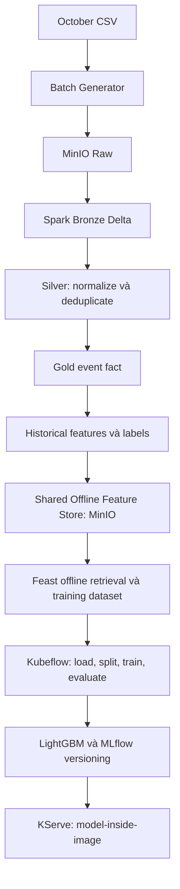
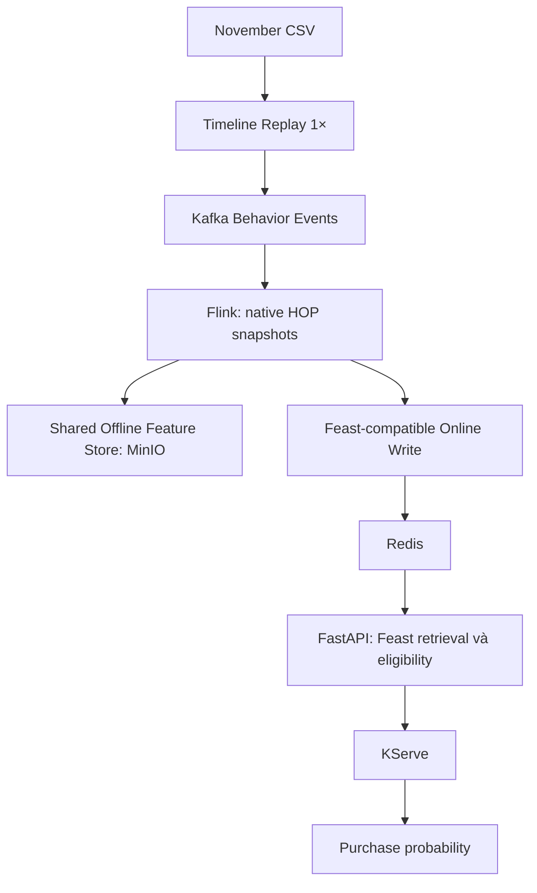

# Kiến trúc mục tiêu

## Mục tiêu và phạm vi

Baseline Purchase Propensity dự đoán purchase trong `[t,t+1h)`, với `t=feature_as_of`. Bốn feature 15 phút và time/cleaning/serving semantics có canonical home tại [DATA_CONTRACT.md](DATA_CONTRACT.md). E2E phải có **Kubeflow + LightGBM/MLflow + KServe + Feast + FastAPI**. Target chốt ngày 2026-10-10 không phải runtime evidence; xem [implementation](CURRENT_IMPLEMENTATION.md).

## Offline training

Complete October đi qua Medallion; không bypass Silver/Gold hoặc dùng benchmark samples/replicas làm training truth. Gold dimensions/SCD2 và PostgreSQL DWH là nhánh analytics từ Silver. Dimension join không được nhân/mất event hoặc đưa future attributes vào feature. Label cần đủ coverage, thiếu tương lai không thành label 0.

## Online on-demand inference

**Không có Kafka Feature Topic hoặc Feature Push Consumer riêng trong baseline.** Hai write responsibilities nằm trong Flink job. Online write qua API/adapter tương thích Feast, không tự viết Redis keys. Sink binding/storage format chưa chốt: phải vượt [Phase 9 gate](IMPLEMENTATION_ROADMAP.md#phase-9--flink-features-và-direct-writes).

Một native HOP implementation: window 15 phút, slide 1 phút, `window_end=feature_as_of`.

| Profile | Producer late injection | Watermark lag đề xuất | Serving |
| --- | --- | --- | --- |
| Demo inference | Tắt synthetic late 5–10 phút; giữ duplicate | 10 giây | Sau warm-up/freshness checks |
| Rubric late | Bật delay 5–10 phút và duplicate | 11 phút | Không phục vụ inference |

Watermark values là target cần native verification, không bảo đảm trước mọi backlog. Window final khi watermark đi qua mốc đóng; không sửa snapshot final. Test late theo từng assigned HOP window: không coi `event_time < watermark` là bằng chứng drop khỏi mọi window. Kiểm chứng idle partition và toàn stream dừng; không tạo watermark giả từ wall-clock để che thiếu event.

## Shared Offline Feature Store

Chỉ **một logical Offline Feature Store**, ưu tiên MinIO, chứa cả historical October do Spark ghi và snapshot November do Flink ghi. Có thể tách bảng/partition trong cùng store; output history của Flink không tạo thêm offline store. Labels giữ riêng khỏi feature history.

Cả hai producers dùng chung feature contract và **một Feast Feature Registry**, không duy trì hai bộ definitions độc lập. Source bindings/physical layout có thể khác nhưng phải tái dùng canonical definitions. Historical retrieval chọn rõ dataset/source và replay run, rồi PIT lookup theo `feature_as_of`; không union các timelines mù quáng. [Metadata/key semantics](DATA_CONTRACT.md#target-canonical-offlineonline-feature-history--not-implemented) là canonical contract; cách lọc/binding tương thích Feast 0.38.0 vẫn cần integration test.

## Trách nhiệm công nghệ

| Component | Trách nhiệm |
| --- | --- |
| Python / Kafka | Timeline replay, faults, behavior transport; rate cap không phải replay clock |
| Spark / Delta | Bronze preservation/evolution; Silver cleaning; Gold; historical features/labels và storage/versioning |
| Flink | Event-time HOP/dedup, checkpoint và hai sink responsibilities |
| Feast / Redis | Definition, retrieval, materialization, compatible online write; không tính feature |
| Airflow | DP1–DP3/materialization; không thay Flink runtime hoặc Kubeflow |
| Kubeflow / MLflow / KServe | Training orchestration, versioning và model serving |
| FastAPI / DataHub | On-demand feature eligibility/inference; metadata/lineage/validation |

## Direct-write correctness gate

[Feast 0.38.0 source audit và write invariants](DATA_CONTRACT.md#feast-0380--source-audit-và-write-invariants) là canonical reference. Không giả định SDK sink tham gia Flink checkpoint hoặc dual-write atomic. Phase 9 phải chứng minh offline idempotency, online ordering/fencing, checkpoint recovery và partial failure bằng tiny fixture và cả hai readbacks.

Incremental materialization vẫn bắt buộc. Baseline dùng phiên ghi **tuần tự**: materialization trước, Flink writer sau; xác nhận writer cũ đã dừng. Airflow không materialize cạnh tranh vào cùng live view. October giữ timestamp 2019, không refresh thành hiện tại để làm dữ liệu cũ trông mới. Materialization phải chọn đúng source/run và khoảng `feature_as_of`; không materialize October vào live view khi Flink đang ghi. Backfill đang live dùng online destination tách biệt cho tới khi coordination được kiểm chứng.

Nếu direct sinks không vượt gate với ít code hợp lý, ghi BLOCKER. Alternative cần learner duyệt: native offline commit trước, rồi dùng incremental materialization đã yêu cầu bởi rubric để cập nhật online; đo lại freshness/recovery. Không tự thêm feature topic, consumer/service hoặc custom Redis backend.

## Ngoài baseline và OPEN

Hoãn stream labels/evaluator, auto prediction, prediction queue, A/B, live generator, CDC và ecommerce UI. Rubric LLM/RAG/agent, cloud/IaC/security/monitoring/bonus vẫn được tracking; xem [RUBRIC.md](RUBRIC.md).

OPEN: Flink SDK/connector binding; offline sink format/commit visibility và Feast access; writer fencing/recovery; partial-failure coordination; TTL/retention; connector/Python versions; coverage/distribution audit; SCD2 tie rules; durable stream event archive sau baseline. Cadence, label boundary, inference anchor, timeline 1× và bỏ feature topic đã chốt.

Theo [roadmap](IMPLEMENTATION_ROADMAP.md), chỉ implement component tiếp theo khi learner đồng ý. Architecture changes không nâng implementation status hoặc thay evidence cũ.
