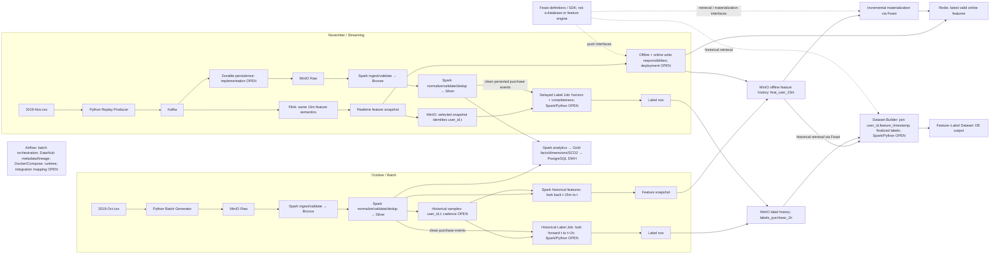

# Target architecture and product decision

## Agreed DE scope and feature contract

DE prepares event history, feature history and label history, ending at a Feature–Label Dataset for downstream ML. Model training, prediction and production outcome tracking are outside this DE flow. This is the learner-approved target design, not implementation/runtime evidence.

The four features are `views_15m`, `carts_15m`, `purchases_15m`, and `total_spend_15m`. Counts match event types; spend sums `price` for purchases only. Spark computes historical/backfill features; Flink computes realtime features with the same semantics. The UTC window is `[t-15m,t)`; grain is `(user_id, feature_timestamp)` with `t=feature_timestamp`. `created_timestamp` is when the row is created, distinct from window end and actual availability. A 15-minute lookback does not specify snapshot cadence or TTL. Detailed schemas belong to [DATA_CONTRACT.md](DATA_CONTRACT.md).

## Target flow

Every processing box is a logical responsibility, not automatically a separate deployable unit. Solid arrows show target data movement; dashed arrows show interfaces/control. No arrow establishes runtime success.

Raw/Bronze/Silver preserve events; offline feature history preserves time-indexed snapshots; Redis holds latest valid serving values. Gold/DWH is an analytics path, not a mandatory feature source. DataHub tracks metadata/lineage rather than storing events; Airflow orchestrates jobs rather than computing features.

## Responsibilities and invariants

| Component | Responsibility | Invariant to preserve |
| --- | --- | --- |
| Batch generator | Prepare offline historical input and rubric fault cases | Date/schema partitions have explicit boundaries; a bounded fixture proves count and identity before scaling. |
| Stream generator/Kafka | Replay or transport events with keys and event-time preserved | Event payload time is not arrival time; retry duplicates are handled by a declared identity rule. |
| Raw event archive | Preserve accepted event detail for audit/reprocessing | Never replace event history with feature aggregates. |
| Spark | Normalize/history backfill and compute offline features/facts | Historical feature rows obey the exact canonical feature/window definition. |
| Flink | Maintain streaming event-time state and compute current 15m features | Late-data policy and watermark behavior match the declared availability rule. |
| Feast | Define entity/features, historical retrieval, push/materialize and online retrieval | Feast serves/materializes values; Spark/Flink own feature calculations. |
| Airflow | Order and retry pipeline stages | Trigger success is distinct from task/DAG completion and data readback. |
| Dataset Builder | Retrieve historical features through Feast and join finalized labels | Join the matching `(user_id,feature_timestamp)` sample and selected snapshot/revision; exclude pending labels. |
| Historical / delayed label jobs | Read clean purchase events for selected `(user_id,t)` samples in both lanes | Label needs sample identity/time and events, not feature values; never finalize 0 before coverage/completeness is sufficient. |
| Governance | Describe datasets/lineage and run contracts | Metadata is checked against physical schemas and active snapshots. |

## Offline/stream parity

Spark historical computation and Flink live computation must share event filters, count/spend definitions, timestamp parsing, UTC convention, `[t-15m,t)` boundary, dedup identity, and late-arrival availability semantics. Offline training must reconstruct the feature state that serving could have known at the same prediction time. If the selected serving rule does not wait for a watermark, late events must not silently rewrite a previously emitted prediction's historical feature snapshot.

## Why retain both event history and feature rows?

The event archive is the detailed source of truth for rebuilding windows, auditing late events and deriving future features. A 15-minute row loses the event sequence, individual products/sessions and information outside its aggregate fields. Offline feature history records the values available at specific times for point-in-time training. Redis holds the latest online values needed for low-latency serving. These stores serve different consumers and do not substitute for one another.

## Feast and materialization

Feast is required by the workbook even with a 15m-only model: offline feature history supports historical retrieval/training, incremental offline-to-online materialization maintains online values, and Flink-produced stream features must be pushed to offline and online stores. Materialization and realtime offline/online writes are distinct responsibilities requiring independent verification; their deployable job mapping remains OPEN. Feast is not a database and does not create labels. TTL controls configured online freshness/availability; it is not a window definition and does not prove offline retention.

## Labels and Feature–Label Dataset

1. Select historical samples `(user_id,t)` for October; for November, durably store identities of selected realtime snapshots. Eligibility/cadence remains OPEN.
2. Compute features over `[t-15m,t)`; derive labels independently from clean Silver purchase events over `[t,t+1h)`.
3. Keep labels PENDING until the horizon and chosen coverage/completeness policy permit finalization. Then set 1 if any qualifying purchase exists, otherwise 0.
4. Store label history separately from feature history on MinIO. Join by `(user_id,feature_timestamp)`, using the matching feature snapshot/revision and finalized labels only.
5. End the DE flow at a reproducible Feature–Label Dataset. Historical labels do not depend on prediction logs. Label jobs may share logic; no separate deployment is implied.

Future production predictions may use `prediction_id` to link exact inputs, model version and outcome. This does not define historical labels and is outside the current DE flow. Saved exact prediction snapshots must never be rewritten by later backfills; the relation between feature time and actual prediction time remains OPEN.

## Dataset direction and unresolved decisions

The agreed source split is `2019-Oct.csv` for historical batch/bootstrap over `[2019-10-01T00:00:00Z,2019-11-01T00:00:00Z)` and `2019-Nov.csv` for Kafka replay, without loading the same November interval through both paths. Batch schema V1 is `[Oct 01,Oct 16)` and V2 is `[Oct 16,Nov 01)`; membership comes from parsed UTC event_time independently of source order. Small sampling happens after classification, approximately 50/50 per schema, with no quota backfill when a population is short. These are design rules, not evidence of full-scale execution. Both files' actual schema, event overlap, sort order and coverage must be checked before generation. Source CSV event time alone does not reconstruct historical arrival time.

### OPEN decisions — resolve at the relevant component

- Full event source for features/labels, separate from sampled/replicated benchmark data. Event sampling can lose purchases; replicas can shift timestamps. Neither automatically establishes historical truth.
- Sample/snapshot cadence and user eligibility; future prediction triggering and feature-time versus prediction-time relation remain outside current DE implementation scope and unresolved.
- Replay clock and its relation to dataset event time, wall clock and label maturation.
- Event identity/dedup and normalization; watermark, late-event availability and snapshot emission.
- Label horizon coverage/completeness and maturation; incomplete future coverage must not become label 0.
- Historical feature correction/backfill/revision policy, including snapshot selection for datasets; no policy is chosen here.
- Kafka → Lakehouse persistence implementation, offset/checkpoint/retry mapping.
- Realtime offline/online write deployment mapping and write coordination/idempotency.
- Offline format/Feast compatibility, TTL/freshness, materialization cursor and stale-write coordination.
- Physical layout, retention/versioning of samples, features, labels and datasets; analytics/DWH mapping and DAG boundaries.

These are target decisions, not runtime facts. Do not redesign or silently close an OPEN item while implementing another component.

## Complete October Batch Generator direction — corrected 2026-10-08

Batch Generator owns complete October ingestion and benchmark generation. Complete-source mode retains every source event, applies UTC OLD/NEW schema evolution, and adds configured 2% duplicate copies. It preserves natural skew, without synthetic user/price/time changes, sampling or replicas. Source CSV stays local with checksum; bounded multipart transport creates exactly two CSV objects plus manifest in a fresh MinIO prefix, with only small manifest/readback local.

Injected copies must be handled before feature/label computation without losing valid source events; exact downstream identity/dedup policy remains OPEN. Full feature-source validity cannot be inferred from injection/readback alone. The earlier no-injection run was superseded and cleaned with retained evidence. Full corrected Batch Generator and Spark Raw → Bronze readback are verified ([Batch](docs/evidence/batch_generator_october.json), [Bronze](docs/evidence/spark_raw_to_bronze_evolution_full.json)); scale and other pending rubric requirements remain unverified. This status update does not change the target design.
