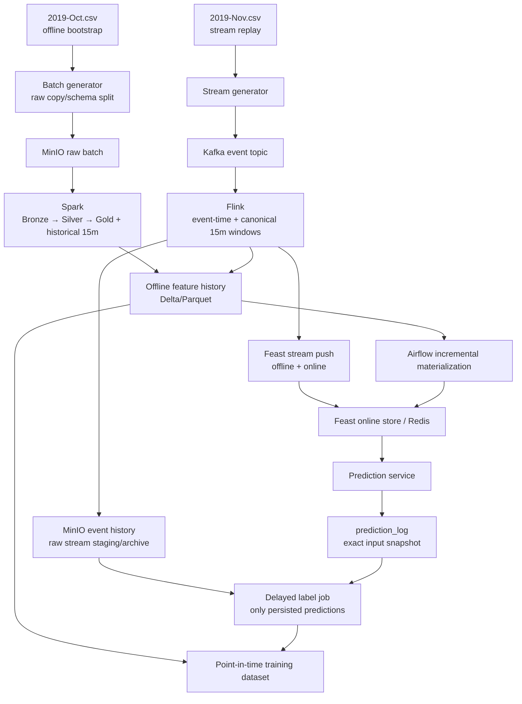

# Target architecture and product decision

## Agreed prediction problem

Predict whether a user will produce at least one `purchase` event in the hour after a prediction decision. The baseline model receives only four behavioral features computed over the 15 minutes immediately before its feature as-of timestamp. Longer-window behavior can be considered later as a measured experiment; it is not part of this baseline.

The target feature set is `f_views_15m`, `f_carts_15m`, `f_purchases_15m`, and `total_spend_15m`. Counts include the matching event types; spend sums `price` for purchases only. The window is half-open `[t-15m,t)`, all timestamps are UTC, and the offline/online feature record grain is `(user_id, feature_timestamp)`. The canonical detailed schema and all current mismatches are in [DATA_CONTRACT.md](DATA_CONTRACT.md).

An initial schedule hypothesis is: events handled during `[t-1m,t)` can make a user eligible for a prediction at minute `t`; the feature window ends at `t`; outcome is purchase in `[t,t+1h)`. That scheduling rule remains a **design question** until the team chooses how event availability and late data affect the snapshot. Event time alone cannot prove an event had reached Flink/Feast before a prediction was made.

## Target flow

The diagram is the desired architecture, not current implementation evidence. Solid system components are selected technologies; actual code links and missing pieces are listed in [CURRENT_IMPLEMENTATION.md](CURRENT_IMPLEMENTATION.md).

## Responsibilities and invariants

| Component | Responsibility | Invariant to preserve |
| --- | --- | --- |
| Batch generator | Prepare offline historical input and rubric fault cases | Date/schema partitions have explicit boundaries; a bounded fixture proves count and identity before scaling. |
| Stream generator/Kafka | Replay or transport events with keys and event-time preserved | Event payload time is not arrival time; retry duplicates are handled by a declared identity rule. |
| Raw event archive | Preserve accepted event detail for audit/reprocessing | Never replace event history with feature aggregates. |
| Spark | Normalize/history backfill and compute offline features/facts | Historical feature rows obey the exact canonical feature/window definition. |
| Flink | Maintain streaming event-time state and compute current 15m features | Late-data policy and watermark behavior match the declared availability rule. |
| Feast | Define entity/features, historical retrieval, push/materialize and online retrieval | Feast serves/materializes values; Spark/Flink own feature calculations. |
| Airflow | Order and retry pipeline stages | Trigger success is distinct from task/DAG completion and data readback. |
| Prediction service | Read online values and persist prediction plus exact values used | Every actual prediction has an immutable id and reproducible input snapshot. |
| Delayed label job | Join outcomes to actual prediction records when labels mature | Never assign an early negative label while the horizon/completeness policy is pending. |
| Governance | Describe datasets/lineage and run contracts | Metadata is checked against physical schemas and active snapshots. |

## Offline/stream parity

Spark historical computation and Flink live computation must share event filters, count/spend definitions, timestamp parsing, UTC convention, `[t-15m,t)` boundary, dedup identity, and late-arrival availability semantics. Offline training must reconstruct the feature state that serving could have known at the same prediction time. If the selected serving rule does not wait for a watermark, late events must not silently rewrite a previously emitted prediction's historical feature snapshot.

## Why retain both event history and feature rows?

The event archive is the detailed source of truth for rebuilding windows, auditing late events and deriving future features. A 15-minute row loses the event sequence, individual products/sessions and information outside its aggregate fields. Offline feature history records the values available at specific times for point-in-time training. Redis holds the latest online values needed for low-latency serving. These stores serve different consumers and do not substitute for one another.

## Feast and materialization

Feast is required by the workbook even with a 15m-only model: offline feature history supports historical retrieval/training, incremental offline-to-online materialization maintains online values, and Flink-produced stream features must be pushed to offline and online stores. The batch materializer and the stream pusher are separate routes and require independent verification. TTL controls configured online freshness/availability; it is not a window definition and does not prove offline retention.

## Label and training contract

1. Persist an immutable prediction with `prediction_id`, user, decision timestamp, model version, canonical feature timestamp and the exact four values used.
2. Open the outcome interval `[prediction_timestamp, prediction_timestamp + 1h)`.
3. Keep the outcome pending until the interval has elapsed and the agreed event completeness/late-arrival policy permits finalization.
4. Set the label to 1 if any qualifying purchase exists in the interval, otherwise 0. Join by `prediction_id`, not merely user or date.
5. Build training examples from finalized prediction rows and their exact feature snapshots. Split train/validation/test chronologically to avoid future leakage.

The current DP3 label code instead creates candidate user/minute rows from Silver activity; it is not an implementation of this target prediction-linked label contract.

## Dataset direction and unresolved decisions

The agreed source split is `2019-Oct.csv` for historical batch/bootstrap over `[2019-10-01T00:00:00Z,2019-11-01T00:00:00Z)` and `2019-Nov.csv` for Kafka replay, without loading the same November interval through both paths. Batch schema V1 is `[Oct 01,Oct 16)` and V2 is `[Oct 16,Nov 01)`; membership comes from parsed UTC event_time independently of source order. Small sampling happens after classification, approximately 50/50 per schema, with no quota backfill when a population is short. These are design rules, not evidence of full-scale execution. Both files' actual schema, event overlap, sort order and coverage must be checked before generation. Source CSV event time alone does not reconstruct historical arrival time.

Before the relevant milestone, choose (a) eligibility/scheduling rule for predictions, (b) how much late data is available at the feature cutoff, (c) event identity/dedup rule, (d) whether late corrections update offline aggregates without changing saved predictions, and (e) label maturation/completeness policy. Do not encode these unresolved choices as runtime facts.
