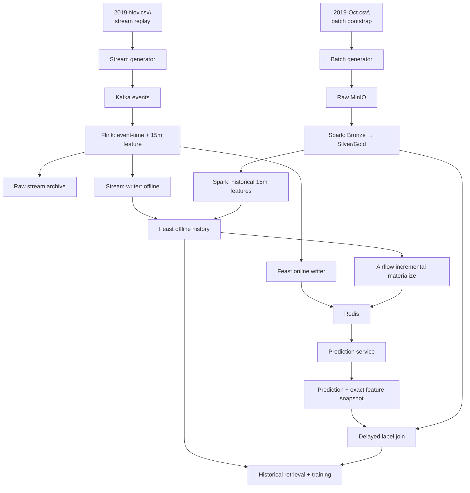

# Bài toán và luồng mục tiêu

File này lưu các quyết định thiết kế đã thống nhất. Nó mô tả điều ta muốn xây, không khẳng định source hiện tại đã triển khai hoặc runtime đã chạy đúng. Tiến độ học nằm ở [LEARNING_ROADMAP.md](LEARNING_ROADMAP.md), hiện trạng source ở [DATA_FLOW.md](DATA_FLOW.md), còn tiêu chí chấm ở [RUBRIC.md](RUBRIC.md).

## Bài toán baseline

Dự đoán xác suất một người dùng có ít nhất một sự kiện `purchase` với bất kỳ sản phẩm nào trong một giờ sau thời điểm dự đoán.

- Mỗi đầu phút `t`, tạo tối đa một prediction cho mỗi user vừa có `view` hoặc `cart` hợp lệ được xử lý trong phút `[t−1m,t)`.
- Dùng bốn feature theo event time trong cửa sổ `[t−15m,t)`: `f_views_15m`, `f_carts_15m`, `f_purchases_15m`, `total_spend_15m`.
- Lưu prediction cùng đúng feature values đã dùng. Label là purchase của user trong `[t,t+1h)`, gắn vào prediction đó; chưa đủ tương lai/lateness thì giữ `pending`, không gán 0 sớm.
- Thời gian UTC; cửa sổ trái đóng, phải mở. Event tới muộn sau mốc prediction không sửa ngược feature/prediction đã phát.

Ví dụ: view lúc 10:27:05 được xử lý lúc 10:27:06. Prediction phát lúc 10:28, feature nhìn `[10:13,10:28)` và label nhìn `[10:28,11:28)`. Purchase lúc 11:05 có thể cập nhật label về sau.

Đây là baseline dễ tính tay và so sánh giữa Spark/Flink. Tradeoff là chưa có tín hiệu thói quen dài hạn; chỉ thử thêm feature dài hạn sau khi có temporal holdout và số đo so sánh. Baseline 15m-only chưa được triển khai/kiểm chứng trong code.

## Vai trò các bảng / bản ghi mục tiêu

| Bảng/bản ghi | Grain và vai trò |
| --- | --- |
| Raw event | Một dòng nguồn hoặc event stream; giữ dấu vết trước xử lý |
| Bronze `raw_events` | Event đã ingest, còn gần nguồn |
| Silver `stg_events` | Event chuẩn hóa, lỗi/null được phân loại và duplicate xử lý theo quy tắc đã chốt |
| Gold dimensions/fact | Chiều user/product và fact event cho phân tích |
| Offline feature history | Một hàng cho user tại `event_timestamp`, cùng `created`/availability metadata để truy vấn lịch sử đúng thời điểm |
| Online feature | Giá trị mới nhất theo user để phục vụ prediction, có timestamp/version chống ghi đè giá trị mới bằng bản cũ |
| `prediction_log` | Một hàng cho mỗi `prediction_id`, lưu user, thời điểm, bốn feature thực dùng và kết quả prediction |
| `prediction_labels` | Outcome theo `prediction_id`; 1/0 chỉ khi horizon được xác nhận đầy đủ, nếu chưa thì pending |
| Training row | Prediction có feature snapshot và label hợp lệ, chia train/validation/test theo thời gian |

Tên bảng cuối cùng có thể đổi khi đọc rubric/code, nhưng grain và ý nghĩa phải được giữ rõ.

## Luồng đích

Sơ đồ này là thiết kế; nét thường ở đây không biểu thị đã xác minh runtime.

Kafka vận chuyển event; Flink xử lý stream/window; Spark tạo lịch sử và batch features; MinIO/Delta lưu lakehouse; Airflow điều phối; Feast khai báo/truy vấn/materialize feature; Redis phục vụ online. Rubric còn yêu cầu stream feature được ghi offline lẫn online, và có incremental offline→online materialization. Materialize vẫn cần dù baseline model chỉ có feature 15 phút.

## Sử dụng hai CSV và giới hạn dữ liệu

- `2019-Oct.csv`: dự kiến dùng bootstrap batch cho tháng 10, tách schema cũ/mới tại ngày 16/10 theo rubric.
- `2019-Nov.csv`: dự kiến replay tháng 11 qua Kafka; không đồng thời preload cùng phần tháng 11 vào Silver rồi ingest lại qua stream.
- CSV có `event_time` nhưng không có arrival time đáng tin cậy. Historical training từ CSV vì vậy chỉ mô phỏng replay lý tưởng trừ khi arrival được ghi lại.
- Trước khi chốt sampling, phải xác minh thứ tự, khoảng trống, duplicate, độ phủ và định nghĩa cohort; giữ nguyên full-file source.
- Bắt đầu bằng fixture nhỏ. Cấu hình scale >=100GB và output namespace riêng; chỉ chạy khi generator/ingest/resource đã được kiểm tra.

## Các quyết định còn cần làm rõ khi đọc component

- Nguồn hiện không có `event_id`; dedup theo các cột trùng có thể gộp nhầm hai hành vi thật.
- Không chờ watermark trước prediction, nhưng watermark vẫn phục vụ event-time progress/window/late-event behavior theo semantics Flink đã cấu hình. Cần kiểm bằng event fixture và tài liệu đúng version.
- Cần định nghĩa chính xác feature snapshot đầu phút khi event có `event_time<t` nhưng tới sau `t`; training phải dùng cùng availability semantics với serving.
- Cần kiểm tra pusher target offline/online, timestamp/freshness guard và thứ tự với materialize để batch cũ không ghi đè stream mới.
- Prediction service và delayed label job chưa được xác nhận là có implementation; label chỉ áp dụng cho prediction records, không gán tùy tiện lên mọi dòng CSV.
