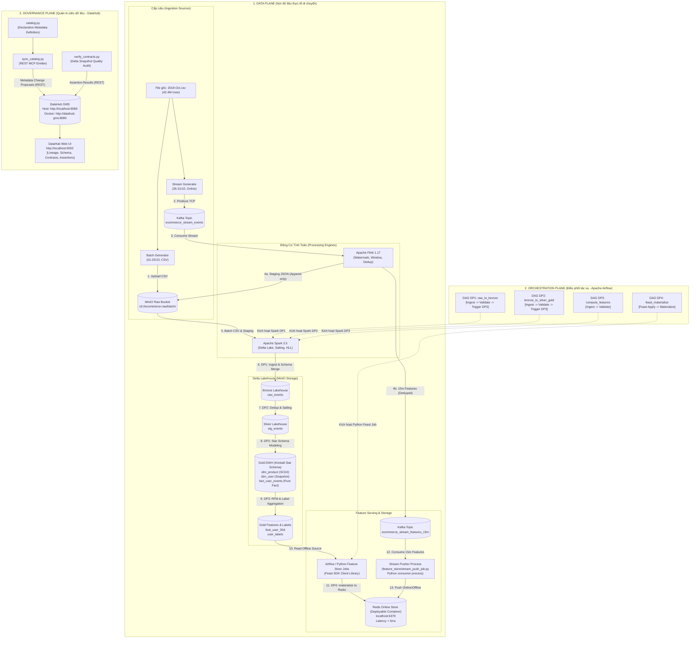

# TOÀN BỘ KIẾN TRÚC HỆ THỐNG DATA ENGINEERING (SYSTEM ARCHITECTURE)
**Dự án:** E-Commerce Real-Time Purchase Propensity Prediction System (`ecom_ML_system`)  
**Khóa học:** EDAI K11 - Data Engineering (Mini-coursework)

---

## 1. TỔNG QUAN KIẾN TRÚC 3 MẶT PHẲNG (THREE-PLANE ARCHITECTURE)

Hệ thống được thiết kế theo chuẩn phân tách trách nhiệm công nghiệp (Separation of Concerns), chia thành 3 mặt phẳng hoạt động độc lập:



---

## 2. PHÂN TÍCH CHI TIẾT TỪNG MẶT PHẲNG

### 1. Data Plane (Mặt phẳng dữ liệu)
Đây là tuyến đường duy nhất mà dữ liệu kinh doanh (bytes/records) thực sự đi qua:
* **Batch Generator (`src/generator/batch_generator.py`):** Giả lập dữ liệu lịch sử từ ngày 01 đến ngày 25 tháng 10 năm 2019. Tiêm 2% duplicate ngẫu nhiên và tiêm Schema Evolution (từ ngày 16/10 chèn thêm cột `discount_percent`).
* **Stream Generator (`src/generator/stream_generator.py`):** Đóng vai luồng clickstream trực tuyến từ 26 đến 31 tháng 10 năm 2019. Tiêm 3 bài toán streaming: Burst Traffic (x30 lưu lượng), Late Arrival (trễ 5-10 phút), và Streaming Duplicate (1.5%).
* **Apache Kafka (`localhost:9092`):** Hàng đợi thông điệp phân tán với key partition là `user_id` để bảo toàn tính tuần tự thời gian của từng khách hàng.
* **Apache Flink (`src/flink/stream_optimized.py`):** Động cơ xử lý dòng thời gian thực. Thiết lập Watermark 15 phút để gom dữ liệu đến trễ, dùng cửa sổ trượt `HOP` 15 phút (trượt 1 phút) tính 4 stream features, và khử trùng lặp qua `ROW_NUMBER() OVER (...) = 1`.
* **Apache Spark (`src/spark/spark_optimized.py`):** Động cơ xử lý mẻ trên Delta Lakehouse. Xử lý triệt để Data Skew bằng kỹ thuật Salting kết hợp Broadcast Join; xử lý High Cardinality bằng thuật toán HyperLogLog (`approx_count_distinct`), và tự động hợp nhất schema qua `mergeSchema=true`.
* **Feast Feature Store & Redis (`feature_store/`):** Feast là thư viện Python SDK (không phải daemon server độc lập). Dữ liệu online được phục vụ và lưu trữ trên Redis deployable container (`localhost:6379`) với độ trễ `< 5ms`.
* **Feast Stream Pusher (`feature_store/stream_push_job.py`):** Tiến trình Python độc lập (consumer process) tiêu thụ topic `ecommerce_stream_features_15m` và push vào Redis / Parquet backup.

### 2. Orchestration Plane (Mặt phẳng điều phối)
* **Apache Airflow (`localhost:8080`):** Đóng vai trò người điều khiển lịch trình tự động.
* Sử dụng mô hình kiểm soát chất lượng **Quality Gate**:
  * `DP1`: Chỉ khi nạp vào Bronze và kiểm tra 0 NULL `user_id` thành công thì mới kích hoạt `DP2`.
  * `DP2`: Sau khi khử trùng lặp và xác nhận tính toàn vẹn khóa ngoại `product_sk` hợp lệ thì mới kích hoạt `DP3`.
  * `DP3`: Tính toán đặc trưng và kiểm tra hợp đồng Feast Schema (`event_timestamp`, `created`).
  * `DP4`: Kích hoạt Python Feast Job (`materialize.py`) đồng bộ hóa đặc trưng từ Delta sang Redis.

### 3. Governance Plane (Mặt phẳng quản trị)
* **DataHub (`localhost:9002` Web UI, GMS Host: `localhost:8089`, GMS Docker: `datahub-gms:8080`):** Đóng vai trò đài quan sát siêu dữ liệu (Metadata & Data Contracts).
* **Nguyên tắc bất biến:** DataHub **không** nằm trên đường đi của dữ liệu. Nó chỉ nhận thông tin mô tả qua REST API thông qua bộ module:
  * `catalog.py`: Nguồn sự thật duy nhất khai báo cấu trúc bảng, kiểu dữ liệu, phả hệ (Lineage) và hợp đồng chất lượng.
  * `sync_catalog.py`: Phát các gói tin MCP (Metadata Change Proposal) lên DataHub GMS.
  * `verify_contracts.py`: Đọc dữ liệu thực tế trên MinIO bằng PyArrow/Delta snapshot, kiểm tra các điều khoản hợp đồng và phát sự kiện `AssertionRunEvent` lên DataHub.

---

## 3. ÁNH XẠ LƯU TRỮ VẬT LÝ (PHYSICAL STORAGE LAYOUT)

Dữ liệu trên máy cục bộ không có dung lượng vô hạn mà phụ thuộc vào ổ cứng vật lý của máy host:

```text
MinIO Object Storage (S3 API: http://localhost:9000)
        │
        ▼ (Ánh xạ qua Docker Volume)
Docker Volume: minio_data
        │
        ▼ (Lưu trữ trên Filesystem của Host)
/var/lib/docker/volumes/... hoặc Thư mục Mount của Host
        │
        ▼ (Phân vùng ổ cứng thực tế)
Physical Hard Drive Partition (SSD / NVMe / HDD)
```

* **Dung lượng lưu trữ:** Khi chạy ở chế độ mặc định (`mode: small`), hệ thống chỉ chiếm khoảng ~150MB đến ~500MB trên đĩa cứng.
* **Chế độ 100GB (`mode: full`):** Để chạy toàn bộ 100GB benchmark, máy tính cần tối thiểu 120GB dung lượng trống trên phân vùng chứa Docker Volume của MinIO.
