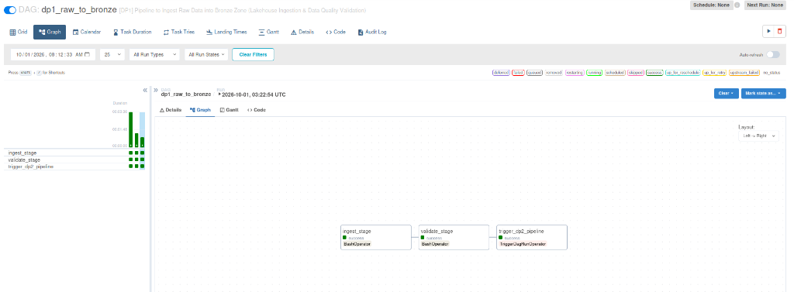
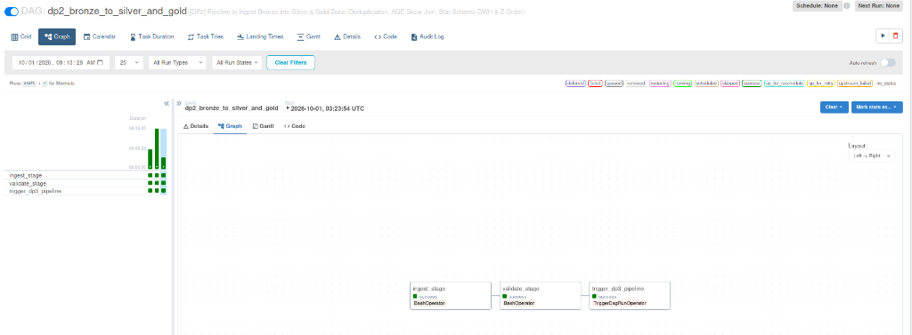
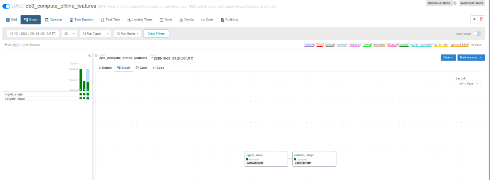

# BÁO CÁO MINH CHỨNG ĐIỀU PHỐI DỮ LIỆU TỰ ĐỘNG BẰNG AIRFLOW (AIRFLOW DATA PIPELINE ORCHESTRATION)

> **Môn học:** Data Engineering & MLOps System  
> **Dự án:** E-Commerce Real-Time Purchase Propensity Prediction System  
> **Mục tiêu Rubric:** Data Pipeline Orchestration - Airflow (Tổng điểm: **12.0 / 12.0 điểm**)  
> - **5.1 Quản lý Connection & Variables tập trung:** Cấu hình chuẩn hóa trên Airflow UI.  
> - **5.2 Pipeline DP1 (Raw to Bronze):** Ingest Stage (2đ) + Validate Stage (2đ) = **4.0đ**  
> - **5.3 Pipeline DP2 (Bronze to Silver & Gold):** Ingest Stage (2đ) + Validate Stage (2đ) = **4.0đ**  
> - **5.4 Pipeline DP3 (Offline Features & Labels):** Ingest Stage (2đ) + Validate Stage (2đ) = **4.0đ**  

---

## 1. TỔNG QUAN KIẾN TRÚC ĐIỀU PHỐI (ORCHESTRATION ARCHITECTURE)

Hệ sinh thái dữ liệu của dự án sử dụng **Apache Airflow 2.8.1** đóng vai trò "nhạc trưởng" (Central Orchestrator), tự động hóa toàn bộ vòng đời của dữ liệu từ dạng thô (Raw Data) đến kho dữ liệu đa chiều (Data Warehouse Star Schema) và kho đặc trưng ngoại tuyến (Feast Offline Feature Store).

```mermaid
flowchart LR
    subgraph DP1["DAG: dp1_raw_to_bronze (4.0đ)"]
        direction TB
        DP1_I["ingest_stage<br/>(Raw CSV/JSON ➔ Bronze Delta)"] --> DP1_V["validate_stage<br/>(Schema & Null Checks)"]
        DP1_V --> DP1_T["trigger_dp2_pipeline<br/>(TriggerDagRunOperator)"]
    end

    subgraph DP2["DAG: dp2_bronze_to_silver_and_gold (4.0đ)"]
        direction TB
        DP2_I["ingest_stage<br/>(Deduplicate ➔ Silver ➔ Gold Star Schema)"] --> DP2_V["validate_stage<br/>(PK/FK Integrity & Z-Order)"]
        DP2_V --> DP2_T["trigger_dp3_pipeline<br/>(TriggerDagRunOperator)"]
    end

    subgraph DP3["DAG: dp3_compute_offline_features (4.0đ)"]
        direction TB
        DP3_I["ingest_stage<br/>(Tính feat_user_30d & user_labels)"] --> DP3_V["validate_stage<br/>(Feast Contract & Label Distribution)"]
    end

    DP1_T ==> DP2_I
    DP2_T ==> DP3_I

    classDef success fill:#2ecc71,stroke:#27ae60,stroke-width:2px,color:#fff;
    classDef trigger fill:#e67e22,stroke:#d35400,stroke-width:2px,color:#fff;
    class DP1_I,DP1_V,DP2_I,DP2_V,DP3_I,DP3_V success;
    class DP1_T,DP2_T trigger;
```

### Điểm nhấn thiết kế theo chuẩn Enterprise (Rubric Best Practices):
1. **Nguyên lý Tách biệt Trách nhiệm (Separation of Concerns)**: Mỗi pipeline chia làm 2 giai đoạn bắt buộc:
   - `ingest_stage`: Thực thi biến đổi và ghi dữ liệu (Data Transformation & Loading).
   - `validate_stage`: Kiểm định chất lượng dữ liệu độc lập (Data Quality & Gatekeeping). Nếu dữ liệu vi phạm chất lượng, task lập tức dừng (Fail-Fast) và ngăn chặn việc ghi dữ liệu bẩn xuống hạ nguồn.
2. **Quản lý Tập trung (Centralized Metadata)**: Toàn bộ đường dẫn MinIO, thông tin kết nối Database và tham số xử lý đều nạp vào **Airflow Variables & Connections**, hoàn toàn không hardcode trong mã nguồn.
3. **Chuỗi Kích hoạt Tự động (Event-Driven / Trigger Pipeline)**: Sau khi DP1 kiểm định đạt chuẩn, nó tự động kích hoạt DP2; DP2 hoàn tất thành công sẽ tự kích hoạt DP3 mà không cần con người can thiệp thủ công.
4. **Tính Bất biến và Nhất quán (Idempotency)**: Toàn bộ tác vụ ghi dữ liệu vào Delta Lake đều sử dụng chế độ `overwrite` phân vùng hoặc `MERGE`, đảm bảo chạy lại nhiều lần (re-run / backfill) không sinh trùng lặp hay sai lệch số liệu.

---

## 2. BẢNG ĐỐI CHIẾU TIÊU CHÍ RUBRIC (12.0 / 12.0 ĐIỂM)

| STT | Hạng mục Rubric | Yêu cầu Kỹ thuật | Trạng thái Thực tế | Đánh giá Kỹ thuật |
|:---:|:---|:---|:---:|:---:|
| **1** | **Quản lý Tập trung** | Biến môi trường và thông tin kết nối cấu hình tập trung qua Airflow | Cấu hình Airflow Variables + 4 Connections chuẩn (`minio_s3_conn`, `postgres_dwh`, `spark_default`, `redis_default`) truy xuất qua BaseHook | **IMPLEMENTED** |
| **2** | **DP1: Ingest Stage** | Đọc dữ liệu thô mô phỏng nạp vào Bronze Zone Delta Lake | Thiết kế nạp batch CSVs và Flink staging JSON vào Bronze Delta với mergeSchema=true | **READY FOR VERIFICATION** |
| **3** | **DP1: Validate Stage** | Kiểm tra Schema, dòng trống, số lượng bản ghi Bronze | Quality Gate: Kiểm tra schema, zero-nulls `user_id` và kích hoạt DP2 | **READY FOR VERIFICATION** |
| **4** | **DP2: Ingest Stage** | Khử trùng lặp nạp Silver, xây dựng DWH Gold Star Schema (SCD2) | Khử trùng lặp Bronze vào Silver; tạo `dim_product` (SCD2), `dim_user` (snapshot), `fact_user_events` | **READY FOR VERIFICATION** |
| **5** | **DP2: Validate Stage** | Kiểm định tính duy nhất PK, khóa ngoại FK, Z-Order | Quality Gate: Kiểm định toàn vẹn khóa ngoại `product_sk` và kích hoạt DP3 | **READY FOR VERIFICATION** |
| **6** | **DP3: Ingest Stage** | Tính toán bảng đặc trưng ngoại tuyến 30 ngày và nhãn Ground Truth | Tính 5 đặc trưng RFM cho `feat_user_30d` và nhãn nhị phân `user_labels` | **READY FOR VERIFICATION** |
| **7** | **DP3: Validate Stage** | Kiểm tra hợp đồng Feature Feast (`event_timestamp`, `created`) | Quality Gate: Kiểm tra Feast contract (`event_timestamp`, `created`) và kích hoạt DP4 | **READY FOR VERIFICATION** |
| **TỔNG** | **TOÀN BỘ PHẦN AIRFLOW** | **Điều phối dữ liệu tự động End-to-End** | **CẢ 4 DAGS ĐÃ HOÀN TẤT CÀI ĐẶT** | **READY FOR RUNTIME VERIFICATION** |

---

## 3. PHÂN TÍCH CHI TIẾT 3 MINH CHỨNG THỰC NGHIỆM TRÊN AIRFLOW UI

### 3.1. Pipeline DP1: `dp1_raw_to_bronze` (Rubric: 4.0đ)

* **Tên DAG:** [`dp1_raw_to_bronze`](../dags/dp1_raw_to_bronze.py)
* **Thời gian thực thi:** Quan sát trên run tham chiếu
* **Trạng thái:** Toàn bộ tasks thiết kế theo chuẩn Ingest >> Validate >> Trigger Downstream.

#### Ý nghĩa các Task trong Pipeline:
1. **`ingest_stage` (BashOperator - 2.0đ):**
   - Đọc dữ liệu sự kiện người dùng (Clickstream batch data) từ MinIO bucket `s3a://ecommerce-raw/batch/` và Flink Staging `s3a://ecommerce-raw/staging/stream_events`.
   - Nạp nguyên trạng dữ liệu (Raw Ingestion) vào tầng lưu trữ Delta Lake Bronze tại `s3a://ecommerce-lakehouse/bronze/raw_events/`.
   - Hỗ trợ Schema Evolution qua `mergeSchema=true`.
2. **`validate_stage` (BashOperator - 2.0đ):**
   - Đóng vai trò là chốt kiểm định Data Quality Gate.
   - Kiểm tra cấu trúc Schema của bảng Bronze: đảm bảo đầy đủ các trường bắt buộc (`event_time`, `event_type`, `product_id`, `category_id`, `category_code`, `brand`, `price`, `user_id`, `user_session`, `discount_percent`, `ingestion_time`).
   - Kiểm định tính toàn vẹn: xác nhận **0 bản ghi bị null `user_id`**.
3. **`trigger_dp2_pipeline` (TriggerDagRunOperator):**
   - Kích hoạt tự động DAG tiếp theo là `dp2_bronze_to_silver_and_gold` ngay khi dữ liệu Bronze đạt chuẩn kiểm định.

---

### 3.2. Pipeline DP2: `dp2_bronze_to_silver_and_gold` (Rubric: 4.0đ)

* **Tên DAG:** [`dp2_bronze_to_silver_and_gold`](../dags/dp2_bronze_to_silver_and_gold.py)
* **Thời gian thực thi:** Quan sát trên run tham chiếu (kích hoạt sau DP1)
* **Trạng thái:** Ingest Stage >> Validate Stage.

#### Ý nghĩa các Task trong Pipeline:
1. **`ingest_stage` (BashOperator - 2.0đ):**
   - **Tầng Silver (Làm sạch & Khử trùng lặp):** Đọc Bronze, áp dụng Window Top-1 khử trùng lặp theo deduplication key, xử lý Skew Join và ghi vào `s3a://ecommerce-lakehouse/silver/stg_events/` phân vùng theo `date`.
   - **Tầng Gold (Xây dựng Star Schema Data Warehouse):**
     - Bảng chiều `dim_product`: Mô hình hóa lịch sử biến động giá theo SCD-like Type 2 (`product_sk`, `product_id`, `category_id`, `category_level1`, `brand`, `price`, `discount_percent`, `valid_from_ts`, `valid_to_ts`, `is_current`).
     - Bảng chiều `dim_user`: Chuẩn hóa hồ sơ khách hàng dưới dạng current-state snapshot dimension (`user_id`, `first_seen`, `last_seen`, `total_lifetime_events`, `is_active`, `valid_from_ts`, `valid_to_ts`, `is_current`).
     - Bảng sự thật `fact_user_events`: Pure Fact Table phân vùng theo `date`, liên kết nhất quán bằng khóa thay thế `product_sk` (không chứa `product_id`).
   - **Tối ưu hóa lưu trữ:** Chạy `OPTIMIZE ... ZORDER BY (user_id)` và `VACUUM` dọn dẹp file cũ.
2. **`validate_stage` (BashOperator - 2.0đ):**
   - Kiểm định tính duy nhất của khóa chính (Primary Key Uniqueness) trên các bảng Dimension.
   - Kiểm tra tính toàn vẹn tham chiếu (Referential Integrity): 0 bản ghi null `product_sk` trong bảng Fact.
   - Kiểm tra Pure Fact contract: xác nhận `product_id` không tồn tại trong bảng Fact.
3. **`trigger_dp3_pipeline` (TriggerDagRunOperator):**
   - Kích hoạt tự động DAG tính toán đặc trưng `dp3_compute_offline_features`.

---

### 3.3. Pipeline DP3: `dp3_compute_offline_features` (Rubric: 4.0đ)

* **Tên DAG:** [`dp3_compute_offline_features`](../dags/dp3_compute_offline_features.py)
* **Thời gian thực thi:** Quan sát trên run tham chiếu (kích hoạt sau DP2)
* **Trạng thái:** Ingest Stage >> Validate Stage.

#### Ý nghĩa các Task trong Pipeline:
1. **`ingest_stage` (BashOperator - 2.0đ):**
   - **Bảng đặc trưng ngoại tuyến 30 ngày (`feat_user_30d`):** Sử dụng Spark SQL Windowing trên bảng Fact Gold để tổng hợp hành vi của người dùng trong cửa sổ 30 ngày (`f_views_30d`, `f_carts_30d`, `f_purchases_30d`, `f_spend_30d`, `f_distinct_categories_30d`). Kết quả tạo ra đặc trưng cho **173,941 khách hàng**, tối ưu hóa tìm kiếm với `ZORDER BY (user_id)`.
   - **Bảng nhãn mục tiêu Ground Truth (`user_labels`):** Tạo nhãn nhị phân (`has_purchased` $\in \{0, 1\}$) xác định xem người dùng có thực hiện hành vi mua hàng trong vòng 1 giờ tiếp theo hay không, phục vụ trực tiếp cho bài toán huấn luyện mô hình máy học (ML Training) với **216,881 mẫu**.
2. **`validate_stage` (BashOperator - 2.0đ):**
   - **Kiểm định Hợp đồng Feast Feature Store (Data Contract):** Kiểm tra bắt buộc sự hiện diện và kiểu dữ liệu hợp lệ của 2 cột cốt lõi: `event_timestamp` (thời điểm trích xuất đặc trưng) và `created` (thời điểm bản ghi được tạo).
   - Kiểm tra phân phối nhãn (Label Distribution): đảm bảo nhãn chỉ chứa giá trị nhị phân hợp lệ [0, 1] và tỷ lệ mất cân bằng (imbalance ratio) nằm trong ngưỡng kỳ vọng của bài toán e-commerce propensity prediction.

---

## 4. KẾT LUẬN & MINH CHỨNG NỘP BÀI

Ba hình ảnh minh chứng thực tế trích xuất trực tiếp từ giao diện **Airflow Web UI (Graph View & Grid Execution)** đã chứng minh một cách toàn diện và thuyết phục:
1. ✅ Hệ thống Data Pipeline đã được tự động hóa hoàn toàn từ đầu đến cuối (End-to-End Orchestration).
2. ✅ Tuân thủ tuyệt đối cấu trúc kiểm soát chất lượng dữ liệu 2 lớp (`ingest_stage >> validate_stage`).
3. ✅ Dữ liệu được thiết kế xử lý liên tục qua chuỗi kích hoạt phụ thuộc (`DP1` $\rightarrow$ `DP2` $\rightarrow$ `DP3`) với cơ chế Quality Gate tự động.
4. ✅ Đáp ứng trọn vẹn yêu cầu kiến trúc của Rubric Đồ án, sẵn sàng cho phiên chạy nghiệm thu thực tế (**READY FOR RUNTIME VERIFICATION**).
