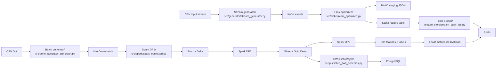

# Luồng dữ liệu hiện có trong source

Phạm vi file đã rà trong bản đồ này: generator, Spark/Flink, DAG, Feast và DWH entrypoints liên kết trực tiếp. Đây là liên kết tĩnh trong source, không phải kết quả chạy. Luồng sẽ được kiểm chứng lại theo từng milestone.

**Thiết kế đã chốt cho baseline đầu:** [WorkFlow.md](WorkFlow.md) dùng bốn feature 15m, không dùng feature 30d làm đầu vào model. Code hiện tại vẫn có 30d và cần thay/đối chiếu ở các milestone; đây là khác biệt implementation so với mục tiêu.

Mục tiêu: mỗi đầu phút `t`, dự đoán purchase trong một giờ tới cho user có view/cart hợp lệ mới được xử lý trong phút trước. Một prediction/user tại `t`, với bốn feature event-time `[t − 15 phút, t)` đã được xử lý trước điểm chốt; không chờ watermark. Spark tính cùng feature offline theo từng mốc đủ điều kiện; Flink tính online. Training lịch sử CSV ban đầu giả định replay lý tưởng theo event time vì CSV không ghi arrival time. Source hiện tại chưa được xác nhận đạt mục tiêu này.

## Producer → nơi lưu → consumer hiện có trong source

Sơ đồ dưới đây chỉ mô tả đường đi hiện tại xác nhận được từ lời gọi/đích trong code. Mũi tên không khẳng định job đã chạy thành công.

| Producer | Output mặc định | Consumer |
| --- | --- | --- |
| [Batch generator](../src/generator/batch_generator.py) đọc 2019-Oct.csv | MinIO ecommerce-raw/batch/raw_events_old*.csv và raw_events_new*.csv; small còn lưu local | Spark DP1 |
| [Stream generator](../src/generator/stream_generator.py) replay CSV | Kafka ecommerce_stream_events, JSON, key=user_id | Flink |
| [Flink optimized](../src/flink/stream_optimized.py) nhánh raw | MinIO ecommerce-raw/staging/stream_events/ JSON | Spark DP1 |
| Flink nhánh dedup/window | Kafka ecommerce_stream_features_15m | Feast stream pusher |
| [Spark DP1](../src/spark/spark_optimized.py) | Bronze Delta raw_events | DP2 |
| Spark DP2 | Silver stg_events, Gold dim_product/dim_user/fact_user_events Delta trên MinIO | DP3 đọc Silver; script DWH sync đọc Lakehouse |
| Spark DP3 | feat_user_30d/user_labels Delta; Parquet export feast/user_batch_features_30d | Feast batch materialize và historical retrieval |
| [DWH sync](../scripts/setup_dwh_schemas.py) | PostgreSQL bronze/silver/gold | SQL analytics |
| [Feast materialize](../feature_store/materialize.py) | Redis batch features | Online retrieval |
| [Stream pusher](../feature_store/stream_push_job.py) | Redis mặc định; offline/both là tùy chọn cần kiểm tra thực tế | Online/historical retrieval |

Airflow DAGs gọi Spark stages/validation và trigger downstream theo định nghĩa DAG. DataHub catalog/lineage được khai báo và gửi qua scripts riêng. Cả hai kết nối này mới là xác nhận từ source.

Thiết kế 15m-only, feature/prediction contract và luồng mong muốn nằm riêng ở [WorkFlow.md](WorkFlow.md); sơ đồ đó không được trộn vào sơ đồ code hiện trạng này.

## Những điểm cần kiểm tra khi tới component

- Batch small chọn đầu CSV và skip dòng cố định, chưa lọc date_range. Schema/fault flags cần đối chiếu với logic thực.
- Stream late buffer dùng event time; enqueue counter không phải Kafka ACK. Checkpoint chưa chứng minh resume không mất/lặp.
- DP1 append staging rồi archive không atomic; retry và bootstrap dở dang cần fixture.
- Silver dedup theo user_id/event_time/product_id/event_type; event_id Gold lại bỏ event_type. SCD2 cần thử giá A→B→A.
- Một số scripts đọc thư mục Parquet thay vì active snapshot Delta; cần đối chiếu trước khi tin count hoặc nạp DWH.
- DP4 kiểm thư mục Gold, còn Feast đọc Parquet export riêng. Pusher auto-commit và flush cuối phiên cần kiểm chứng.

Khi debug: chọn một khóa event → tìm ở nguồn → Bronze/staging → Silver/window → fact/feature → consumer. Kiểm timestamp, count và checkpoint ở mỗi chặng; không suy toàn luồng đúng từ port mở, tên bảng hoặc log PASS.
