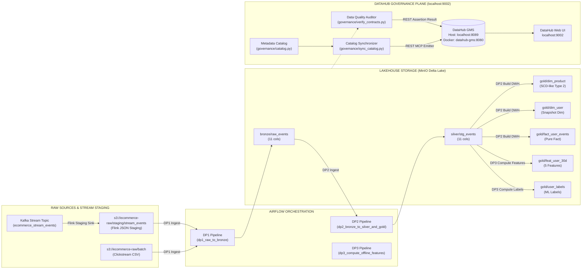

# BÁO CÁO KỸ THUẬT: DATA GOVERNANCE VỚI DATAHUB (RUBRIC MỤC 6: DATA GOVERNANCE)

**Dự án:** E-Commerce Real-Time Purchase Propensity Prediction System  
**Tác giả:** Hoàng Minh Nhân  
**Hệ thống Quản trị:** Acryl DataHub  
**Trạng thái Rubric:** IMPLEMENTED — READY FOR RUNTIME VERIFICATION  
**Giao diện Web UI:** `http://localhost:9002` (Tài khoản: `datahub` / `datahub`)  
**Metadata API Endpoint:**
* Trên máy Host: `http://localhost:8089`
* Trong mạng Docker nội bộ: `http://datahub-gms:8080`

---

## 1. TỔNG QUAN KIẾN TRÚC QUẢN TRỊ DỮ LIỆU (DECLARATIVE GOVERNANCE)

Hệ thống Data Governance của dự án được xây dựng dựa trên nguyên lý **Khai báo tập trung (Declarative Catalog)** và **Tách biệt mặt phẳng (Separation of Concerns)**:
* **Data Plane:** Spark, Flink, MinIO, Kafka, Feast, Redis trực tiếp xử lý dữ liệu.
* **Orchestration Plane:** Airflow lập lịch và điều phối các DAG DP1 ➔ DP4.
* **Governance Plane:** DataHub đóng vai trò quan sát viên (Observer), lưu trữ siêu dữ liệu (Metadata), đồ thị phả hệ (Lineage) và kết quả kiểm định hợp đồng dữ liệu (Data Contracts / Assertions). DataHub **hoàn toàn không nằm trên đường truyền dữ liệu vật lý (Data Path)**.

```
┌────────────────────────────────────────────────────────────────────────────────────────┐
│                        ACRYL DATAHUB DECLARATIVE GOVERNANCE                            │
├────────────────────────────┬─────────────────────────────┬─────────────────────────────┤
│ 1. DECLARATIVE CATALOG     │ 2. VISUAL LINEAGE GRAPH     │ 3. SAMPLE-BASED QA ENGINE   │
│ Nguồn sự thật duy nhất     │ Đồ thị phả hệ liên kết từ   │ PyArrow kiểm tra mẫu 50,000 │
│ catalog.py định nghĩa 12   │ Raw S3/Kafka ➔ Bronze       │ dòng thực tế từ MinIO;      │
│ Datasets, Schemas, Domains │ ➔ Silver ➔ Gold DWH & Feat  │ bắn Assertion kết quả động  │
└────────────────────────────┴─────────────────────────────┴─────────────────────────────┘
```



---

## 2. PHƯƠNG THỨC TÍCH HỢP VỚI AIRFLOW & METADATA FLOW

### 2.1. Phân biệt Rõ Ràng: Declarative Sync (Option B) vs Automatic Runtime Listener
* **Declarative Metadata Synchronization (Option B - Phương thức kiến trúc của dự án):**
  - Siêu dữ liệu được mô tả tường minh tại `governance/catalog.py` (Metadata-as-Code).
  - Script `governance/sync_catalog.py` đóng vai trò REST MCP Emitter đồng bộ 12 bảng, quan hệ phả hệ, thông tin sở hữu, thẻ nhãn và định nghĩa 5 hợp đồng dữ liệu sang DataHub GMS.
  - Script `governance/verify_contracts.py` trực tiếp đọc dữ liệu từ MinIO qua PyArrow và phát kết quả kiểm định (`AssertionResult`) lên DataHub GMS.
* **Airflow Listener Plugin (`plugins/datahub_plugin.py`):**
  - Không kích hoạt runtime listener tự động để giữ cho Airflow scheduler hoàn toàn ổn định, không bị ảnh hưởng bởi lỗi mạng sang DataHub và tránh xung đột phiên bản thư viện với Airflow 2.7.3.
  - Lineage và DataJob được quản lý tập trung và phát sinh tường minh qua `sync_catalog.py`.

---

## 3. SỐ LIỆU ĐO ĐẠC THỰC TẾ TRÊN MẪU DỮ LIỆU (SAMPLE-BASED 50,000 ROWS)

Do kích thước dữ liệu hồ dữ liệu rất lớn, hệ thống kiểm định sử dụng chiến lược **Kiểm định chất lượng trên mẫu chuẩn hóa (Sample-based Data Quality Audit trên 50,000 bản ghi đầu của từng bảng)** qua PyArrow đọc trực tiếp từ MinIO Lakehouse:

| Phân vùng | Đường dẫn MinIO | Số cột | Mẫu kiểm định | Quy tắc kiểm định (Live Assertion) | Kết quả kiểm định | Trạng thái DataHub |
| :--- | :--- | :---: | :---: | :--- | :---: | :---: |
| **Bronze** | `s3a://ecommerce-lakehouse/bronze/raw_events` | 11 | 50,000 | `dp1_bronze_null_check`: user_id không được null | `null_user_count = 0` | **PASSED** |
| **Silver** | `s3a://ecommerce-lakehouse/silver/stg_events` | 11 | 50,000 | `dp2_silver_dedup_check`: Khử trùng lặp khóa tự nhiên | `duplicate_count = 0` | **PASSED** |
| **Gold Dim Product** | `s3a://ecommerce-lakehouse/gold/dim_product` | 10 | 50,000 | `dp2_scd2_integrity_check`: Khóa thay thế `product_sk` không null và `valid_from_ts <= valid_to_ts` | `scd2_invalid_count = 0` | **PASSED** |
| **Gold Feature Store** | `s3a://ecommerce-lakehouse/gold/feat_user_30d` | 9 | 50,000 | `dp3_feast_schema_contract`: Cột mốc thời gian Feast không null | `timestamp_null = 0` | **PASSED** |
| **Ground Truth Labels**| `s3a://ecommerce-lakehouse/gold/user_labels` | 4 | 50,000 | `dp3_binary_labels_contract`: Nhãn mua hàng thuộc `[0, 1]` | `invalid_labels = 0` | **PASSED** |

---

## 4. ĐỐI CHIẾU TIÊU CHÍ RUBRIC MỤC 6 (DATA GOVERNANCE)

Theo đúng cấu trúc Rubric chính thức (`EDAI K11 - DE.xlsx`, Sheet `edai-1 (50%)`), Mục 6 (Data Governance) yêu cầu 3 phân hệ cốt lõi:

### 4.1. Tiêu chí 1: DP1 Linked with Related Tables (Rubric: 4.0đ) - READY FOR VERIFICATION
* **Lineage Pipeline & Tables (2.0đ):**
  - Đồ thị DataHub hiển thị liên kết rõ ràng: `s3://ecommerce-raw/batch` + `s3://ecommerce-raw/staging/stream_events` ➔ `dp1_raw_to_bronze` (`ingest_stage`) ➔ `bronze/raw_events`.
  - Tên trường thời gian nạp đã được thống nhất chuẩn hóa là `ingestion_time` trên cả Spark, DataHub catalog và Delta Lake.
* **Data Validation & Data Contract (2.0đ):**
  - **Hợp đồng Schema:** Kiểm định đủ 11/11 trường dữ liệu chuẩn của tầng Bronze.
  - **Hợp đồng Chất lượng:** Kiểm định tính toàn vẹn 0 bản ghi null `user_id` trên tập mẫu (`null_user_count = 0`).
  - **Trạng thái:** Data Contract `contract_bronze_lakehouse` được định nghĩa ACTIVE, Assertion `dp1_bronze_null_check` sẵn sàng xác minh.

---

### 4.2. Tiêu chí 2: DP2 Linked with Related Tables (Rubric: 4.0đ) - READY FOR VERIFICATION
* **Lineage Pipeline & Tables (2.0đ):**
  - Đồ thị DataHub hiển thị cấu trúc phân nhánh Medallion:
    - `bronze/raw_events` ➔ `dp2_bronze_to_silver_and_gold` (`ingest_stage`) ➔ Tạo ra `silver/stg_events` và bộ ba Star Schema Gold DWH:
      * `gold/dim_product` (SCD-like Type 2 với lịch sử phiên bản quan sát)
      * `gold/dim_user` (Current-state snapshot dimension)
      * `gold/fact_user_events` (Pure Fact Table)
    - `dp2_bronze_to_silver_and_gold` (`validate_stage`) ➔ Kiểm định toàn vẹn chất lượng dữ liệu và quan hệ khóa ngoại Dim - Fact.
* **Data Validation & Data Contract (2.0đ):**
  - **Silver Quality Contract:** Cam kết 0% trùng lặp rác trên deduplication key (`duplicate_count = 0`).
  - **Gold SCD2 Contract:** Cam kết tính hợp lệ khóa thay thế `product_sk` và mốc thời gian `valid_from_ts <= valid_to_ts`.
  - **Trạng thái:** Các hợp đồng `contract_silver_curated` và `contract_gold_dim_product` sẵn sàng xác minh.

---

### 4.3. Tiêu chí 3: DP3 Linked with Related Tables (Rubric: 4.0đ) - READY FOR VERIFICATION
* **Lineage Pipeline & Tables (2.0đ):**
  - Đồ thị DataHub kết nối liền mạch từ tầng Silver:
    - `silver/stg_events` ➔ `dp3_compute_offline_features` (`ingest_stage`) ➔ Sinh ra đồng thời 2 bảng:
      * `gold/feat_user_30d` (Offline Feature Store 30 ngày)
      * `gold/user_labels` (Ground Truth binary target)
* **Data Validation & Data Contract (2.0đ):**
  - **Feast Contract Validation:** Bắt buộc sự hiện diện của cặp trường thời gian chuẩn Feast (`event_timestamp` và `created`) để chống Data Leakage.
  - **ML Target Distribution Contract:** Cam kết nhãn mục tiêu `target_purchase_1h` thuộc tập nhị phân hợp lệ `[0, 1]` trên tập mẫu kiểm định.
  - **Trạng thái:** Hợp đồng `contract_feat_user_30d` và `contract_user_labels` sẵn sàng xác minh.

*(Lưu ý: Pipeline DP4 Feast Materialization là thành phần mở rộng bổ trợ cho Feature Store, không nằm trong yêu cầu tính điểm của Mục 6 Data Governance).*

---

## 5. HƯỚNG DẪN TRUY CẬP VÀ NGHIỆM THU TRÊN WEB UI

1. **Truy cập:** Mở trình duyệt tại **`http://localhost:9002`** (Đăng nhập: `datahub` / `datahub`).
2. **Kiểm tra Lineage Đồ thị:**
   - Tại thanh tìm kiếm, gõ **`bronze/raw_events`** hoặc **`silver/stg_events`**.
   - Bấm vào tab **Lineage** ➔ Quan sát đồ thị dòng chảy trực quan từ file thô S3 qua Bronze, Silver, Gold và Feature Store.
3. **Kiểm tra Data Contracts & Quality:**
   - Chọn bất kỳ bảng nào (`bronze/raw_events`, `silver/stg_events`, `gold/dim_product`, `gold/feat_user_30d`).
   - Bấm vào tab **Quality** / **Assertions** hoặc **Contracts**.
   - Quan sát danh sách các quy tắc kiểm định đều hiển thị dấu tích xanh **`Passing`** kèm các số liệu đo lường thực tế từ tập mẫu.
