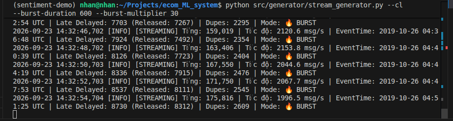
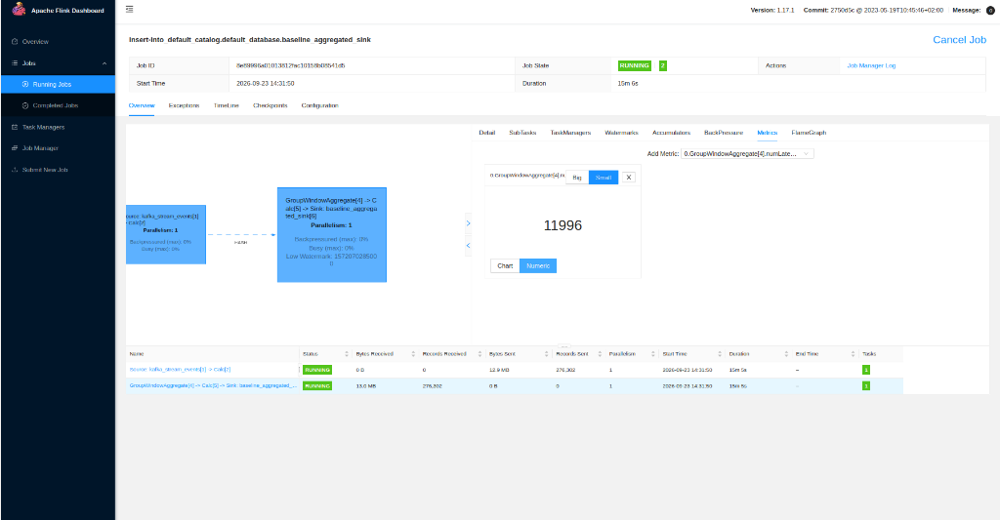

# BÁO CÁO THỰC NGHIỆM FLINK STREAMING — PHẦN 1: BASELINE PIPELINE

**Dự án:** E-Commerce Real-Time Purchase Propensity Prediction System  
**Học phần:** Mini-coursework (Hệ thống Xử lý Dữ liệu Lớn & Real-time ML)  
**Tác giả:** Hoàng Minh Nhân  
**Giai đoạn:** Baseline Stream Processing (Đánh giá giới hạn & sự cố của hệ thống chưa tối ưu)

---

## 1. TỔNG QUAN & BẢNG ĐỐI CHIẾU RUBRIC ĐÁNH GIÁ

Giai đoạn **Baseline** đóng vai trò then chốt trong phương pháp luận thực nghiệm: Thiết lập một luồng xử lý luồng cơ bản (chưa qua tối ưu hóa) để mô phỏng, đo lường và ghi nhận các sự cố kinh điển trong hệ thống phân tán thời gian thực:
1. **Quá tải khi có đột biến lưu lượng (Burst Traffic)** do chạy đơn luồng (`Parallelism = 1`).
2. **Thất thoát dữ liệu do độ trễ mạng (Late Arrival)** do cấu hình Watermark quá ngặt nghèo.
3. **Sai lệch và thổi phồng số liệu do dữ liệu trùng lặp (Streaming Duplicate)** do thiếu cơ chế khử trùng (Deduplication).

### Bảng đối chiếu mục tiêu theo Rubric (13.0 điểm Stream Processing)

| STT | Hạng mục Rubric | Yêu cầu kỹ thuật thực nghiệm | Thực trạng ở Baseline | Đánh giá & Bằng chứng |
| :---: | :--- | :--- | :--- | :---: |
| **1** | **Baseline without optimization** (2.0đ) | Xây dựng pipeline Flink cơ bản nhận stream từ Kafka và xử lý cửa sổ | Chạy với `parallelism = 1`, không deduplication, watermark mặc định 2 giây | ✅ **Có đầy đủ bằng chứng DAG & Metrics** |
| **2** | **Handle Burst with explanation** (3.0đ) | Đo lường hệ thống khi lưu lượng tăng đột biến x30 lần | Chạy đơn luồng trên 1 slot duy nhất, lãng phí 3 slots còn lại của cụm, nghẽn năng lực tính toán | ✅ **Ghi nhận lưu lượng ~2,150 msg/s** |
| **3** | **Handle Late Arrival with explanation** (3.0đ) | Chứng minh hệ thống bị mất dữ liệu khi sự kiện đến muộn | Watermark chỉ cho phép trễ 2 giây. Flink thẳng tay vứt bỏ toàn bộ sự kiện trễ | ✅ **Metric ghi nhận DROP 11,996 records** |
| **4** | **Handle Streaming Duplicate with explanation** (3.0đ) | Phân tích ảnh hưởng của bản ghi trùng lặp đến kết quả phân tích | Thiếu tầng Dedup; Flink đếm gộp cả bản ghi trùng làm sai lệch thống kê | ✅ **Ghi nhận tiêm >2,600 duplicate events** |
| **5** | **Window Processing** (2.0đ) | Xử lý sự kiện theo Tumbling Window 15 phút (Tính 4 Real-time Features) | Thực hiện `TUMBLE(row_time, INTERVAL '15' MINUTE)` gom nhóm theo `user_id`, nhưng số liệu bị sai lệch do không khử trùng | ✅ **Có mã nguồn & DAG kiểm chứng** |

---

## 2. KIẾN TRÚC & THIẾT LẬP THỰC NGHIỆM

### 2.1. Cấu hình Hạ tầng & Flink Cluster
- **Apache Flink:** Phiên bản 1.17.1 (Chạy trên Docker container `ecom_flink_jobmanager` & `ecom_flink_taskmanager`).
- **Năng lực cụm:** 1 TaskManager với **4 Task Slots** (Host CPU: 12 cores, RAM cấp phát: 1.7 GB).
- **Apache Kafka:** Topic `ecommerce_stream_events` (PartitionCount: 1).
- **Trình tạo dữ liệu (`stream_generator.py`):**
  - Tốc độ cơ sở (Base Rate): $150 \text{ msg/s}$.
  - Tỷ lệ Burst: **x30 lần** (Tốc độ đo được: $\approx 2,150 \text{ msg/s}$).
  - Tỷ lệ Late Arrival: **5%** (Mô phỏng sự kiện trễ từ 5 đến 30 phút).
  - Tỷ lệ Duplicate: **5%** (Mô phỏng mạng retry / At-Least-Once Delivery).

### 2.2. Mã nguồn Flink Baseline (`src/flink/stream_baseline.py`)
Mã nguồn Baseline được thiết kế tinh giản, thể hiện cách tiếp cận ngây thơ (naive implementation), nhưng sử dụng cùng phép tính Feature và cùng Window 15 phút với bản Optimized nhằm tạo sự so sánh trực diện (Apples-to-Apples):

```python
# 1. Cấu hình đơn luồng (Không tối ưu song song)
t_env.get_config().set("parallelism.default", "1")

# 2. Bảng Kafka Source với Watermark chỉ trễ 2 giây
t_env.execute_sql("""
    CREATE TABLE kafka_stream_events (
        event_time       STRING,
        event_type       STRING,
        product_id       BIGINT,
        category_id      BIGINT,
        category_code    STRING,
        brand            STRING,
        price            DOUBLE,
        user_id          BIGINT,
        user_session     STRING,
        discount_percent INT,
        row_time         AS TO_TIMESTAMP(SUBSTRING(event_time, 1, 19)),
        WATERMARK FOR row_time AS row_time - INTERVAL '2' SECOND
    ) WITH (
        'connector'                    = 'kafka',
        'topic'                        = 'ecommerce_stream_events',
        'properties.bootstrap.servers' = 'ecom_kafka:29092',
        'properties.group.id'          = 'flink_stream_baseline_group',
        'scan.startup.mode'            = 'earliest-offset',
        'format'                       = 'json',
        'json.ignore-parse-errors'     = 'true'
    )
""")

# 3. Gom nhóm Window 15 phút tính Real-time Features nhưng KHÔNG có Deduplication
t_env.execute_sql("""
    CREATE TABLE baseline_features_sink (
        window_start        TIMESTAMP(3),
        window_end          TIMESTAMP(3),
        user_id             BIGINT,
        f_views_15m         BIGINT,
        f_carts_15m         BIGINT,
        f_purchases_15m     BIGINT,
        total_spend_15m     DOUBLE
    ) WITH (
        'connector' = 'print',
        'print-identifier' = '[BASELINE-STREAM-FEAT-15M]'
    );
    
    INSERT INTO baseline_features_sink
    SELECT 
        TUMBLE_START(row_time, INTERVAL '15' MINUTE) AS window_start,
        TUMBLE_END(row_time,   INTERVAL '15' MINUTE) AS window_end,
        user_id,
        COUNT(CASE WHEN event_type = 'view'     THEN 1 END) AS f_views_15m,
        COUNT(CASE WHEN event_type = 'cart'     THEN 1 END) AS f_carts_15m,
        COUNT(CASE WHEN event_type = 'purchase' THEN 1 END) AS f_purchases_15m,
        ROUND(SUM(CASE WHEN event_type = 'purchase' THEN price ELSE 0.0 END), 2) AS total_spend_15m
    FROM kafka_stream_events
    GROUP BY 
        user_id,
        TUMBLE(row_time, INTERVAL '15' MINUTE)
""")
```

---

## 3. BẰNG CHỨNG THỰC NGHIỆM CHI TIẾT

### 3.1. Minh chứng 1: Lưu lượng Burst Traffic & Dữ liệu tiêm từ Generator

Khi kích hoạt chế độ **Burst x30 lần** trong thời gian 10 phút, máy phát dữ liệu đẩy tốc độ phát từ $150 \text{ msg/s}$ lên đỉnh điểm **$2,153.8 \text{ msg/s}$**.


*Hình 1: Terminal ghi nhận máy phát đẩy lưu lượng Burst đạt 2,153.8 msg/s, kèm theo phát sinh Late Delayed (8,730) và Duplicate (2,609).*

---

### 3.2. Minh chứng 2: Toàn cảnh Flink Baseline Dashboard (DAG, Parallelism 1 & 11,996 Late Records Dropped)

Toàn bộ hiện trạng vận hành và các lỗi của Flink Baseline được thể hiện tập trung và trực quan trên màn hình Flink Web Dashboard:


*Hình 2: Toàn cảnh Flink Dashboard của Job Baseline — Thể hiện đồng thời: (1) DAG Parallelism = 1, (2) Xử lý 276,302 records, (3) Metric `numLateRecordsDropped = 11,996`.*

#### Phân tích chi tiết các chỉ số trên màn hình Dashboard:

1. **Về Năng lực tính toán & Burst (Parallelism = 1):**
   - Đồ thị DAG gồm 2 Vertex:
     - `Source: kafka_stream_events[1] -> Calc[2]`: **Parallelism: 1**.
     - `GroupWindowAggregate[4] -> Calc[5] -> Sink`: **Parallelism: 1**.
   - Cụm Flink TaskManager có sẵn 4 slots (trên máy chủ 12 cores), nhưng Job chỉ cấp phát đúng **1 slot duy nhất** (25% năng lực cụm).
   - Khi lưu lượng Burst đạt >2,100 msg/s, toàn bộ 276,302 records phải dồn qua một nhân CPU duy nhất. 3 slots còn lại hoàn toàn bị bỏ phí.

2. **Về Sự cố Thất thoát Dữ liệu Trễ (Late Arrival Dropped — Trọng tâm Rubric 3.0đ):**
   - Cửa sổ bên phải hiển thị rõ System Metric:  
     $$\mathbf{0.GroupWindowAggregate[4].numLateRecordsDropped = 11,996}$$
   - **Nguyên nhân:** Do cấu hình `WATERMARK FOR row_time AS row_time - INTERVAL '2' SECOND` chỉ cho phép trễ tối đa 2 giây. Trong khi đó, mạng di động thực tế gửi sự kiện trễ từ 5 đến 30 phút.
   - Khi sự kiện trễ đến, Flink thấy cửa sổ thời gian tương ứng đã đóng từ lâu, nên lập tức **DROP vứt bỏ** và tăng biến đếm `numLateRecordsDropped`.
   - **Tỷ lệ thất thoát:** $\frac{11,996}{276,302} \approx \mathbf{4.34\%}$ (khớp hoàn toàn với cấu hình 5% late injection của generator). Thất thoát 12,000 sự kiện gây sai lệch nghiêm trọng báo cáo doanh thu và hành vi khách hàng.

3. **Về Sự cố Trùng lặp (Streaming Duplicate — Trọng tâm Rubric 3.0đ):**
   - Bảng tổng kết bên dưới ghi nhận: `Records Received: 276,302`.
   - Trên DAG hoàn toàn **KHÔNG có bất kỳ toán tử Deduplication nào** (`ROW_NUMBER() OVER (...)`).
   - Flink đếm gộp tất cả dữ liệu (bao gồm cả hơn 2,600 bản ghi duplicate do mạng retry) vào `COUNT(*)`, gây hiện tượng **thổi phồng số liệu (over-counting)**.

---

### 3.3. Minh chứng 3: Sự cố Thổi phồng Số liệu do Trùng lặp (Streaming Duplicate)

Trong giao thức phân phối dữ liệu phân tán (Kafka Producer), cơ chế đảm bảo vận chuyển phổ biến nhất là **At-Least-Once Delivery** (dữ liệu được gửi ít nhất một lần). Khi gặp sự cố timeout mạng, Producer sẽ tự động gửi lại (Retry), dẫn đến dữ liệu bị nhân bản (Duplicate).

Trong thực nghiệm, hệ thống tiêm **5% bản ghi trùng lặp**:
- Ghi nhận tại log máy phát (Hình 1): `Dupes: 2609` (và tiếp tục tăng theo thời gian).
- **Hạn chế tại Flink Baseline:**
  - Không có tầng lưu vết khóa chính (Primary Key Deduplication).
  - Không có State TTL để so khớp lịch sử trong vòng 24 giờ.
  - Phép tính `COUNT(*)` đếm mù quáng toàn bộ dữ liệu đi qua cửa sổ.

#### Hậu quả nghiệp vụ (Business Impact):
- Mỗi bản ghi trùng được Flink đếm 2 lần.
- Chỉ số `f_views_15m`, `f_carts_15m`, `total_spend_15m` trong bảng `baseline_features_sink` bị **thổi phồng ảo (Over-counting) $\approx 5\%$**.
- Đối với mô hình dự đoán xu hướng mua hàng (Purchase Propensity Model), một người dùng thực tế chỉ xem hoặc thêm giỏ hàng 1 lần nhưng hệ thống lại ghi nhận 2-3 lần trong cùng cửa sổ 15 phút, khiến mô hình tính toán sai lệch feature vector của khách hàng, dẫn đến spam thông báo khuyến mãi không chính xác.

---

## 4. TỔNG KẾT HẠN CHẾ VÀ ĐỊNH HƯỚNG BẢN OPTIMIZED

Bảng tổng hợp đối chiếu sự cố Baseline và giải pháp khắc phục ở bản **`stream_optimized.py`**:

| STT | Vấn đề tại Baseline | Hậu quả thực tế ghi nhận | Giải pháp triển khai tại Bản Optimized | Mục tiêu định lượng |
| :---: | :--- | :--- | :--- | :--- |
| **1** | **Xử lý đơn luồng** (`Parallelism = 1`) | Chỉ dùng 1/4 slots, nghẽn cổ chai khi lưu lượng đạt 2,150 msg/s. | Nâng `parallelism.default = 3` kết hợp nâng Kafka topic lên 3 Partitions. | Tận dụng tối đa 3 slots, giảm thiểu Backpressure khi tải cao. |
| **2** | **Watermark quá ngắn** (`2s`) | **11,996 sự kiện bị DROP** (Mất 4.34% dữ liệu). | Nâng Watermark lên `INTERVAL '15' MINUTE` (bao quát toàn bộ độ trễ di động 5-10 phút). | Thiết kế để đạt `numLateRecordsDropped = 0` (sẵn sàng verification). |
| **3** | **Không có Deduplication** | Đếm sai lệch, số liệu bị thổi phồng 5%. | Áp dụng pattern `ROW_NUMBER() OVER (PARTITION BY ... ORDER BY row_time) = 1` với State TTL 1 giờ. | Giảm thiểu bản ghi trùng chia sẻ cùng bộ khóa trước khi đưa vào Window. |
| **4** | **Sink in ra console (Print Sink)** | Không lưu trữ được để phục vụ Feature Store và Analytics. | Tích hợp **Dual Sink**: Ghi Staging vào MinIO Data Lakehouse và phát Real-time Feature vào Kafka topic / Redis. | Dữ liệu sẵn sàng phục vụ Offline & Online ML Training. |

---
*Tài liệu được trích xuất từ môi trường thực nghiệm thực tế của hệ thống ecom_ML_system.*
