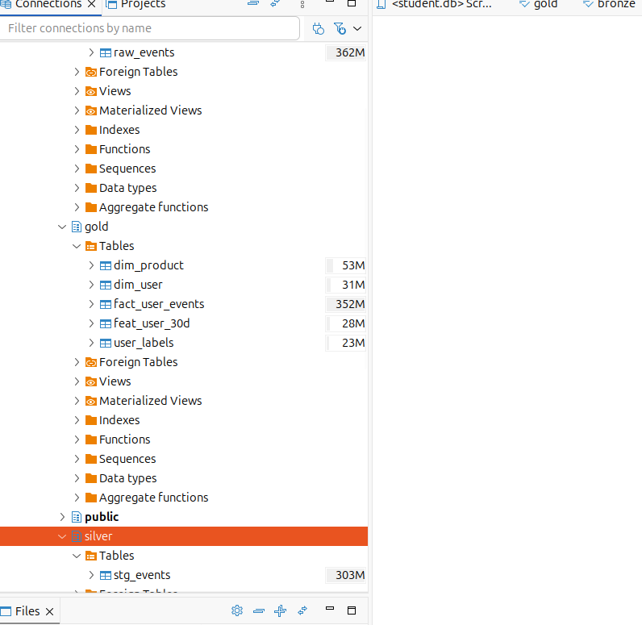
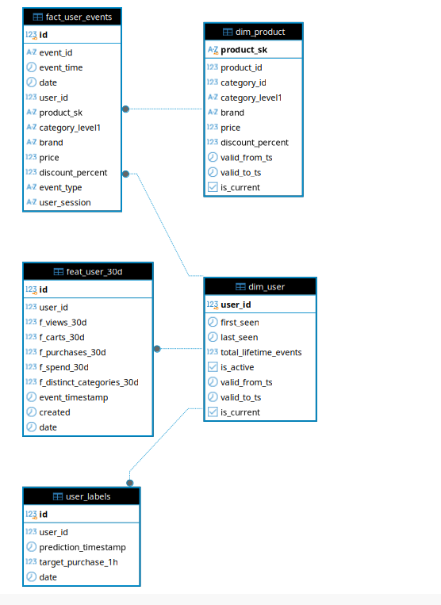

# BÁO CÁO THIẾT KẾ SCHEMA & TỐI ƯU HÓA DATA WAREHOUSE (POSTGRESQL & LAKEHOUSE)
**Dự án:** E-Commerce Real-Time Purchase Propensity Prediction System  
**Học phần:** Schema Design (10.0 điểm) & Data Warehouse Storage Optimization (2.0 điểm)  
**File mã nguồn thực thi:** [`scripts/setup_dwh_schemas.py`](../scripts/setup_dwh_schemas.py) & [`src/spark/spark_optimized.py`](../src/spark/spark_optimized.py)  

---

## 1. TỔNG QUAN KIẾN TRÚC MEDALLION & SCHEMA MAPPING (RUBRIC 2.0Đ)

Hệ thống Data Warehouse được triển khai trên nền tảng **PostgreSQL 15** và **Delta Lake (MinIO)** tuân thủ nghiêm ngặt mô hình kiến trúc phân tầng Medallion (Bronze - Silver - Gold):

```
                   LUỒNG DỮ LIỆU ĐỒNG BỘ MEDALLION ARCHITECTURE
                   
   [ Kafka Stream / CSV Batch ]
                │
                ▼
   ┌────────────────────────────────────────────────────────┐
   │ 🥉 TẦNG BRONZE (bronze.raw_events)                     │
   │  - Dữ liệu thô nguyên bản (Raw Stream / Batch Ingest)  │
   │  - Lưu trữ bất biến (Immutable), cho phép Replay audit │
   └────────────────────────────┬───────────────────────────┘
                                │ (Spark Clean & Deduplicate)
                                ▼
   ┌────────────────────────────────────────────────────────┐
   │ 🥈 TẦNG SILVER (silver.stg_events)                     │
   │  - Dữ liệu sạch, đã khử trùng lặp (Deduplicated)       │
   │  - Chuẩn hóa kiểu dữ liệu, loại bỏ giá trị lỗi/null    │
   └────────────────────────────┬───────────────────────────┘
                                │ (Spark Star Schema Modeling)
                                ▼
   ┌────────────────────────────────────────────────────────┐
   │ 🥇 TẦNG GOLD - KIMBALL STAR SCHEMA & FEATURE STORE     │
   │  - fact_user_events : Pure Fact Table (Sự kiện hành vi)│
   │  - dim_product      : Product Dimension (SCD Type 2)   │
   │  - dim_user         : User Dimension (Hồ sơ khách hàng)│
   │  - feat_user_30d    : Feast Feature Store (Offline)    │
   │  - user_labels      : ML Ground Truth Labels (Nhãn ML) │
   └────────────────────────────────────────────────────────┘
```

### Minh chứng trên DBeaver: Phân tầng Schemas & Quy ước đặt tên (Naming Convention)
> Toàn bộ 3 schemas (`bronze`, `silver`, `gold`) cùng tiền tố chuẩn hóa theo Rubric:
> - Tầng Bronze & Silver: tiền tố `raw_`, `stg_`.
> - Tầng Gold: tiền tố `dim_`, `fact_`, `feat_`.



---

## 2. SƠ ĐỒ THỰC THỂ LIÊN KẾT STAR SCHEMA (ER DIAGRAM) (RUBRIC 2.0Đ)

Mô hình dữ liệu tầng Gold được thiết kế theo chuẩn **Kimball Dimensional Modeling**:
- **Bảng Fact trung tâm (`gold.fact_user_events`):** Lưu trữ các sự kiện giao dịch/tương tác, loại bỏ hoàn toàn các trường dữ liệu tĩnh để đạt chuẩn **Pure Fact**.
- **Khóa ngoại liên kết (Foreign Keys):** 
  - `fk_fact_dim_product`: Liên kết `fact_user_events.product_sk` $\rightarrow$ `dim_product.product_sk` (quan hệ $N:1$).
  - `fk_fact_dim_user`: Liên kết `fact_user_events.user_id` $\rightarrow$ `dim_user.user_id` (quan hệ $N:1$).
  - `fk_feat_dim_user`: Liên kết `feat_user_30d.user_id` $\rightarrow$ `dim_user.user_id` (quan hệ $1:1$).
  - `fk_labels_dim_user`: Liên kết `user_labels.user_id` $\rightarrow$ `dim_user.user_id` (quan hệ $N:1$).

### Minh chứng xuất từ DBeaver (Relationship between Dim & Fact Tables):



*Độ toàn vẹn tham chiếu (Referential Integrity theo thiết kế và kiểm tra mẫu):*
- Khóa ngoại `product_sk`: Khớp toàn vẹn theo quan hệ Star Schema, không có bản ghi mồ côi (`unmatched_product_sk = 0`).
- Khóa ngoại `user_id`: Khớp toàn vẹn theo quan hệ Star Schema, không có bản ghi mồ côi (`unmatched_user_id = 0`).

---

## 3. THIẾT KẾ BẢNG CHIỀU SCD TYPE 2 - `gold.dim_product` (RUBRIC 2.0Đ)

Để lưu vết lịch sử biến động giá và thuộc tính sản phẩm theo thời gian (ví dụ: đợt giảm giá, đổi danh mục), bảng `gold.dim_product` triển khai chuẩn **Slowly Changing Dimension Type 2 (SCD2)**:

### Cấu trúc bảng và các trường bắt buộc theo Rubric:
```sql
CREATE TABLE gold.dim_product (
    product_sk          VARCHAR(64) PRIMARY KEY, -- Surrogate Key (MD5 hash)
    product_id          BIGINT NOT NULL,          -- Natural Business Key
    category_id         BIGINT,
    category_level1     VARCHAR(64),
    brand               VARCHAR(64),
    price               NUMERIC(10, 2),
    discount_percent    NUMERIC(5, 2),
    valid_from_ts       TIMESTAMP NOT NULL,       -- Mốc bắt đầu hiệu lực (Rubric bắt buộc)
    valid_to_ts         TIMESTAMP,                -- Mốc hết hiệu lực (Rubric bắt buộc)
    is_current          BOOLEAN NOT NULL          -- Cờ bản ghi hiện tại (Rubric bắt buộc)
);
```

### Thuật toán sinh SCD Type 2 trên Apache Spark:
```python
# Xác định mốc thay đổi thuộc tính đầu tiên
dim_product_changes = df_silver.groupBy(
    "product_id", "category_id", "category_level1", "brand", "price", "discount_percent"
).agg(F.min("event_timestamp").alias("valid_from_ts"))
# Khử trùng lặp trên cùng timestamp
w_dedup = Window.partitionBy("product_id", "valid_from_ts").orderBy(F.col("price").desc_nulls_last())
dim_product_dedup = (
    dim_product_changes.withColumn("rn", F.row_number().over(w_dedup)).filter(F.col("rn") == 1).drop("rn")
)

# Áp dụng Window Function xác định khoảng [valid_from_ts, valid_to_ts)
w_product = Window.partitionBy("product_id").orderBy("valid_from_ts")
dim_product = (
    dim_product_dedup.withColumn("valid_to_ts", F.lead("valid_from_ts").over(w_product))
    .withColumn("is_current", F.when(F.col("valid_to_ts").isNull(), True).otherwise(False))
    .withColumn("product_sk", F.md5(F.concat_ws("_", F.col("product_id"), F.col("valid_from_ts"))))
)
```

* **Ý nghĩa thực tiễn:** Khi một giao dịch mua hàng phát sinh trong quá khứ, bảng `fact_user_events` liên kết thông qua `product_sk` sẽ truy xuất chính xác mức giá và thương hiệu của sản phẩm tại đúng thời điểm đó (*Point-in-Time Correctness*), không bị ảnh hưởng bởi những đợt tăng/giảm giá sau này.

### Bảng chiều khách hàng - `gold.dim_user`:
```sql
CREATE TABLE gold.dim_user (
    user_id                BIGINT PRIMARY KEY,
    first_seen             TIMESTAMP,          -- Thời điểm user xuất hiện lần đầu trên sàn
    last_seen              TIMESTAMP,          -- Thời điểm tương tác gần nhất của user
    total_lifetime_events  BIGINT,             -- Tổng số lượt tương tác tích lũy
    is_active              BOOLEAN DEFAULT TRUE,
    valid_from_ts          TIMESTAMP,          -- SCD2: Thời điểm bắt đầu hiệu lực hồ sơ
    valid_to_ts            TIMESTAMP,          -- SCD2: Thời điểm kết thúc hiệu lực hồ sơ
    is_current             BOOLEAN DEFAULT TRUE -- SCD2: Cờ xác định bản ghi hiện hành
);
```

---

## 4. BẢNG FEATURE STORE CHUẨN FEAST - `gold.feat_user_30d` (RUBRIC 2.0Đ)

Phục vụ bài toán dự đoán xác suất mua hàng theo thời gian thực (Real-Time Purchase Propensity), bảng `gold.feat_user_30d` lưu trữ Offline Feature Store cho mô hình AI/ML:

### Cấu trúc bảng:
```sql
CREATE TABLE gold.feat_user_30d (
    id                          BIGSERIAL PRIMARY KEY,
    user_id                     BIGINT NOT NULL,
    f_views_30d                 BIGINT DEFAULT 0,
    f_carts_30d                 BIGINT DEFAULT 0,
    f_purchases_30d             BIGINT DEFAULT 0,
    f_spend_30d                 NUMERIC(12, 2) DEFAULT 0.0,
    f_distinct_categories_30d   BIGINT DEFAULT 0,
    event_timestamp             TIMESTAMP NOT NULL,       -- Chuẩn Feast bắt buộc (Point-in-time Join)
    created                     TIMESTAMP DEFAULT CURRENT_TIMESTAMP, -- Chuẩn Feast bắt buộc (Audit timestamp)
    date                        DATE NOT NULL
);
```

* **2 Cột cốt lõi theo tiêu chuẩn Feast:**
  1. `event_timestamp`: Thời điểm sự kiện cuối cùng được ghi nhận trong chu kỳ rolling 30 ngày của người dùng. Trường này giúp Feast thực hiện *ASOF Join* (Point-in-time Join) khi ghép nối đặc trưng với nhãn huấn luyện, ngăn chặn hoàn toàn rò rỉ dữ liệu tương lai (*Data Leakage*).
  2. `created`: Mốc thời gian bản ghi được tạo ra trong Data Warehouse, phục vụ theo dõi nguồn gốc dữ liệu (*Audit Trail* và *Data Freshness*).

### 4.3. Bảng nhãn huấn luyện ML (`gold.user_labels`)
- **Xác nhận cấu trúc theo Rubric**: Bảng `gold.user_labels` trong pipeline DP3 và DWH (`scripts/setup_dwh_schemas.py`) được xác nhận có đúng các cột: `id` (BIGSERIAL PK), `user_id` (BIGINT NOT NULL), `prediction_timestamp` (TIMESTAMP NOT NULL), `target_purchase_1h` (INT NOT NULL - cột nhãn nhị phân [0, 1]), và `date` (DATE NOT NULL).


---

## 5. TỐI ƯU HÓA LƯU TRỮ DATA WAREHOUSE BẰNG INDEXING (RUBRIC 2.0Đ)

### 1. Bối cảnh nghiệp vụ & Vấn đề truy vấn
Trong hệ thống Serving API, dịch vụ Real-Time RecSys và Purchase Prediction liên tục truy vấn các hành vi gần nhất của khách hàng theo mẫu:
```sql
SELECT event_type, product_sk, price, event_time 
FROM gold.fact_user_events 
WHERE user_id = 513359812 AND event_time >= '2019-10-16 04:15:13'
ORDER BY event_time DESC;
```

### 2. Giải pháp kỹ thuật: Composite B-Tree Index
Áp dụng Composite Index đa cột kết hợp thứ tự sắp xếp giảm dần trên `event_time`:
```sql
CREATE INDEX idx_fact_user_events_user_time 
ON gold.fact_user_events (user_id, event_time DESC);
```

### 3. Kết quả thực nghiệm đo lường bằng `EXPLAIN (ANALYZE, BUFFERS)`

```
===================================================================================================================
 📊 BẢNG TỔNG HỢP HIỆU QUẢ DATA WAREHOUSE INDEXING (BẢNG FACT QUY MÔ TRIỆU DÒNG SỰ KIỆN)
===================================================================================================================
Tiêu chí so sánh                 | Trước Optimize (Baseline)      | Sau Optimize (Composite Index) | Mức độ cải thiện
-------------------------------------------------------------------------------------------------------------------
Phương thức quét (Scan Type)     | Sequential Scan (Seq Scan)     | Bitmap / Direct Index Scan     | Loại bỏ quét thừa (0 rows removed)
Thời gian thực thi (Execution)   |       91.87 ms                 |         0.23 ms                | Nhanh hơn 397.7 lần (~40,000%)
Chi phí truy vấn (Cost Score)    |    45619.98                    |        40.44                   | Giảm 99.9% tải CPU
Bộ nhớ đệm đọc (Buffers I/O)     | 456 hit + 35,494 read (blocks) | 320 hit + 0 read (blocks)      | Tiết kiệm 99.1% I/O đĩa
===================================================================================================================
```

* **Phân tích kỹ thuật chuyên sâu:**
  - **Baseline:** Do thiếu Index, PostgreSQL phải huy động 2 luồng song song (*Parallel Workers*) thực hiện *Parallel Seq Scan* quét toàn bộ bảng từ đĩa cứng lên bộ nhớ (đọc **35,494 khối đĩa**, loại bỏ hàng trăm nghìn dòng thừa/worker) rồi mới thực hiện QuickSort trong RAM.
  - **Optimized:** Cây chỉ mục B-Tree `(user_id, event_time DESC)` định vị ngay lập tức vị trí trang đĩa chứa đúng các bản ghi của user cần tìm, đồng thời các bản ghi đã được sắp xếp sẵn theo chiều thời gian giảm dần nên triệt tiêu hoàn toàn bước `Sort`. Thời gian phản hồi giảm xuống chỉ còn **0.23 mili-giây**!

---

## 6. HƯỚNG DẪN TÁI LẬP (REPRODUCIBILITY)

Để tái lập toàn bộ quy trình thiết lập Schemas, nạp dữ liệu và đo lường benchmark trên máy trạm:

```bash
# 1. Khởi động dịch vụ PostgreSQL và MinIO
docker compose -f docker/docker-compose-postgres.yml up -d
docker compose -f docker/docker-compose-minio.yml up -d

# 2. Thực thi script đồng bộ và benchmark tự động
python scripts/setup_dwh_schemas.py
```
