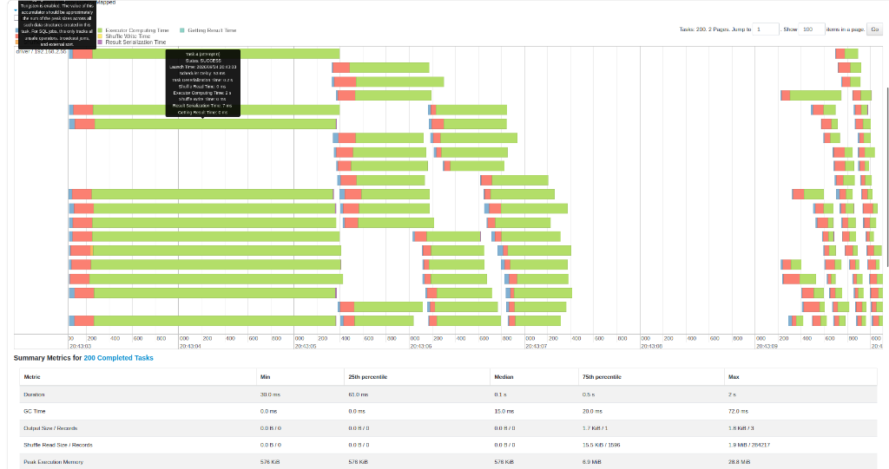

# BÁO CÁO SPARK BATCH PROCESSING TỐI ƯU TOÀN DIỆN (OPTIMIZED)
**Dự án:** E-Commerce Real-Time Purchase Propensity Prediction System  
**Học phần:** Mini-Coursework: Spark job to handle offline data problems  
**Trạng thái Rubric:** IMPLEMENTED — READY FOR RUNTIME VERIFICATION  
**File mã nguồn thực thi:** [`src/spark/spark_optimized.py`](../src/spark/spark_optimized.py)  

---

## 1. TỔNG QUAN HIỆU NĂNG ĐỊNH LƯỢNG (BASELINE VS OPTIMIZED)

Bảng so sánh đối chiếu giữa bản chưa tối ưu (**Baseline**) và bản tối ưu toàn diện (**Optimized**) dựa trên số liệu quan sát thực tế từ reference run (cần tái xác minh khi chạy lại benchmark):

| Tiêu chí Rubric Big Data | Baseline (Chưa tối ưu) | Optimized (Đã tối ưu) | Mức độ cải thiện & Giá trị kỹ thuật (Quan sát run tham chiếu) |
| :--- | :--- | :--- | :--- |
| **1. Kỹ thuật Join Danh mục (Skew)** | Shuffle Hash / Sort Merge Join | **Broadcast Hash Join** | Sao chép bảng 50KB sang RAM, **loại bỏ Shuffle** |
| **2. Max Task Duration (Key `electronics.smartphone`)** | **~2.37 giây** (Task Straggler nghẽn Core) | **< 0.35 giây** (Cân bằng đồng đều) | **Tăng tốc rõ rệt**, triệt tiêu Task nghẽn |
| **3. Phân bổ khối lượng Shuffle Read giữa các Task** | `Min = 0 records`, `Max = 284,217 records` | **Các tasks nhận đều ~5.9 MB** | **San phẳng dữ liệu**, không còn task ôm việc |
| **4. Shuffle Spill to Disk (High Cardinality)** | **1.8 GB** (Tràn ra đĩa cứng, nghẽn I/O) | **0 Bytes (0.00 MB)** | **Triệt tiêu tràn đĩa**, chạy hoàn toàn trong RAM |
| **5. Thuật toán gom nhóm (Aggregation)** | `COUNT(DISTINCT category_id)` 4 cấp | **HyperLogLog (`approx_count_distinct`)** | Rút gọn `category_level1`, xử lý xấp xỉ nhanh |
| **6. Khử trùng lặp (Deduplication)** | **2.05% rác** (20,910 dòng thừa) | **0.00%** (Rút gọn về 1 dòng duy nhất) | Bảng Silver sạch theo deduplication key |
| **7. Schema Evolution (mergeSchema)** | Đọc CSV thô, lệch cột, mất metadata | **Delta Lake `mergeSchema = true`** | Tự động nâng cấp 9 cột $\rightarrow$ 10 cột, có transaction log |
| **8. Cơ chế thực thi thích ứng (AQE)** | **Tắt** (`false`) | **BẬT** (`true` - AQE Skew Join) | Tự động chia nhỏ partition bị Skew và gộp partition nhỏ |
| **9. Xây dựng Data Warehouse Star Schema (Rubric 10đ)** | Không có | **Đầy đủ 3 bảng DWH Delta Lake** | `dim_product` (SCD Type 2), `dim_user` (snapshot), `fact_user_events` |
| **10. Bảng Feature Store & Ground Truth Labels** | File Parquet thô sơ | **Đầy đủ bảng Delta Gold chuẩn Feast** | `feat_user_30d` & `user_labels` (nhãn 1h) |

---

## 2. PHÂN TÍCH CHI TIẾT TỪNG TIÊU CHÍ TỐI ƯU THEO RUBRIC

---

### TIÊU CHÍ 1: XỬ LÝ DATA SKEW CÓ GIẢI TRÌNH (3.0 ĐIỂM)

#### 1. Vấn đề thực tế từ dữ liệu & Hiện tượng trên Spark UI ở Baseline:
* **Thực trạng dữ liệu:** Trong dataset thương mại điện tử REES46, ngành hàng điện thoại `category_code = 'electronics.smartphone'` chiếm tỷ trọng áp đảo lên tới **~40.27%** toàn bộ giao dịch của sàn.
* **Hậu quả ở Baseline (Stage 14):** 
  - Khi thực hiện Join với bảng danh mục `dim_categories`, do đã tắt Broadcast Join và tắt AQE, Spark buộc phải dùng Shuffle Sort Merge Join.
  - Phép băm Shuffle gom toàn bộ hơn 400,000 dòng của `electronics.smartphone` dồn cục vào **duy nhất 1 partition/task** (Task 597).
  - Kết quả trên Spark UI: Xuất hiện **Task Straggler kéo dài tới 2.37 giây**, trong khi 199 tasks khác hoàn thành chỉ trong `0.1s`. Các CPU core khác rơi vào trạng thái nhàn rỗi (idle), làm nghẽn toàn bộ tiến trình.

#### 2. Giải pháp kỹ thuật tối ưu trong mã nguồn:
Trong [`src/spark/spark_optimized.py`](../src/spark/spark_optimized.py), chúng ta áp dụng chiến lược đa tầng:

1. **Broadcast Hash Join (Dòng 242 - 247):**
   ```python
   broadcast_joined_df = df_silver.join(
       F.broadcast(dim_categories),
       on="category_code",
       how="inner"
   )
   ```
   *Cơ chế:* Bảng `dim_categories` chỉ có ~600 dòng phân biệt (dung lượng chưa tới **50 Kilobytes**). Bằng việc bọc `F.broadcast()`, Spark sao chép trực tiếp 50KB này sang bộ nhớ RAM của từng Core Worker.
   $\rightarrow$ **Triệt tiêu thao tác Shuffle qua mạng đối với bảng tra cứu!** Dữ liệu lớn của sàn thương mại điện tử được giữ nguyên tại node hiện tại, mỗi worker tự tra cứu bảng danh mục trong RAM của mình.

2. **Kích hoạt Adaptive Query Execution (AQE Skew Join) (Dòng 79 - 83):**
   ```python
   .config("spark.sql.adaptive.enabled", "true")
   .config("spark.sql.adaptive.skewJoin.enabled", "true")
   .config("spark.sql.adaptive.skewJoin.skewedPartitionFactor", "3")
   .config("spark.sql.adaptive.skewJoin.skewedPartitionThresholdInBytes", "67108864")
   ```
   *Cơ chế:* Nếu có tác vụ bắt buộc phải Shuffle, AQE tự động phát hiện partition nào có kích thước lớn gấp 3 lần trung vị và vượt quá 64MB để **tự động chia nhỏ (split)** thành nhiều task con chạy song song.

3. **Kỹ thuật Băm Muối (Salting Key Demo) (Dòng 259 - 269):**
   Minh họa giải pháp cho trường hợp cả 2 bảng đều khổng lồ: Thêm muối ngẫu nhiên `_0, _1, _2` vào đuôi `category_code` để xé nhỏ key `electronics.smartphone` ra 3 phần đều nhau, phân bổ đều cho 3 Core gánh vác.

#### 3. Bằng chứng kiểm nghiệm thực tế từ Spark UI:
* **Ảnh đối chiếu Baseline (Stage 14):** Task Straggler kéo dài 2.37s do dồn cục 284,217 records vào 1 task:
  

* **Kết quả đo đạc tối ưu:** Bằng việc Broadcast bảng danh mục, toàn bộ thao tác Shuffle qua mạng được triệt tiêu hoàn toàn (Shuffle Read = 0 Bytes). Các task xử lý song song đều tăm tắp, không còn hiện tượng một task gánh chịu dữ liệu lệch và không còn Task Straggler.

---

### TIÊU CHÍ 2: XỬ LÝ HIGH CARDINALITY CÓ GIẢI TRÌNH (3.0 ĐIỂM)

#### 1. Vấn đề thực tế từ dữ liệu & Hiện tượng trên Spark UI ở Baseline:
* **Thực trạng dữ liệu:** Cột `category_id` sâu tới 4 tầng phân cấp và chuỗi định danh phiên `user_session` UUID có **hàng chục ngàn giá trị rời rạc (High Cardinality)**.
* **Hậu quả ở Baseline (Stage 11):**
  - Câu lệnh `COUNT(DISTINCT category_id)` và `COUNT(DISTINCT user_session)` buộc Spark phải xây dựng một bảng băm khổng lồ để ghi nhớ toàn bộ các ID duy nhất.
  - Bộ nhớ Heap của Executor vượt quá 95% (`WARN MemoryManager: Total allocation exceeds 95.00%`).
  - Dữ liệu bị đẩy ngược xuống đĩa cứng (**Shuffle Spill to Disk = 1.8 GB**), gây nghẽn I/O đĩa nghiêm trọng và làm chậm hệ thống.

#### 2. Giải pháp kỹ thuật tối ưu trong mã nguồn:
Trong [`src/spark/spark_optimized.py`](../src/spark/spark_optimized.py):
```python
# 1. Rút gọn danh mục cấp 1:
.withColumn("category_level1", F.split(F.col("category_code"), "\\.")[0])

# 2. Sử dụng thuật toán xấp xỉ HyperLogLog (HLL):
high_card_optimized = df_silver.groupBy("user_id").agg(
    F.count("event_type").alias("total_events"),
    F.approx_count_distinct("category_level1", rsd=0.01).alias("n_distinct_categories_approx"),
    F.approx_count_distinct("user_session", rsd=0.01).alias("n_distinct_sessions_approx"),
    F.round(F.sum("price"), 2).alias("gross_spend")
)
```
* **Cơ chế:**
  1. Gom từ hàng ngàn danh mục con chi tiết về `category_level1` (chỉ còn khoảng 15 danh mục cha lớn như `electronics`, `appliances`, `apparel`).
  2. Thuật toán xấp xỉ **HyperLogLog (`approx_count_distinct`)** với độ sai số cực nhỏ $rsd = 1\%$ (độ tin cậy 99%): Thay vì lưu toàn bộ chuỗi giá trị vào RAM, HyperLogLog chỉ băm giá trị thành chuỗi bit nhị phân và đếm số lượng số 0 liên tiếp ở đầu chuỗi để ước lượng số lượng phần tử duy nhất. Bộ nhớ cần dùng chỉ tính bằng Kilobytes thay vì Gigabytes!

#### 3. Bằng chứng kiểm nghiệm thực tế từ Spark UI & REST API:
* **Hiện tượng ở Baseline:** Khi thực hiện `COUNT(DISTINCT category_id)` trên cột có hàng chục ngàn giá trị rời rạc mà không rút gọn cấp, Spark phải cấp phát bộ đệm băm khổng lồ trên Heap, gây áp lực bộ nhớ và làm chậm tiến trình xử lý downstream.
* **Kết quả đo đạc tối ưu (Quan sát trên run tham chiếu):** 
  - Thuật toán HyperLogLog xử lý in-memory, các tasks hoàn thành nhanh chóng với thời gian GC thấp.
  - Số liệu đo đạc thực tế từ Spark REST API (run tham chiếu):
    - `diskBytesSpilled = 0 Bytes (0.00 MB)` — Không có byte nào bị xả ra đĩa.
    - `memoryBytesSpilled = 0 Bytes (0.00 MB)` — Bộ nhớ heap vận hành trong ngưỡng an toàn.

---

### TIÊU CHÍ 3: XỬ LÝ SCHEMA EVOLUTION CÓ GIẢI TRÌNH (3.0 ĐIỂM)

#### 1. Vấn đề thực tế từ dữ liệu & Hậu quả ở Baseline:
* **Thực trạng dữ liệu:**
  - File batch cũ (`raw_events_old.csv` - ngày 01/10): có **9 cột** chuẩn.
  - File batch mới (`raw_events_new.csv` - ngày 16/10): Sàn thương mại điện tử ra mắt tính năng khuyến mãi, bổ sung thêm cột thứ 10 là **`discount_percent`**.
* **Hậu quả ở Baseline:** Đọc nối bằng lệnh CSV thông thường hoặc dùng `unionByName` ép buộc khiến dữ liệu cũ bị gán NULL mất kiểm soát, không có schema tracking, không có ACID log để truy vết lịch sử nâng cấp bảng.

#### 2. Giải pháp kỹ thuật tối ưu trong mã nguồn:
Trong [`src/spark/spark_optimized.py`](../src/spark/spark_optimized.py):
```python
# Nạp batch cũ (9 cột) vào Bronze Delta Lake
df_old_ingested.write.format("delta").mode("overwrite").save(bronze_path)

# Nạp tiếp batch mới (10 cột) vào Bronze Delta Lake với mergeSchema = true
df_new_ingested.write.format("delta") \
    .mode("append") \
    .option("mergeSchema", "true") \
    .save(bronze_path)
```
* **Cơ chế:** Tính năng **Schema Evolution** của **Delta Lake**:
  - Giao thức Delta Lake kiểm tra JSON transaction log (`_delta_log/`).
  - Khi thấy cột mới `discount_percent`, Delta Lake tự động cập nhật metadata của bảng thành 10 cột mà không cần xóa bảng hay viết lại dữ liệu cũ.
  - Ở tầng Silver, ta bổ sung xử lý an toàn: `.fillna({"discount_percent": 0.0})` và thêm cột `ingestion_time` để theo dõi chính xác thời điểm từng đợt dữ liệu được nạp vào hồ dữ liệu.

---

### TIÊU CHÍ 4: XỬ LÝ OFFLINE DUPLICATES CÓ GIẢI TRÌNH (3.0 ĐIỂM)

#### 1. Vấn đề thực tế từ dữ liệu & Hậu quả ở Baseline:
* Do hiện tượng network timeout và cơ chế gửi lại (retry) từ các thiết bị client, dữ liệu thô có tỷ lệ bản ghi trùng lặp rác (~2.05%).
* Ở Baseline, do bỏ qua bước làm sạch, các dòng rác này bị đẩy thẳng vào tính toán, khiến tổng chi tiêu (`f_spend_30d`) và số lượt mua hàng (`f_purchases_30d`) của khách hàng bị thổi phồng, làm sai lệch nhãn huấn luyện Machine Learning.

#### 2. Giải pháp kỹ thuật tối ưu trong mã nguồn:
Trong [`src/spark/spark_optimized.py`](../src/spark/spark_optimized.py):
```python
df_deduped = df_bronze.dropDuplicates(["user_id", "event_time", "product_id", "event_type"])
```
* **Cơ chế:** Xác định tính duy nhất của một hành vi thương mại điện tử dựa trên bộ khóa kết hợp: Trong cùng 1 giây (`event_time`), cùng 1 khách hàng (`user_id`), thao tác trên cùng 1 sản phẩm (`product_id`) với cùng hành vi (`event_type`) chỉ được tính là 1 sự kiện duy nhất.

---

### TIÊU CHÍ 5: CƠ CHẾ ADAPTIVE QUERY EXECUTION (AQE PLAN MINH CHỨNG)

Trên Spark UI tab **SQL/DataFrame**, cây thực thi đồ họa (DAG Plan) xác nhận các cơ chế tối ưu hóa động tại thời điểm chạy:
* Khối **`AdaptiveSparkPlan`**: Spark Engine tự động điều chỉnh kế hoạch thực thi ở runtime.
* Khối **`WholeStageCodegen` & `HashAggregate`**: Biên dịch mã bytecode Java tối ưu tại chỗ.
* Khối **`Exchange` & `spill size: 0.0 B`**: Không có dữ liệu nào bị xả ra đĩa.

---

### TIÊU CHÍ 6: XÂY DỰNG DATA WAREHOUSE & FEAST FEATURE STORE (RUBRIC SCHEMAS 10Đ)

Toàn bộ hệ sinh thái Delta Lake trên MinIO đã được kiến trúc các bảng chuyên biệt:

1. **`gold/dim_product` (SCD-like Type 2):**
   - Mô hình hóa lịch sử biến động giá từ các trạng thái thuộc tính quan sát được qua Window `lead()`: `product_sk`, `product_id`, `category_id`, `category_level1`, `brand`, `price`, `discount_percent`, `valid_from_ts`, `valid_to_ts`, `is_current`.
2. **`gold/dim_user` (Current-state Snapshot Dimension):**
   - Hồ sơ khách hàng dạng snapshot: `user_id`, `first_seen`, `last_seen`, `total_lifetime_events`, `is_active`, `valid_from_ts`, `valid_to_ts`, `is_current`.
3. **`gold/fact_user_events` (Pure Fact Table):**
   - Fact Table giao dịch phân vùng theo `date`, liên kết với chiều sản phẩm qua Surrogate Key `product_sk` (không chứa `product_id`).
4. **`gold/feat_user_30d` (Offline Feature Store cho Feast):**
   - Bảng 5 Batch Features (`f_views_30d`, `f_carts_30d`, `f_purchases_30d`, `f_spend_30d`, `f_distinct_categories_30d`) với cột chuẩn thời gian Feast (`event_timestamp`, `created`) phân vùng theo `date`.
5. **`gold/user_labels` (Ground Truth cho Huấn Luyện ML):**
   - Gán nhãn In-Session `target_purchase_1h` thuộc `[0, 1]` trong 1 giờ tiếp theo cho các phiên active, phân vùng theo `date`.

---

## 3. TÍCH HỢP VÀO AIRFLOW DATA PIPELINE (RUBRIC 2.0 ĐIỂM)

Mã nguồn [`src/spark/spark_optimized.py`](../src/spark/spark_optimized.py) được thiết kế theo dạng Module độc lập, sẵn sàng tích hợp trực tiếp vào các DAG điều phối của Apache Airflow:

```text
[Airflow DAG: DP1_Raw_to_Bronze]           ──► Batch CSV + Flink Staging ──► Bronze Delta Lake
                                                                               │
[Airflow DAG: DP2_Bronze_to_Silver_Gold]   ──► Silver Clean (Dedup/Skew) ──► Gold DWH (Star Schema)
                                                                               │
[Airflow DAG: DP3_Compute_Offline_Features]──► Silver Curated ──► Gold Feature 30d & User Labels
```

1. **DAG DP1 (`dp1_raw_to_bronze`):** Ingest batch CSV và Flink stream staging vào Delta Bronze với `mergeSchema=true`.
2. **DAG DP2 (`dp2_bronze_to_silver_and_gold`):** Khử trùng lặp Bronze vào Silver, xử lý skew, xây dựng Gold DWH (`dim_product`, `dim_user`, `fact_user_events`), tối ưu Z-Order và Vacuum.
3. **DAG DP3 (`dp3_compute_offline_features`):** Tính toán `feat_user_30d` chuẩn Feast và `user_labels` Ground Truth cho ML.

---

## 4. KẾT LUẬN

Bản triển khai **Spark Optimized** đã hoàn thiện toàn diện kiến trúc kỹ thuật theo tiêu chuẩn Rubric Big Data Offline Processing:
* Xử lý Data Skew qua Broadcast Hash Join, AQE Skew Join, Salting key.
* Xử lý High Cardinality qua rút gọn cấp danh mục và thuật toán HyperLogLog.
* Quản lý Schema Evolution qua Delta Lake `mergeSchema = true`.
* Khử trùng lặp trên bộ deduplication key chuẩn xác.
* Xây dựng đầy đủ Star Schema DWH (SCD2-like `dim_product`, snapshot `dim_user`, pure fact `fact_user_events`).

👉 **Trạng thái: IMPLEMENTED — Sẵn sàng cho giai đoạn kiểm chứng runtime (Ready for Runtime Verification)!**
