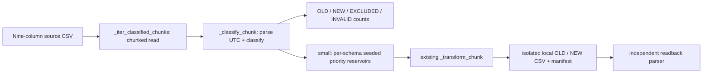
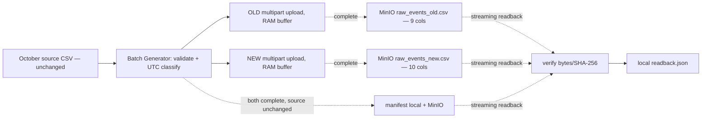

# Batch Generator — October batch selection and small local readback

Lịch sử small (evidence riêng đã dọn theo learner): [roadmap 2026-10-06](../IMPLEMENTATION_ROADMAP.md#batch-generator--minio-raw-storage--2026-10-06). Nội dung runtime bên dưới vẫn là lịch sử local, không dùng thay cho lần chạy mới.

Cleanup baseline: evidence JSON/log và script readback cũ đã được dọn. Số liệu runtime dưới đây là lịch sử, không phải evidence còn sẵn hay lần chạy mới.

Ngày kiểm chứng: 2026-10-05, khoảng 08:09–08:12 Asia/Ho_Chi_Minh. Runtime: Python 3.13.12, pandas 2.3.3, NumPy 2.5.1. Config requirements declare pandas >=2.0.0 and NumPy >=1.24.0; installed versions above describe this run, not all environments.

## Purpose and contract

October is historical batch; November is the intended stream source (stream code removed from rebuild baseline). Batch Generator checks only source selection and handoff to existing transformations:

```text
BATCH = [2019-10-01T00:00:00Z, 2019-11-01T00:00:00Z)
OLD   = [2019-10-01T00:00:00Z, 2019-10-16T00:00:00Z)
NEW   = [2019-10-16T00:00:00Z, 2019-11-01T00:00:00Z)
```

Source event_time accepts `YYYY-MM-DD HH:MM:SS UTC` with optional 1–9 fractional digits. Parsed UTC time determines schema membership; missing/malformed values are INVALID and valid times outside BATCH are EXCLUDED. The parser does not change the source event_time field.



Arrows describe inspected source; fixture and local small path below have evidence. Medium/full call the shared classifier but were not run. Byte targets, replication and transformation logic retain their existing semantics.

## Relevant files and diff explanation

- [Generator](../src/generator/batch_generator.py): `_load_batch_boundaries` validates explicit UTC config and `start < effective < end`; `_classify_chunk` returns labels without changing source data; `_iter_classified_chunks` reads and counts; `_sample_classified_rows` samples; `run_sample_mode` hands selected rows to existing transformation and writer. Benchmark selection now uses the same classifier, with no schema row offset or separate date constants.
- [Config](../config/generator_config.yaml): one start/end/evolution timestamp, one small sample size, existing base seed. Old date fields and duplicated top-level sample size removed.
- [Tests](../tests/test_batch_generator.py), [fixture](../tests/fixtures/batch_generator_october_boundaries.csv.fixture); independent readback script was removed during cleanup.
- `--local-output-dir` disables MinIO and writes CSV/manifest in the specified directory. Existing upload behavior remains available without this argument.

Random-priority reservoirs retain the highest random priorities per schema, using independent seeds derived from base_seed. Quotas are floor(N/2) OLD and remainder NEW. Each valid source row is a candidate only for its own population. Same source order/config/seed gives repeatable selection; reordered source may yield different sampled identities but cannot change membership. Short populations return fewer rows, without duplicate backfill or quota transfer. Memory is bounded by sample plus a source chunk; source scanning is still required. Missing/invalid config raises; structural CSV errors raise rather than being silently skipped.

## UNIT-VERIFIED

Commands (retained test paths use the new functional names; recorded results below are historical):

```bash
python -m pytest tests/test_batch_generator.py -q -s
python -m pytest tests/test_batch_generator.py -q
python -m pytest tests/test_generator.py -q -k 'schema_evolution_part or seed_sequence_reproducibility'
```

Batch Generator suite: 9 passed; final run after fixture rename: 9 passed in 1.68s. Existing related schema/seed tests: 3 passed, 15 deselected. These do not establish pipeline or scale success.

Fixture is intentionally unsorted. Actual boundary readback from the test:

| user_id | event_time (UTC) | Expected | Actual | Pass |
|---|---|---|---|---|
| 101 | 2019-10-25 12:00:00 | NEW | NEW | yes |
| 102 | 2019-09-30 23:59:59 | EXCLUDED | EXCLUDED | yes |
| 103 | 2019-10-01 00:00:00 | OLD | OLD | yes |
| 104 | 2019-10-15 23:59:59 | OLD | OLD | yes |
| 105 | 2019-11-01 00:00:00 | EXCLUDED | EXCLUDED | yes |
| 106 | 2019-10-16 00:00:00 | NEW | NEW | yes |
| 107 | 2019-10-10 12:00:00 | OLD | OLD | yes |
| 108 | not-a-time | INVALID | INVALID | yes |
| 109 | 2019-10-31 23:59:59 | NEW | NEW | yes |
| 110 | 2019-10-20 12:00:00 | NEW | NEW | yes |
| 111 | 2019-10-15 23:59:59.999999 | OLD | OLD | yes |
| 112 | 2019-10-31 23:59:59.999999 | NEW | NEW | yes |

Reconciliation: 12 input = 4 OLD + 5 NEW + 2 EXCLUDED + 1 INVALID. OLD ∩ NEW is empty, and their union equals all nine valid October fixture rows. Reversing source order preserves membership. Same seed repeats sample; changing chunk size preserves selected IDs in the test. Requested 1,000 rows from this fixture returns 4+5 rather than backfilling. Empty NEW writes a header-only CSV. Invalid timestamps and sample sizes/config order are rejected/classified as specified.

## Historical small runtime — artifacts removed

The following commands preserve historical removed script/temp paths; they are not current instructions.

Input: project-root `2019-Oct.csv`, readable, 5,668,612,855 bytes; source header matches nine expected columns. No source file modifications or MinIO writes.

```bash
python src/generator/batch_generator.py --mode small --sample-size 1000 --local-output-dir /tmp/ecom-m1-runtime-kWrAz2
python tests/m1_readback.py /tmp/ecom-m1-runtime-kWrAz2
```

Both commands exited 0. Generator reported 170.64s for this local run; this is an observation, not a scale benchmark. Source scan classified 42,448,764 records: OLD 20,442,805; NEW 22,005,959; EXCLUDED 0; INVALID 0. Sampling selected exactly 500 per schema.

| Readback result | OLD | NEW |
|---|---|---|
| Selected source count | 500 | 500 |
| Output count after transformation | 510 | 510 |
| Min event time UTC | 2019-10-01 02:32:47 | 2019-10-16 01:42:22 |
| Max event time UTC | 2019-10-15 21:18:52 | 2019-10-31 20:50:16 |
| Schema | Original nine columns | Nine + discount_percent |
| Wrong membership rows | 0 | 0 |

Independent output parser checks all timestamps against the frozen boundaries and exact column order. The 20 extra rows come from existing duplicate transformation; Batch Generator records output counts but does not certify duplicate/skew/discount distribution correctness.

Evidence JSON/manifest/log và script readback đã được dọn. Không dựa vào output tạm cũ để xác nhận runtime hiện tại. Bản trước cleanup được lưu tại `old-vibe-backup` (`2cf00cf`).

## Limits and debugging path

Full October **output**, medium/full scale, replication, MinIO delivery and downstream systems remain NOT YET VERIFIED. Reading all October input for reservoir sampling is not a full-output run. No rubric criterion was marked complete from these results.

For a wrong schema row, inspect parsed timestamp and `_classify_chunk` before sampling; compare source classification counts with selected counts and then output counts. For a short sample, inspect population/quota warnings. For malformed source time, inspect INVALID count. For local output issues, inspect manifest and independently verify output; the old readback script is no longer present. Batch Generator stopped after Level 2 for learner review; no Batch Generator — schema and deterministic fields work.


## Batch Generator — complete October direct MinIO ingest

Ngày 2026-10-08, Asia/Ho_Chi_Minh. Source implementation + simulated-S3 unit verification only; full October/real MinIO integration **NOT VERIFIED**. Uses project boto3==1.34.0, python-dotenv==1.2.1; actual learner versions must be checked. Python unit environment 3.13.12.

Input is configured `batch_generator.input_csv`. Source mode reads every CSV record, validates header/field count/second-resolution UTC membership, preserves all source records and their nine original field strings, including natural duplicate multiplicities, before adding synthetic copies. OLD `[Oct 01,Oct 16)` has nine columns; NEW `[Oct 16,Nov 01)` adds deterministic synthetic discount_percent from configured seed/source-record hash. No sampling, replica, synthetic skew or drift. Configured duplicate injection is enabled: each schema emits floor(source_count × rate) adjacent identical copies at quota increments; this is deterministic periodic injection, not random sampling. Natural skew is preserved, not statistically audited by this verifier. Natural duplicate business identity and complete feature/label coverage remain unresolved.



Dashed external connections are planned runtime, not verified. Multipart pieces are transport pieces, not extra CSV files. Buffers configured 64 MiB per schema; transient serialization/request copies add RAM overhead, so this is not a total RSS cap. Local run directory contains only manifest/readback JSON; original CSV remains local. MinIO still consumes local disk (~5.5 GiB additional estimated, not measured). Source hash before/after means additional full file reads; no throughput/runtime claim.

### Learner commands

From project root, first read-only checks:

```bash
conda activate ecom-rebuild
python -c "import sys, boto3, yaml, dotenv; print(sys.version); print('boto3', boto3.__version__)"
docker compose ps minio
df -h .
python -m src.generator.batch_generator --help
```

If MinIO is stopped, start only it: `docker compose up -d --no-deps minio` (writes container/service state, no Kafka command). Wait for healthy. Bucket must already exist. CLI loads root .env without printing credentials; missing credentials fail, no fallback. No bucket creation/deletion.

This command reads full October and writes three objects to a fresh MinIO prefix, plus local manifest. It does not make local CSV copies. Use a new run-id if either destination already exists; do not run simultaneous writers to one prefix:

```bash
python -m src.generator.batch_generator --mode source --action ingest --run-dir artifacts/october-source-20261008-04 --prefix source/rees46/2019-10/20261008-04
```

Progress every million records. Successful output is `UPLOADED_NOT_VERIFIED`; expected count from prior inspection is 42,448,764 total, OLD 20,442,805 and NEW 22,005,959, not a result of the corrected job. At rate 0.02 expected injected copies are OLD 408,856 and NEW 440,119; expected outputs OLD 20,851,661 and NEW 22,446,078, total 43,297,739. These are expectations, require runtime audit. Remote keys: raw_events_old.csv, raw_events_new.csv, manifest.json. The manifest is written only after both CSV objects complete and source hash is unchanged. This does not equal readback PASS.

Then read all remote objects, compare bytes/SHA-256 and independently parse CSV headers, field counts, UTC OLD/NEW membership, discount membership, source/output counts and scheduled identical-copy pairs. Write only local readback.json:

```bash
python -m src.generator.batch_generator --mode source --action verify --run-dir artifacts/october-source-20261008-04 --prefix source/rees46/2019-10/20261008-04 --evidence-output docs/evidence/batch_generator_october.json
```

Require three `READBACK_PASS` lines and completed readback.json. A verification rerun removes only its previous local readback.json first to avoid stale PASS after failure. No remote writes in verify.

### Failures and evidence boundaries

- Prefix object/incomplete multipart detection and existing local directory refuse ingest. This is not an atomic distributed lock; use a unique prefix and one writer.
- Invalid source or caught upload/interrupt exception aborts unfinished multipart uploads. Completed objects can remain if a later step fails; no automatic deletion. No checkpoint/resume. Kill -9/power loss can leave incomplete multipart state; inspect before any cleanup, do not claim automatic recovery.
- Do not feed Spark a prefix without a completed remote manifest plus successful verification. On failure preserve diagnostics and report the error; no bucket deletion/retry overwrite.
- Natural duplicates remain, schema adaptation is synthetic, ID/price semantics are not fully audited, October edge coverage still matters, ≥100 GB rubric not satisfied by this run.
- Existing small/medium/full implementations unchanged; small mode still retains historical behavior of writing local CSV as well as uploading. Use source mode for this complete October workflow.
- Unit command: `PYTHONDONTWRITEBYTECODE=1 python -m pytest tests/test_batch_generator.py -q -p no:cacheprovider` → 16 passed (includes legacy nine cases). Simulated-S3 tests prove local code behavior only, not actual MinIO compatibility.
- Record actual learner commands/time/version/counts/readback after the real run; no evidence status upgraded yet. No new script/test/note file.

### Superseded run without duplicate injection

Learner ran ingest then native verify on `20261008-03`. Full source count 42,448,764 and bytes/hash readback PASS, but injected_duplicates=0 did not meet requested fault scope. Not a corrected-run PASS or full rubric completion. Only a one-line superseded status remains in [pending corrected evidence](evidence/batch_generator_october.json), per learner request; old full snapshots removed. Agent inspected exact three remote keys/sizes, deleted only that prefix's objects with learner authorization and confirmed prefix empty by S3 list; no unfinished multipart uploads. Local two JSON files and empty run directory removed afterwards. No bucket, sampled prefix, original CSV or Kafka artifact changed. Snapshot timestamps are artifact creation/verification times, not measured whole-job duration.

Corrected schema/duplicate audit is implemented with simulated-S3 tests only. Natural duplicate count is NOT_AUDITED; injected copies are measured separately. Source preservation follows code and count/hash checks; business event identity/dedup remains unresolved. Spark must not simply drop all identical rows without defining how valid source multiplicities are preserved. Rubric ≥100 GB and statistical skew audit remain unverified.

### Evidence ownership and timing

One current evidence JSON: [batch_generator_october.json](evidence/batch_generator_october.json), pending corrected runtime. Historical MinIO note/manifest JSON removed at learner request; only concise history in roadmap, no historical snapshot copied into the current report. Kafka evidence unchanged.

Ingest manifest now records `timing.started_timestamp`, `finished_timestamp`, `elapsed_seconds` (monotonic duration) with explicit scope: includes preflight, source hashing, CSV processing/upload; excludes final manifest publication. Verify readback includes its own start/end/elapsed, covering complete remote hash/schema/date/count/copy audit, excluding local report write. Timing is not a throughput benchmark. Counts and schema audits already implemented; corrected full runtime remains pending. Natural duplicate total/statistical skew/≥100 GB remain unverified.

### Automatic evidence export

Source verify accepts `--evidence-output docs/evidence/batch_generator_october.json`. Only after all remote checks pass does it atomically replace the evidence JSON, containing manifest, readback, measured injected duplicate/source and duplicate/output ratios, UTC start/end/elapsed, Python/boto3/botocore versions, code SHA-256 and local artifact hashes. Console prints EVIDENCE_WRITTEN. No manual numeric transcription is needed. Evidence status VERIFIED_DECLARED_CHECKS refers only to declared checks, not full rubric.

If verification fails, current readback is absent and evidence is left unchanged (an older successful report, if present, describes its own timestamp/prefix, not the failed attempt). Export path must differ from manifest/readback and have an existing directory. Evidence contains no credentials. Ingest writes MinIO and small local manifest; verify reads MinIO and writes local reports plus the explicitly requested tracked evidence file. No auto-commit. 18 unit tests PASS with simulated S3; corrected October runtime still pending.

## Full October runtime result — 2026-10-08

Learner executed ingest and verify for 20261008-04 including --evidence-output; actual automatic [report](evidence/batch_generator_october.json) supersedes pending descriptions above. Python 3.11.17/boto3 1.34.0/botocore 1.34.162. Source OLD/NEW=20,442,805/22,005,959; injected copies=408,856/440,119; output=20,851,661/22,446,078. Total 43,297,739 rows and 5,879,140,530 CSV bytes. Full remote header/field/date/discount/count/scheduled-copy-pair and SHA-256 checks PASS. Local manifest/readback and code hashes agree with evidence snapshot; no local output CSVs. Agent inspection only, no agent workload rerun.

Ingest 583.4097s, verify 391.7169s, exact UTC timestamps/scopes in report; not benchmark. Ingest manifest's UPLOADED_NOT_VERIFIED is its historical stage status; final readback is READBACK_PASS. Natural duplicates/statistical skew/≥100 GB/Spark/feature-label coverage not verified. Learner explanation pending; stop for review/save before Spark proposal.
