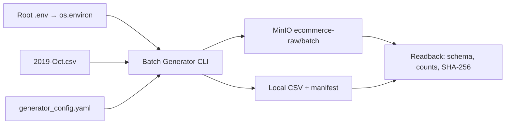

# Batch Generator → MinIO Raw Storage — runtime evidence

Ngày chạy: **2026-10-06, 14:33:29–14:36:09 Asia/Ho_Chi_Minh**. Verification thực hiện sau lần chạy này trong cùng phiên làm việc; không ghi giờ chính xác vì không thu thập timestamp cho readback.

## Purpose, input/output và phạm vi

Input: root `2019-Oct.csv`, config [generator_config.yaml](../config/generator_config.yaml), small sample 1.000.000, seed 42, chunk 250.000. Output: hai CSV OLD/NEW và manifest trong `ecommerce-raw/batch/`, kèm bản local trong `data/`.



Luồng CSV → output local → MinIO → readback đã kiểm chứng cho lần chạy small này. `.env` → `os.environ` là source-declared; dotenv được kiểm tra bằng fixture riêng, không đọc credentials để chứng minh nguồn giá trị thực tế.

## Code/config và version

- [compose.yaml](../compose.yaml): một service MinIO; image bên thứ ba `ghcr.io/coollabsio/minio:RELEASE.2025-04-22T22-12-26Z`; API 9000, Console 9001, named volume `minio_data` tại `/data`. Log runtime của learner: MinIO cùng release, go1.24.9 linux/amd64. Compose trên máy kiểm tra: v5.5.0.
- Healthcheck dùng bash HTTP GET và yêu cầu status 200; image không có curl. Lệnh thay thế đã chạy trực tiếp trong container, exit 0; sau recreate learner thấy healthy, agent xác nhận lại healthy.
- [batch_generator.py](../src/generator/batch_generator.py): CLI gọi `load_dotenv` với root path và `override=False` trước constructor; class vẫn đọc `os.environ`. Upload logic không đổi; bucket lấy từ YAML, không lấy `MINIO_RAW_BUCKET`.
- [requirements.txt](../requirements.txt): khai báo `python-dotenv==1.2.1`, `boto3==1.34.0`. Python của agent kiểm tra: 3.13.12, dotenv 1.2.1, boto3 1.43.106. Không suy ra phiên bản môi trường `(ecom-rebuild)` của learner từ môi trường agent.

## Commands/input và kết quả thật

Learner chạy:

```bash
python src/generator/batch_generator.py --mode small
```

Log learner ghi thời gian xử lý 159,69 giây, source OLD=20.442.805; NEW=22.005.959; EXCLUDED=INVALID=0. Chọn 500.000 mỗi schema. Manifest timestamp `2026-10-06T07:36:09.560768+00:00`. Đây là số liệu log/manifest, không phải benchmark hay independent source-count audit.

Agent kiểm tra:

```bash
docker inspect --format '{{.State.Health.Status}}' ecom_ml_system-minio-1
docker exec ecom_ml_system-minio-1 mc --version
PYTHONDONTWRITEBYTECODE=1 python -m pytest tests/test_batch_generator.py -q -p no:cacheprovider
```

Kết quả: `healthy`; mc RELEASE.2025-08-13T08-35-41Z; **9 passed in 1.07s** (unit verification, không thay thế runtime readback).

Readback chạy bằng Python inline gọi `docker exec ... sh -c` để dùng `mc stat`, `mc ls --json`, `mc cat` tại `verify/ecommerce-raw` và `verify/ecommerce-raw/batch/<object>`. Alias `MC_HOST_verify` được cung cấp từ environment của container, không in credentials. Không lưu script riêng. Parser độc lập dùng `csv.reader`, `json.loads`, `hashlib.sha256`; đọc toàn bộ ba object, so sánh với local. Command exit **0**.

| Check | Kết quả runtime |
| --- | --- |
| Bucket | `ecommerce-raw` tồn tại |
| Prefix `batch/` | Có đúng ba object dự kiến |
| OLD | 67.996.015 bytes; 510.000 dòng dữ liệu; header đúng 9 cột; mọi dòng đủ 9 trường |
| NEW | 69.337.926 bytes; 510.000 dòng dữ liệu; header đúng 10 cột, thêm `discount_percent`; mọi dòng đủ 10 trường |
| Manifest | 1.355 bytes; JSON đọc được, bằng JSON local, khớp timestamp/mode/sample/selected counts/total rows/duplicate count của lần chạy |
| Reconciliation | Tổng 1.020.000 dòng và 137.333.941 bytes, đúng manifest/report; SHA-256 mỗi CSV remote bằng local |

OLD header: `event_time,event_type,product_id,category_id,category_code,brand,price,user_id,user_session`. NEW thêm `discount_percent` cuối header.

SHA-256 bản local (CSV remote đã xác nhận bằng local):

```text
OLD f061d7f8e27ee5a938e25e1dd37c2892ac55aefedf1cbaa2b41d665084b719e3
NEW 46fc632c17860a98377ff47f2f9b0e693b994cf4d7c2bf3e8189b1d3f72d0047
```

Bản manifest của lần chạy được giữ trong [evidence JSON](evidence/batch_generator_minio_2026-10-06_manifest.json); không chứa credentials. CSV lớn vẫn ở local/MinIO, không đưa vào Git.

## Giới hạn và debugging

- Chưa đạt/chưa kiểm chứng **≥100 GB**, medium/full, throughput benchmark hoặc downstream Bronze.
- Chưa kiểm chứng persistence sau recreate có dữ liệu, retry/restart/delivery guarantees, timestamp membership của mọi output row hay phân phối skew/discount.
- 20.000 duplicate là số liệu manifest/log: 2% của 1.000.000 input, tương đương 1,9608% của output. Chưa đo duplicate thực tế độc lập hoặc duplicate có sẵn trong source.
- API 200/healthy không thay thế readback. Lỗi healthcheck cũ do thiếu curl, không phải API MinIO lỗi. Bucket/object key cố định và local output có thể bị ghi đè khi chạy lại.
- Runtime verification PASS cho integration small; chưa ghi toàn bộ Batch Generator DONE hoặc xác nhận learner đã giải thích được luồng. Không chuyển component.
