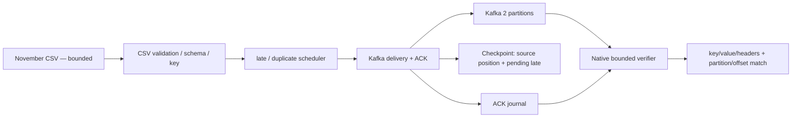

# Kafka Stream Replay — bounded runtime và bàn giao

Ghi nhận ngày **2026-10-08, Asia/Ho_Chi_Minh**. Learner tự chạy các lệnh native và gửi output trong chat; agent đối chiếu local artifacts, không rerun Kafka. Không có thời điểm bắt đầu/kết thúc chính xác cho từng lệnh; không suy timestamp lệnh từ mtime artifact. Đây là evidence bounded correctness, không phải benchmark/full-scale.

## Phạm vi và version

Source tại implementation commit `bd36ff9718e099e365b1207a582b9fab9786e614`: `apache/kafka:4.1.2` trong Compose, dependency `confluent-kafka==2.3.0`; learner environment `ecom-rebuild`, Python 3.11 (3.11.17 được kiểm tra ở implementation review). Topic `ecommerce_stream_events`, 2 partitions, replication factor 1, broker/ISR 1; cluster `MkU3OEVBNTcwNTJENDM2Qk`, topic ID do Python in `mRFFhxORQG6/jRzRiLFBdw` (Kafka CLI biểu diễn `mRFFhxORQG6_jRzRiLFBdw`). Không HA nhiều broker.

Input `2019-Nov.csv`, UTC `[2019-11-01,2019-12-01)`; JSON chín source fields + deterministic `discount_percent`, key UTF-8 `str(user_id)`. Late rate 5%, delay 300–600 giây **event-time progress**, duplicate rate 1,5% event nguồn; burst disabled. Rate là lượt gửi mỗi giây thực, tính cả duplicate.



Đường bounded gửi/đọc đã có learner runtime outputs bên dưới. Không có Flink hoặc Kafka → Lakehouse implementation trong hình.

## Lệnh đã chạy và kết quả

Topic được learner tạo/describe bằng `docker compose exec kafka /opt/kafka/bin/kafka-topics.sh --bootstrap-server kafka:29092 --create --topic ecommerce_stream_events --partitions 2 --replication-factor 1` và cùng CLI với `--describe --topic ecommerce_stream_events`. Describe: partitions 0/1, leader/replica/ISR 1. Warning tên metric underscore không chặn create.

Run nhỏ:

```bash
python -m src.generator.replay_producer --max-events 2000 --rate 100 --run-dir artifacts/kafka-november-2000
python -m scripts.verify_kafka_replay --run-dir artifacts/kafka-november-2000 --timeout 30
```

Run recovery (đọc lại từ đầu CSV, không nối tiếp run 2.000):

```bash
python -m src.generator.replay_producer --max-events 3000 --rate 50 --checkpoint-events 500 --run-dir artifacts/kafka-november-restart
# Learner Ctrl+C sau output checkpoint_record=500.
python -m src.generator.replay_producer --max-events 3000 --rate 50 --checkpoint-events 500 --run-dir artifacts/kafka-november-restart --resume
python -m scripts.verify_kafka_replay --run-dir artifacts/kafka-november-restart --timeout 30
```

Trước Ctrl+C: checkpoint 500, accepted 500, submitted=acked=483, duplicate_messages=7, pending_late=24. `KeyboardInterrupt` tại `Delivery.send()`/sleep là gián đoạn có chủ đích. Resume khôi phục checkpoint và hoàn tất tổng 3.000 event; không phải gửi thêm 3.000 event mới.

| Kết quả | Run 2.000 | Run restart 3.000 |
|---|---:|---:|
| Event nguồn accepted | 2.000 | 3.000 |
| Bản duplicate injection thêm | 31 | 41 |
| Submitted = ACK = audit records | 2.031 | 3.041 |
| Event được chọn late | 99 | 150 |
| Late due, đạt ngưỡng | 51 | 91 |
| Late end_flush, chưa đủ ngưỡng | 48 | 59 |
| Pending cuối run | 0 | 0 |
| Consumer verified_messages | 2.031 | 3.041 |
| Readback status / scope | READBACK_PASS / all | READBACK_PASS / all |

Producer status là `ACK_PASS`; `summary.json` giữ `verification: NOT_RUN` vì được ghi trước verifier. Kết quả consumer nằm riêng ở `readback.json`, không coi summary cũ là consumer thất bại. Run nhỏ báo elapsed 20,6556s; run restart báo elapsed của process resume 51,6319s và elapsed checkpointed 61,3542s. Đây là counters của chương trình, không benchmark; thời gian gián đoạn và phần uncheckpointed không được đo đầy đủ.

Run nhỏ có warning `Coordinator load in progress` khi lấy idempotence PID, client retry rồi hoàn tất ACK/readback. Không suy ra benchmark hoặc guarantee từ warning đã hồi phục.

## Đọc lại sau tắt/bật máy

Learner báo đã tắt/bật máy. Lần verifier đầu báo `localhost:9092 Connection refused`; chưa có readback thành công ở lần đó. Learner chạy `docker compose up -d`; output Kafka/MinIO containers Started, Kafka cùng container ID `228cf5f5679f`, CREATED 21 hours ago, health starting. Sau đó learner chạy lại verifier run restart và nhận `READBACK_PASS`, verified_messages=3041, scope=all.

Kết luận giới hạn: journal targets của run restart vẫn đọc được sau lần dừng/khởi động broker theo mô tả learner, topic identity khớp. Không phải kiểm chứng container recreate, xóa volume, mất điện bất ngờ, crash recovery/HA hoặc thời điểm Kafka fsync từng message. Agent không có log hệ điều hành để xác nhận độc lập chu kỳ tắt máy.

## Evidence giữ trong Git

[Snapshot và local journal audit](evidence/kafka_stream_replay.json) giữ nguyên producer summaries/readback results, checkpoint status, counters kiểm tra local và SHA-256 của bốn artifacts mỗi run. Agent đối chiếu toàn bộ hai ACK journals: unique source records 2.000/3.000; 31/41 copy pairs có cùng key/value; ACK positions không trùng trong từng journal; `due` progress đạt delay. Event-time displacement quan sát trong due messages: 301–571 giây và 301–587 giây. Không phải thời gian chờ thực.

Raw artifacts vẫn ở `artifacts/kafka-november-2000/` và `artifacts/kafka-november-restart/`, bị Git ignore. Snapshot không chứa raw event payload; clone repo không tự có ACK journals hoặc CSV để rerun verifier. SHA-256 liên kết snapshot với bản local đã inspection, không thay thế một native rerun.

## Trạng thái hoàn thành và giới hạn

- **Đã hoàn thành phạm vi bounded correctness:** CSV → schema/key → native ACK/readback; duplicate injection có paired key/value readback; late event-time-progress có due threshold readback; producer interrupt/resume có pending late và final readback; readback sau broker khởi động lại như trên.
- **Chưa hoàn thành/không claim:** toàn November, throughput/scale, exactly-once, độc lập audit toàn topic, downstream dedup/window/watermark, Flink hoặc stream archive. `end_flush` không chứng minh đủ late delay. Verifier đối chiếu producer journal, không tái dựng độc lập toàn bộ fault choices.
- Recovery là **at-least-once**: phần đã gửi sau checkpoint trước Ctrl+C có thể lặp khi resume và nằm ngoài recovered journal. Tổng ACK hai journals = 5.072, **không phải số message toàn topic đã đo**. Hai run đọc trùng prefix CSV, không phải 5.000 event nguồn khác nhau.
- Config percentages là xác suất trên event nguồn. Quan sát duplicate 31/2000=1,55%, 41/3000≈1,37%; late 99/2000=4,95%, 150/3000=5%. Không ép quota hoặc gọi duplicate/output-message ratio là injection rate.

## Điểm tiếp tục session sau

Giữ nguyên topic, Kafka volume và artifacts; không tự cleanup hoặc replay lại. Kafka bounded verification đã xong, không tự chạy full workload. Learner đã giải thích offset theo partition, end_flush khi progress dừng và ACK khác consumer readback; nested callback/test syntax vẫn đang học, chưa xác nhận có thể tự giải thích toàn component nên không đánh dấu toàn learning component DONE.

Nếu learner muốn sang Flink: theo roadmap, trước code phải đọc current state, giải thích purpose/input/output/files, chọn bộ dữ liệu kiểm thử và STOP lấy approval. Topic hiện có nhiều run trùng nguồn, cần kế hoạch input/offset rõ ràng; topic riêng hoặc cleanup chỉ là lựa chọn chưa duyệt. Không tự tạo topic, xóa dữ liệu, sửa kiến trúc hoặc đổi roadmap priority.
