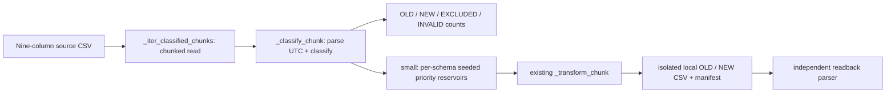

# M1 — October batch selection and small local readback

Ngày kiểm chứng: 2026-10-05, khoảng 08:09–08:12 Asia/Ho_Chi_Minh. Runtime: Python 3.13.12, pandas 2.3.3, NumPy 2.5.1. Config requirements declare pandas >=2.0.0 and NumPy >=1.24.0; installed versions above describe this run, not all environments.

## Purpose and contract

October is historical batch; November is the intended stream source (stream code unchanged). M1 checks only source selection and handoff to existing transformations:

```text
BATCH = [2019-10-01T00:00:00Z, 2019-11-01T00:00:00Z)
OLD   = [2019-10-01T00:00:00Z, 2019-10-16T00:00:00Z)
NEW   = [2019-10-16T00:00:00Z, 2019-11-01T00:00:00Z)
```

Source event_time accepts `YYYY-MM-DD HH:MM:SS UTC` with optional 1–9 fractional digits. Parsed UTC time determines schema membership; missing/malformed values are INVALID and valid times outside BATCH are EXCLUDED. The parser does not change the source event_time field.



Arrows describe inspected source; fixture and local small path below have evidence. Medium/full call the shared classifier but were not run. Byte targets, replication and transformation logic retain their existing semantics.

## Relevant files and diff explanation

- [Generator](../src/generator/batch_generator.py): `_load_batch_boundaries` validates explicit UTC config and `start < effective < end`; `_classify_chunk` returns labels without changing source data; `_iter_classified_chunks` reads and counts; `_sample_classified_rows` samples; `run_sample_mode` hands selected rows to existing transformation and writer. Benchmark selection now uses the same classifier, with no schema row offset or separate date constants.
- [Config](../config/generator_config.yaml): one start/end/evolution timestamp, one small sample size, existing base seed. Old date fields and duplicated top-level sample size removed.
- [Tests](../tests/test_batch_selection_m1.py), [fixture](../tests/fixtures/m1_october_boundaries.csv.fixture), [independent readback](../tests/m1_readback.py).
- `--local-output-dir` disables MinIO and writes CSV/manifest in the specified directory. Existing upload behavior remains available without this argument.

Random-priority reservoirs retain the highest random priorities per schema, using independent seeds derived from base_seed. Quotas are floor(N/2) OLD and remainder NEW. Each valid source row is a candidate only for its own population. Same source order/config/seed gives repeatable selection; reordered source may yield different sampled identities but cannot change membership. Short populations return fewer rows, without duplicate backfill or quota transfer. Memory is bounded by sample plus a source chunk; source scanning is still required. Missing/invalid config raises; structural CSV errors raise rather than being silently skipped.

## UNIT-VERIFIED

Commands:

```bash
python -m pytest tests/test_batch_selection_m1.py -q -s
python -m pytest tests/test_batch_selection_m1.py -q
python -m pytest tests/test_generator.py -q -k 'schema_evolution_part or seed_sequence_reproducibility'
```

M1 suite: 9 passed; final run after fixture rename: 9 passed in 1.68s. Existing related schema/seed tests: 3 passed, 15 deselected. These do not establish pipeline or scale success.

Fixture is intentionally unsorted. Actual boundary readback from the test:

| user_id | event_time (UTC) | Expected | Actual | Pass |
|---|---|---|---|---|
| 101 | 2019-10-25 12:00:00 | NEW | NEW | yes |
| 102 | 2019-09-30 23:59:59 | EXCLUDED | EXCLUDED | yes |
| 103 | 2019-10-01 00:00:00 | OLD | OLD | yes |
| 104 | 2019-10-15 23:59:59 | OLD | OLD | yes |
| 105 | 2019-11-01 00:00:00 | EXCLUDED | EXCLUDED | yes |
| 106 | 2019-10-16 00:00:00 | NEW | NEW | yes |
| 107 | 2019-10-10 12:00:00 | OLD | OLD | yes |
| 108 | not-a-time | INVALID | INVALID | yes |
| 109 | 2019-10-31 23:59:59 | NEW | NEW | yes |
| 110 | 2019-10-20 12:00:00 | NEW | NEW | yes |
| 111 | 2019-10-15 23:59:59.999999 | OLD | OLD | yes |
| 112 | 2019-10-31 23:59:59.999999 | NEW | NEW | yes |

Reconciliation: 12 input = 4 OLD + 5 NEW + 2 EXCLUDED + 1 INVALID. OLD ∩ NEW is empty, and their union equals all nine valid October fixture rows. Reversing source order preserves membership. Same seed repeats sample; changing chunk size preserves selected IDs in the test. Requested 1,000 rows from this fixture returns 4+5 rather than backfilling. Empty NEW writes a header-only CSV. Invalid timestamps and sample sizes/config order are rejected/classified as specified.

## SMALL-RUNTIME-VERIFIED

Input: project-root `2019-Oct.csv`, readable, 5,668,612,855 bytes; source header matches nine expected columns. No source file modifications or MinIO writes.

```bash
python src/generator/batch_generator.py --mode small --sample-size 1000 --local-output-dir /tmp/ecom-m1-runtime-kWrAz2
python tests/m1_readback.py /tmp/ecom-m1-runtime-kWrAz2
```

Both commands exited 0. Generator reported 170.64s for this local run; this is an observation, not a scale benchmark. Source scan classified 42,448,764 records: OLD 20,442,805; NEW 22,005,959; EXCLUDED 0; INVALID 0. Sampling selected exactly 500 per schema.

| Readback result | OLD | NEW |
|---|---|---|
| Selected source count | 500 | 500 |
| Output count after transformation | 510 | 510 |
| Min event time UTC | 2019-10-01 02:32:47 | 2019-10-16 01:42:22 |
| Max event time UTC | 2019-10-15 21:18:52 | 2019-10-31 20:50:16 |
| Schema | Original nine columns | Nine + discount_percent |
| Wrong membership rows | 0 | 0 |

Independent output parser checks all timestamps against the frozen boundaries and exact column order. The 20 extra rows come from existing duplicate transformation; M1 records output counts but does not certify duplicate/skew/discount distribution correctness.

Evidence: [readback JSON with output hashes](evidence/m1-2026-10-05/readback.json), [manifest](evidence/m1-2026-10-05/generation_manifest.json), [run log](evidence/m1-2026-10-05/generator.log). CSV outputs remain in `/tmp/ecom-m1-runtime-kWrAz2`; temporary paths may not persist. Input was identified by path/size/header, not full content hash. Classification scan counts are generator runtime observations; output bounds/schema were checked independently.

## Limits and debugging path

Full October **output**, medium/full scale, replication, MinIO delivery and downstream systems remain NOT YET VERIFIED. Reading all October input for reservoir sampling is not a full-output run. No rubric criterion was marked complete from these results.

For a wrong schema row, inspect parsed timestamp and `_classify_chunk` before sampling; compare source classification counts with selected counts and then output counts. For a short sample, inspect population/quota warnings. For malformed source time, inspect INVALID count. For local output issues, inspect manifest and run the independent readback. M1 stopped after Level 2 for learner review; no M2 work.
