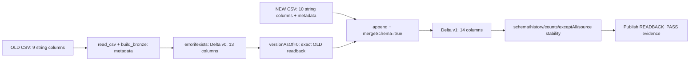

# Spark Raw → Bronze: Delta Schema Evolution

## Mục đích và kết quả đã kiểm chứng

Bronze giữ giá trị CSV đã parse và số lần xuất hiện của mọi dòng; chưa làm sạch, cast nghiệp vụ hoặc dedup. OLD có 9 cột nghiệp vụ; NEW thêm `discount_percent`. Phiên bản đã chạy: PySpark **3.5.0**, Delta **3.0.0**, boto3 **1.34.0**. [Smoke](evidence/spark_raw_to_bronze_evolution_smoke.json) và [full](evidence/spark_raw_to_bronze_evolution_full.json) trên MinIO đều READBACK_PASS ngày **08/10/2026**. Full có **43.297.739 dòng**; đây không phải benchmark ≥100 GB.

Input/schema chuẩn nằm trong [DATA_CONTRACT](../DATA_CONTRACT.md#spark-raw--bronze-handoff--current-input-proposed-consumer); [lệnh, giờ chạy và kết quả chính xác](../IMPLEMENTATION_ROADMAP.md#spark-raw--bronze--delta-schema-evolution-smokefull-runtime-pass--2026-10-08) nằm trong roadmap. Source/config/tests: [job](../src/spark/raw_to_bronze.py), [YAML](../config/spark_config.yaml), [tests](../tests/test_raw_to_bronze.py).

## Luồng dữ liệu và cơ chế native



Sơ đồ từ source; các snapshot và readback trong smoke/full đã có runtime evidence. Cả hai input được persist/materialize và kiểm tra counts trước lần ghi đầu. Full dùng DISK_ONLY, smoke MEMORY_AND_DISK; cache không phải snapshot bất biến của Raw.

1. `read_csv()` khai báo schema tường minh, toàn bộ cột nghiệp vụ là **string**; không infer kiểu. Giữ CSV options hiện tại: quoted/unquoted empty → `''`, literal `null` vẫn là text, không hỗ trợ embedded newline. OLD không được thêm discount trước write.
2. `read_csv()` thêm `_source_object`, `_schema_version`; `build_bronze()` thêm `_run_id` và `_ingested_at` timestamp UTC cố định từ lúc bắt đầu job. OLD/NEW dùng cùng run-id/time.
3. `write_bronze(old)` tạo bảng mới bằng `errorifexists`: v0 gồm 9 nghiệp vụ + 4 metadata. `verify_old()` đọc v0, kiểm tra schema/counts và `exceptAll` hai chiều.
4. `append_bronze(new)` gọi Delta writer:

   ```python
   frame.write.format('delta').mode('append').option('mergeSchema', 'true').save(destination)
   ```

   **Delta Lake mở rộng schema bảng trong transaction NEW.** PySpark là API gọi write; không tự hợp nhất dữ liệu OLD/NEW thành frame để ghi. Các file OLD không có discount; khi đọc snapshot mới, Delta trả NULL cho cột thiếu. Không bật autoMerge toàn cục, không overwrite.
5. Version 1 giữ 13 cột cũ rồi thêm `discount_percent: string` ở cuối. `build_expected()` chỉ tạo đáp án đối chiếu từ input trước write: thêm NULL cho OLD, unionByName và select thứ tự đã khai báo. **Frame này không đi vào writer**, không thực hiện evolution bảng.
6. `verify_bronze()` kiểm tra schema độc lập, counts từng nguồn, manifest full, full-row `exceptAll` hai chiều và OLD discount null. `exceptAll` giữ số lần xuất hiện, khác với phép so sánh tập hợp bỏ duplicate; nó so theo vị trí, nên schema/order được kiểm tra trước và hai frame select cùng thứ tự. NEW discount và provenance nằm trong full-row comparison.
7. `verify_history()` yêu cầu đúng v0 WRITE/ErrorIfExists và v1 WRITE/Append. Chỉ sau source stability PASS, job công bố evidence chính thức ở file mới.

## Cách đọc evidence

| Nội dung | Smoke | Full |
| --- | --- | --- |
| v0: OLD, 13 cột, chưa có discount | 1.000 | 20.851.661 |
| v1: OLD + NEW, 14 cột | 2.000 | 43.297.739 |
| NEW được append | 1.000 | 22.446.078 |
| Thời gian bao gồm exact readback | 56,1980s | 1603,8534s |
| Manifest toàn bộ nguồn | NOT_APPLICABLE | PASS |

`snapshots` ghi schema/counts từng version; `delta_history` ghi hai WRITE modes; `schema_evolution` ghi 13 → 14, v0 → v1. `code_sha256` và `source_evidence_sha256` bind source/evidence nguồn. Các checks PASS mô tả readback của learner-run, không chỉ việc lệnh write đã trả về.

Agent đối chiếu evidence với report local và hashes, rồi đọc bốn remote commit JSON nhỏ: metadata, numOutputRows và tổng add.stats.numRecords khớp. Đây không phải quét độc lập toàn bộ Parquet hoặc tái hash CSV. Input size/ETag/modified được so trước/sau job; không khóa Raw và không chứng minh bất biến tuyệt đối. Natural duplicates/business event identity chưa được audit; injected copies vẫn phải giữ nguyên.

## Failure, retry và debugging

- Xem `artifacts/spark-raw-to-bronze/<run-id>/report.json`, `failed_after`, `transactions`, rồi Delta history. WRITE_RETURNED chỉ nói call đã trả thành công; READBACK_PASS tổng mới xác nhận mọi check.
- OLD write có thể chưa commit hoặc đã commit dù client báo lỗi; NEW lỗi có thể để bảng OLD-only hoặc v1 đã tồn tại. Hai transaction không có atomicity chung. Không tự delete, overwrite, resume hoặc append lại.
- Kill cứng có thể để report stale/COMMIT_UNKNOWN. Không suy ra commit chưa xảy ra từ report. Kiểm tra history/readback trước recovery; run tiếp theo dùng run-id/destination/evidence mới.
- `exceptAll` trên full có thể tốn disk shuffle; không bỏ check để xử lý chậm. Warnings trong log không tự chứng minh fail hay pass; dựa vào kết quả cuối và evidence.
- Native local fixture PASS không thay thế MinIO runtime. 50 tests đã PASS ở implementation stage; không chạy lại tests cho lần cập nhật docs này. Silver, Gold, Airflow, features/labels và optimization ngoài phạm vi.

## Lịch sử thay thế

Cách cũ thêm discount NULL cho OLD bằng PySpark, union rồi ghi một lần thành v0. Nó đã bảo toàn dữ liệu nhưng không chứng minh Delta evolution. Sau khi smoke/full mới PASS, learner yêu cầu dọn hai JSON evidence và hai prefix Bronze cũ; lịch sử, hash evidence cũ và kết quả cleanup nằm trong roadmap. Raw, hai bảng/evidence evolution mới và Kafka được giữ nguyên.
